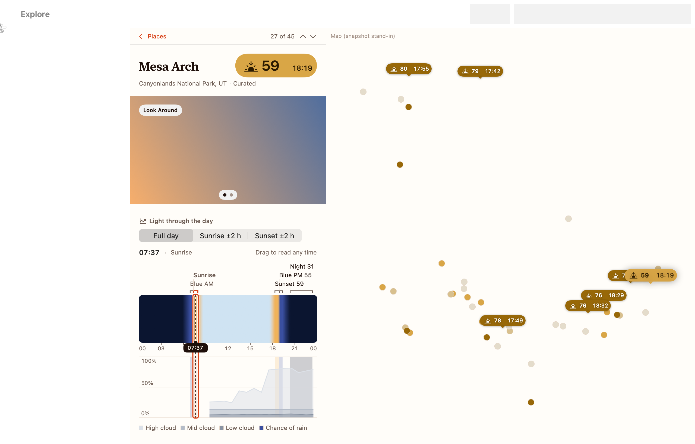

# Iter

Iter is a road-trip planner for photographers, for the Mac. It shows when the light will be good (sunrise, sunset, golden hour and blue hour) at places near you and along your route, scores it from the weather forecast, and helps you plan a trip around it, day by day. *Be in the right place when the light is right.*

## Requirements

- A Mac with macOS 26 or later.
- A free OpenWeather API key. The app walks you through getting one.
- Optional: Apple Intelligence, for Ask Iter. It needs a Mac with Apple silicon, with Apple Intelligence turned on in System Settings.

## Install

1. Download `Iter-0.1.0.zip` from the [Releases page](https://github.com/dwjames88/iter/releases/latest).
2. Unzip it (double-click the zip).
3. Drag **Iter** into your **Applications** folder. It has to live there so that updates can install themselves.
4. Open it. This build is not notarised by Apple, so macOS blocks it the first time:
   - Open Iter once and click **Done** on the warning.
   - Go to **System Settings ▸ Privacy & Security** and scroll down to "Iter was blocked…".
   - Click **Open Anyway**, then confirm with your password.

   On macOS 15 and later, right-click ▸ Open no longer skips this step, so don't bother trying it. If you prefer Terminal, this does the same job: `xattr -dr com.apple.quarantine /Applications/Iter.app`
5. The welcome guide appears. It sets up your location, your weather key and Ask. For the weather key it shows you these steps:
   - Create a free OpenWeather account.
   - Subscribe to **One Call by Call** (One Call API 3.0). The first 1,000 calls a day are free.
   - On your account's **Billing plan** tab, set the daily limit to 1,000, so you are never charged.
   - Copy your key from the API keys page and paste it into Iter. A new key can take up to two hours to start working, so "Key rejected" at first is normal.

   "Do This Later" is fine: a banner in the app brings you back. You can reopen the guide any time from **Help ▸ Welcome to Iter**, and change the key in **Settings ▸ Weather**.

## Updates

Iter checks for updates once a day (turn that off in **Settings ▸ Updates**), and you can check yourself with **Iter ▸ Check for Updates…**. Updates are signed and install themselves. There is no Gatekeeper step after the first install.

## A short tour

- **Explore** (⌘2) lists places near you with the next sunrise or sunset, and shows them on a map. Click a place and the list turns into its **light panel**: a timeline of the day's light, cloud and rain, today's and tomorrow's windows, and a few photos or a satellite view.
- **Scores** show up as a small coloured capsule: a sunrise or sunset symbol, a score out of 100 and the time the window starts. The colour is the band (poor to great), and hovering the symbol tells you which window it is. Scores further out carry a range and lower confidence.
- **When to go** is on every place. It picks the best sunrise or sunset in the days the forecast covers, so you can choose a day and not just a place.
- **Save** a place to keep it in **Locations** (⌘3). You can add your own spots too (⇧⌘N, then click the map), and group places in folders.
- **Build a trip by days.** Start from a template or a blank trip, add stops, and Iter lays out each day as a timeline with drive times and the light at each stop. If a drive can't fit between two stops' light, it tells you, and offers to reorder by light. Drag stops between days, and ⌘Z undoes anything. Pin a trip to keep it for offline use.
- **Ask Iter.** Type something like "foggy forest within two hours of Portland for sunrise" into the search field and choose **Ask Iter**. It looks for real places and says why each might suit you.

## Reporting a problem

[Open an issue with the Bug report template](https://github.com/dwjames88/iter/issues/new?template=bug.md). Please include your macOS version, the build number from **Iter ▸ About Iter**, and what happened.

## Known gaps

- There is no sync between your Mac and your iPhone yet. The iPhone and iPad app is not part of this release.
- There is no Apple Weather, because it needs a paid developer membership. Iter uses OpenWeather's forecast instead: hourly for 48 hours, then daily, and it only knows total cloud cover, so scores are a little rougher. Beyond the forecast, Iter carries the last forecast day forward and says so, with low confidence.
- Ask Iter's answers can be wrong or thin. It sometimes picks a weak match (a town when you wanted a forest), and a request can take 15 to 25 seconds. Check places before you drive.
- Places have no photos of their own. Iter shows Apple's Look Around where it exists (not many places) and a satellite image otherwise.
- Times follow your Mac's clock format, so a 24-hour Mac shows "17:25", not "5:25 PM".
- Searching for a place sometimes doesn't move the map to the result, though the result is listed and scored.
- Parts of the app, such as drag and drop and some map clicks, have had little hands-on testing. If something misbehaves, please report it.
- This build is not notarised by Apple (see Install).

## Licence

Source available under the [PolyForm Noncommercial License 1.0.0](LICENSE). Not open source.

## For developers

A native road-trip planner (Mac, iPhone and iPad) for photographers. *Be in the right place when the light is right.*

`scripts/run.sh` builds and opens the app (`build/Iter.app`), and `scripts/test.sh` runs every test.
The iPhone and iPad app builds from the same project (scheme `Iter iOS`); `scripts/test-ios.sh` builds it and runs its tests on a Simulator, and [TESTING-iOS.md](TESTING-iOS.md) covers running it on a Simulator and on your iPhone.
Start with [TESTING.md](TESTING.md) for the Mac app. It covers what is in this build, a guided tour, the Debug menu, and how to switch on real weather.

- SwiftUI, MapKit, WeatherKit, Apple Intelligence (Foundation Models), SwiftData, Swift Charts. No third-party code.
- macOS 26 or later; iOS 26 or later for the iPhone and iPad app. Swift 6 with complete concurrency checking. Tests use Swift Testing.
- The Xcode project is generated from `project.yml` by XcodeGen (`brew install xcodegen`).

| Where | What |
|---|---|
| `docs/ARCHITECTURE.md`, `docs/ROADMAP.md` | How it is built; what milestone 1 contains and what comes next |
| `docs/DATA-PROVIDERS.md` | Weather sources (Apple Weather, OpenWeather, Windy): what each gives the Light Index, limits, licences, attribution, caching |
| `docs/reference/` | The approved improvement plan and the prototype's flow briefs |
| `Design/` | Design tokens (`tokens.json`, DTCG), `TOKENS.md`, `SCREENS.md`, `COMPONENTS.md`, `snapshots/` |
| `Brand/` | The Step logo (Geist 600) and the First Light palette (`palettes/` also keeps the Alpine study as history) |
| `Packages/IterKit/` | Everything that is not Mac UI: domain, light engine, astronomy, data, services, view models |
| `App/` | The macOS app's scenes, menus and settings, plus the views, assets and String Catalog that the iOS app compiles too |
| `AppiOS/`, `AppiOSTests/` | The iPhone and iPad app: shell, Explore, Trips, Locations, Settings, Info.plist (target in `project-ios.yml`) and its tests |
| `docs/DISTRIBUTION.md`, `CHANGELOG.md` | Versions, cutting a release, the signed update feed and keys, Gatekeeper; what changed in each version |
| `scripts/` | `run.sh`, `test.sh`, `test-ios.sh`, `snapshots.sh`, `tokens.sh` (design tokens round trip), `make-icon.sh`, `strings.sh`, `release.sh`, `bump.sh`, `version.sh`, `updater-e2e.sh` |
