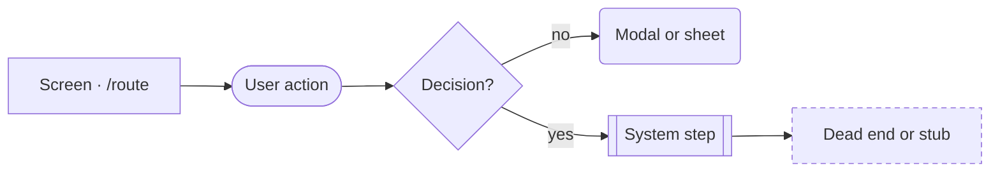
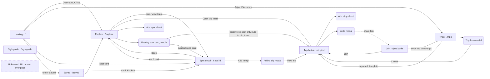
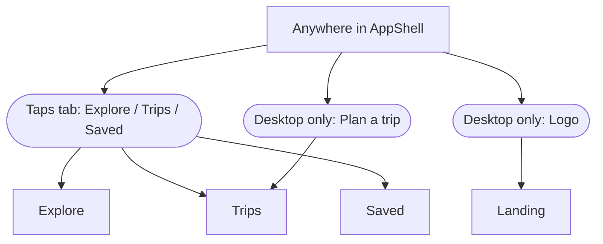
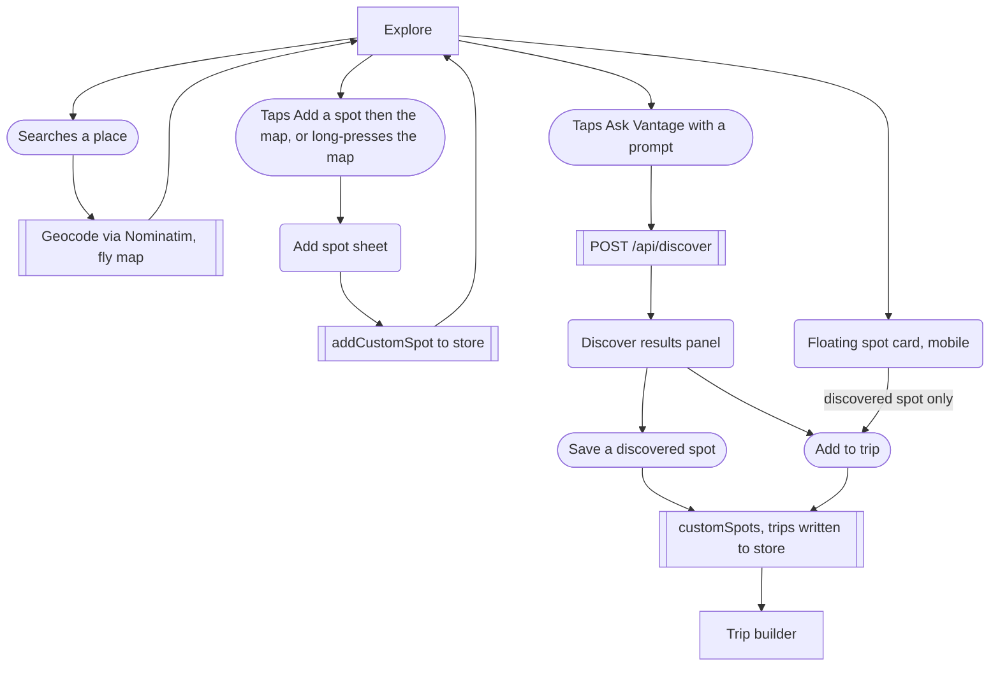

# 00 · App map

## Purpose
Iter is a web prototype that helps photographers find places worth shooting, see when the light will be right (Light Index from sun geometry plus Open-Meteo cloud forecasts), and turn spots into a shareable multi-day road trip. This page is the whole-app overview: how screens connect, what each one is for, and which cross-flow issues a designer should look at first. Per-flow briefs are listed in the Brief index.

Note: the product is being renamed Iter; the build still says "Vantage" in many places (listed under Tweak points).

## Legend

Mermaid shape vocabulary used in every brief:

| Shape | Meaning |
|---|---|
| Rectangle | Screen or route |
| Rounded | Modal, sheet, popover or overlay card |
| Stadium | User action (tap, type, submit) |
| Rhombus | Decision |
| Subroutine (double border) | System or background step: API call, store write, timer |
| Dashed outline (`:::gap`) | Dead end, stub, or gap |

## Global navigation

Source: `src/components/layout/AppShell.tsx`. Routes: `src/main.tsx:26-39`.

- **Landing is outside the shell.** `/` renders `Landing` with its own fixed nav (`src/main.tsx:27`, `src/components/landing/LandingNav.tsx`): Logo, `Explore` and `Trips` links (from 640px up) and an `Open app` button to `/explore`. No tab bar. See brief 01.
- **`/styleguide` is outside the shell** (`src/main.tsx:28`) and not linked from anywhere in the app (grep finds no link to it). Its document title is `Design system · Vantage` (`src/pages/Styleguide.tsx:757`).
- **Everything else is inside AppShell** (`src/main.tsx:30-38`): `/explore`, `/spot/:id`, `/trips`, `/trip/:id`, `/join/:code`, `/saved`. `AppShell` (`AppShell.tsx:95-108`) is a column: top bar, `<main>` with the routed page, tab bar.
- **Desktop (768px and up, Tailwind `md`)**: sticky top bar of 72px (`AppShell.tsx:20-23,39`). Left, **Logo** linking to `/`, which goes back to the marketing page (`Logo.tsx:26`). Centre, tab pills `Explore`, `Trips`, `Saved` (`AppShell.tsx:9-13,41-45`), active state from the router (`NavLinkItem.tsx`). Right, **Plan a trip** (outline button, map icon) linking to `/trips` (`:47`; it is the same destination as the Trips tab) and a non-interactive **avatar** showing initials of the local user, default name `You` (`:48`, `src/components/ui/Avatar.tsx:41-48` renders a ``; no menu, no profile, no rename).
- **Mobile (below 768px)**: the top bar is hidden (`hidden md:flex`, `:23`). A fixed bottom tab bar with `Explore`, `Trips`, `Saved` (`:56-79`; `md:hidden`, 64px plus safe area). There is no Logo, no "Plan a trip" and no avatar on mobile, so there is no route back to the landing page from inside the app on a phone.
- **Bottom padding**: non-Explore pages get padding equal to the tab bar height on mobile (`AppShell.tsx:102`). `/explore` opts out because it is a full-screen map (mobile `fixed inset-0`, `src/pages/Explore.tsx:310`).
- **Active tab highlighting** uses React Router `NavLink` matching, so `/spot/:id`, `/trip/:id` and `/join/:code` highlight no tab at all, even though a spot is conceptually under Explore and a trip under Trips.
- **Scroll**: no `ScrollRestoration` anywhere in `src`; only Spot scrolls to top on id change (`src/pages/Spot.tsx:68`).
- **Unknown URLs** have no route (see the inventory row) and so also have no shell.

## Master flowchart

Main screen transitions. Edges from AppShell tabs (Explore / Trips / Saved reachable from any shell screen) are omitted to stay legible.

Global navigation reachable from every shell screen.

Explore overlays and the writes they cause.

## Screen inventory

| Route | Screen | Purpose | Entry points | Exits | Key components |
|---|---|---|---|---|---|
| `/` | Landing | Marketing page with live "Tonight's light" cards and a hero search | Direct URL; Logo (desktop shell, landing nav and footer); shell-less | `/explore` (nav Open app, Explore, See all spots, Explore spots, hero search), `/trips` (nav Trips, Plan a trip, footer), `/saved` (footer), `/spot/:id` (cards), external Open-Meteo and OSM | `src/pages/Landing.tsx`, `src/components/landing/*`, `SpotCard` |
| `/explore` | Explore, browse mode | Map plus results list; filter by text, category, light, hidden gems, sort; pick a date; area search | Tabs; Landing CTAs; empty states in Saved, Trips, Spot-not-found; toasts' links | `/spot/:id` (card), toast links to `/spot/:id` and `/trip/:id`, Add spot sheet, tab bar | `src/pages/Explore.tsx`, `SpotMap`, `SearchBar`, `FilterBar`, `BrowseResults`, `BottomSheet` (mobile) |
| `/explore` | Explore, discover mode | "Ask Vantage" AI/web scouting for a natural-language prompt; results shown as cards on map and list; save or add to trip | Same route; search bar submit via `runDiscover`; "scout" prompt from empty results (`Explore.tsx:147-150`) | Save to customSpots, Add to trip (creates or uses the active trip), `/spot/:id` (View), `/trip/:id` (toast Open trip), close back to browse | `DiscoverPanel`, `DiscoverCard`, `useDiscover`, `/api/discover` |
| `/spot/:id` | Spot detail | One spot: photo, about, 7-day light timeline, Light Index, sun/moon arc, hourly weather, nearby spots, save, add to trip, directions | Spot cards (Landing, Explore, Saved, nearby tiles); toast View; DiscoverCard link | Back (history back, else `/explore`, `Spot.tsx:105`), `/explore` (Spot not found button), nearby spot tiles, Add to trip modal then `/trip/:id`, external directions and Wikipedia | `src/pages/Spot.tsx`, `DateStrip`, `LightTimeline`, `SpotActions`, `AddToTripModal` |
| `/trips` | Trips list | List of local trips; create from scratch or from templates | Tabs; Plan a trip; Landing CTAs; Join/TripBuilder error buttons | `/trip/:id` (card, template, after create), `/explore` (empty-state Browse spots), Trip form modal | `src/pages/Trips.tsx`, `TripCard`, `TripFormModal`, `TripEmptyState`, template row |
| `/trip/:id` | Trip builder | Day-by-day itinerary with drive times, map, stops, members; syncs to server | Trips list; toast Open trip; Join; Add to trip modal View trip | `/trips` (All trips, desktop; Back to trips when not found), `/explore` (empty-state Explore spots), Add stop sheet, Invite modal, Trip form modal (edit) | `src/pages/TripBuilder.tsx`, `StopCard`, `TripMap`, `AddStopSheet`, `InviteModal`, `src/lib/sync.ts`, `src/lib/routing.ts` |
| `/join/:code` | Join shared trip | Open an invite link, preview the trip, enter a display name and join | Invite link shared from Invite modal (external) | `/trip/:id` (Join, or Open on this device), `/trips` (Go to my trips) | `src/pages/Join.tsx`, `JoinInviteCard`, `fetchSharedTrip` |
| `/saved` | Saved | Bookmarked curated spots plus the user's custom (added or AI-saved) spots | Tab; Landing footer | `/explore` (Explore buttons in empty state), `/spot/:id` (cards) | `src/pages/Saved.tsx`, `SpotCard`, `SavedEmptyState` |
| `/styleguide` | Styleguide | Internal design-system reference | Direct URL only; no links | None in-app | `src/pages/Styleguide.tsx`, `src/components/styleguide/*` |
| Unknown URL, e.g. `/foo` | React Router default error page | No catch-all route exists (`src/main.tsx:26-39`), so React Router renders its built-in error element: an `h2` "Unexpected Application Error!" and an `h3` "404 Not Found" on a bare unstyled page, no AppShell, no link back. In a dev build it also prints a "Hey developer" tip (`node_modules/react-router/dist/development/chunk-OB3PAWPO.mjs:6208-6210`). In production the Worker still serves `index.html` for the path (`wrangler.jsonc:10`), so the SPA boots and shows this error | Mistyped URL, stale link, old share link | Browser back only | None (framework default) |
| Overlay | Add spot sheet | Form to save a custom spot at a chosen map point | Explore: `+` / Add a spot (pick mode) then a map click in pick mode, or right-click / long-press (`Explore.tsx:175,192,238`, `src/components/map/SpotMap.tsx:128,135`) | Saved to `customSpots`, closes, toast `Added <name>` with View link | `src/components/explore/AddSpotSheet.tsx:67` (Modal) |
| Overlay | Floating spot card | Mobile-only card replacing the bottom sheet when a marker/spot is selected. For an AI-discovered spot it is a DiscoverCard with Save and Add to trip; for a curated or custom spot it is a plain compact SpotCard with no Save or Add to trip, only a link to the spot page (`FloatingSpotCard.tsx:34-36`) | Explore, mobile (<768px), after selecting a spot (`Explore.tsx:327`) | Close; discovered: Save, Add to trip (toast with Open trip link); curated: tap through to `/spot/:id` | `src/components/explore/FloatingSpotCard.tsx` |
| Overlay | Add to trip modal | Choose a trip (or new), day and session for a spot | Spot detail "Add to trip" (`Spot.tsx:170`) | Added state, "View trip" to `/trip/:id` | `src/components/spot/AddToTripModal.tsx:194` |
| Overlay | Trip form modal | Create (Trips) or edit (Trip builder) name, start date, number of days | Trips "New trip"/"Create your first trip" (`Trips.tsx:87`); Trip builder edit (`TripBuilder.tsx:274`) | Create navigates to `/trip/:id`; edit updates in place | `src/components/trip/TripFormModal.tsx:46` |
| Overlay | Add stop sheet | Pick a spot to add to a day of the trip | Trip builder "Add stop" / "Add a stop" (`TripBuilder.tsx:273`) | Adds stop, closes | `src/components/trip/AddStopSheet.tsx:59` |
| Overlay | Invite modal | Show the share link (copy / native share) and add named members | Trip builder "Invite" (`TripBuilder.tsx:272`) | Copy or share link; closes | `src/components/trip/InviteModal.tsx:139` |

## Brief index

1. [01 · First visit: landing page](01-first-visit-landing.md)
2. [02 · Explore: browse and map](02-explore-browse-map.md)
3. [03 · AI discover](03-ai-discover.md)
4. [04 · Add a custom spot](04-add-custom-spot.md)
5. [05 · Spot detail](05-spot-detail.md)
6. [06 · Trips list and create](06-trips-list-and-create.md)
7. [07 · Trip builder](07-trip-builder.md)
8. [08 · Invite and sync](08-invite-and-sync.md)
9. [09 · Join a shared trip](09-join-shared-trip.md)
10. [10 · Saved and returning visitors](10-saved-and-returning.md)
11. [11 · System and edge states](11-system-and-edge-states.md)

## Data at a glance

| Store | What | Source |
|---|---|---|
| **Zustand, persisted to localStorage `vantage.v1`** | `user` (`id`, `name` default `You`, `color`), `customSpots`, `savedSpotIds`, `trips`, `activeTripId` | `src/store/index.ts:34-35,112` |
| **Component state (lost on navigation)** | Explore filters, date, mode, selected spot, area, toast; hero search fields; Join name input; modal open/close | `src/pages/Explore.tsx:43-53`, `HeroSearchCard.tsx:92-95` |
| **In-memory module caches (per tab session)** | Forecast per lat/lng; Wikipedia summaries; geocoder and OSRM results | `src/lib/weather.ts:3`, `src/lib/wiki.ts:15-18` |
| **Cloudflare KV `TRIPS`** | Shared trips under `/api/trips/:code`, 90-day TTL; the server keeps whichever PUT arrives last, and the client only pulls a remote copy whose `updatedAt` is newer than its own | `worker/trips.ts:38`, `src/lib/sync.ts:34,53,72` |
| **Worker `/api/discover` (Workers AI + web)** | AI/web spot scouting; combines Wikipedia geosearch, Nominatim, Open-Meteo sunrise and `env.AI` | `src/lib/discover.ts:26`, `worker/discover.ts:139-187,356` |

External APIs, by `fetch` URL in `src/lib`:

| API | Used for | Source |
|---|---|---|
| Open-Meteo `api.open-meteo.com/v1/forecast` | 7-day hourly and daily forecast for Light Index and weather strips | `src/lib/weather.ts:13` |
| Wikipedia REST summary `en.wikipedia.org/api/rest_v1/page/summary/...` | Spot photo, extract, link | `src/lib/wiki.ts:18`, `src/lib/discover.ts:113` |
| Wikipedia action API `en.wikipedia.org/w/api.php` | Wiki search and geosearch | `src/lib/wiki.ts:51`, `src/lib/discover.ts:102` |
| Nominatim `nominatim.openstreetmap.org` | Place search and reverse geocoding | `src/lib/geocode.ts:13` |
| OSRM `router.project-osrm.org/route/v1/driving/` | Drive time and route geometry between stops | `src/lib/routing.ts:19` |
| CARTO Positron style `basemaps.cartocdn.com/gl/positron-gl-style/style.json` | Map tiles (MapLibre) | `src/components/map/SpotMap.tsx:47` |
| Wikimedia Commons | Hero and curated spot images (hard-coded URLs) | `src/components/landing/Hero.tsx:11`, `src/data/spots.ts` |
| Google Fonts | Archivo and Roboto Serif | `index.html:11` |

Local-only vs shared: everything except a trip that has been opened in the builder (which is PUT to KV, see brief 08) exists only in the user's browser. There are no accounts; identity is a random id plus a display name in localStorage.

## Tweak points

App-wide only; per-screen items are in the individual briefs.

**Friction**
- Mobile has no way back to the landing page and no "Plan a trip" shortcut; both are desktop-only (`AppShell.tsx:23,40,47`).
- "Plan a trip" and the Trips tab go to the same place side by side on desktop (`AppShell.tsx:12,47`); pick one primary action or make "Plan a trip" open the New trip modal directly.
- No tab is highlighted on `/spot/:id`, `/trip/:id` or `/join/:code`; the user loses their place in the nav (`NavLinkItem.tsx:28`, `AppShell.tsx:41`).
- No scroll reset between routes except Spot (`Spot.tsx:68`); no `ScrollRestoration` in the router (`main.tsx:26-39`).

**Dead ends**
- Unknown URL shows React Router's unstyled default error page with no navigation back (`main.tsx:26-39`, no `errorElement`, no `path: '*'`).
- The avatar is a non-interactive circle; the display name can only be changed inside a trip's Invite modal ("Your name") or on the Join screen (`AppShell.tsx:48`, `src/components/trip/InviteModal.tsx:125`, `src/pages/Join.tsx:53`). There is no profile or settings screen.
- `/styleguide` is unlinked, which is fine for an internal page but means it is not obvious it exists or that it ships to production (`main.tsx:28`).

**Missing states**
- No global offline or API-failure indicator; each screen swallows or hides network failures individually (forecasts, Wikipedia, routing). See brief 11.
- Route-level lazy loading shows a bare spinner (`main.tsx:15-22`); `RouteFallback` in `AppShell.tsx:84` exists but is not used (a code comment requests the swap).

**Inconsistencies**
- Rename leftovers (visible text that says "Vantage"): page titles `Vantage — Road trips planned around the light` (`src/pages/Landing.tsx:15`, `index.html:7`), `<spot> · Vantage` and fallback `Vantage` (`src/pages/Spot.tsx:69`), `Design system · Vantage` (`src/pages/Styleguide.tsx:757`); Logo wordmark (`src/components/ui/Logo.tsx:23`); hero copy (`src/components/landing/Hero.tsx:53`); "Ask Vantage" button/label/panel (`src/components/explore/SearchBar.tsx:103,107,143`, `DiscoverPanel.tsx:53`, `ScoutPromoCard.tsx:13`, mobile sheet header `src/pages/Explore.tsx:303`); empty-state copy `Let Vantage scout ...` (`BrowseResults.tsx:58`); saved-note text `Why Vantage suggested it: ...` stored in user spots (`useSpotActions.ts:13`); Saved subtitle `Places you found and added to Vantage.` (`Saved.tsx:54`); native share text and hint (`InviteModal.tsx:120,186`); localStorage key `vantage.v1` and sessionStorage `vantage.reloaded` (`store/index.ts:112`, `main.tsx:45`, not user-visible).
- Two "saved" concepts: the bookmark toggles `savedSpotIds` while "Save" on a discovered spot writes `customSpots`; Saved page shows both under different headings, and the Explore toast says `Saved <name> to your spots` for the latter (`Explore.tsx:163`, `Saved.tsx:37-58`).
- The desktop shell has a top bar but the mobile Explore screen is full-bleed with its own floating controls; Trips and Saved use the shell padding and fade-up, so the three tabs feel like different apps on a phone (`AppShell.tsx:98-102`, `Explore.tsx:310`).
- Landing nav and app nav are separate implementations with different heights (64/72px vs 72px), button treatments and active logic (`LandingNav.tsx:45`, `AppShell.tsx:20`).

**Open design questions**
- Should returning users with trips or saved spots skip or shortcut the landing page? `/` always shows marketing (`main.tsx:27`); see brief 10.
- Trips exist only on the device unless shared; there are no accounts. Is the avatar meant to become an account/profile control (`AppShell.tsx:48`)?
- Should the hero search on Landing drive Explore (read `q`, `date`, `light`)? Currently it is ignored (`HeroSearchCard.tsx:103`, `Explore.tsx:43-49`); see brief 01.
