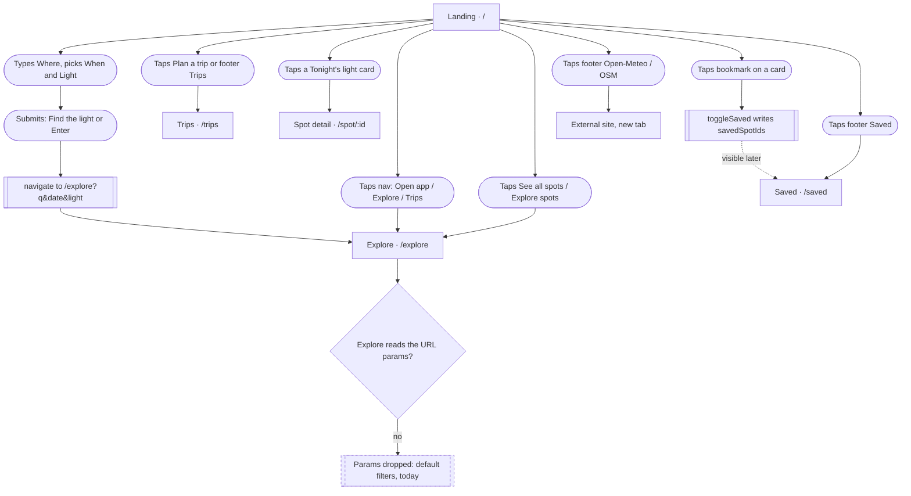
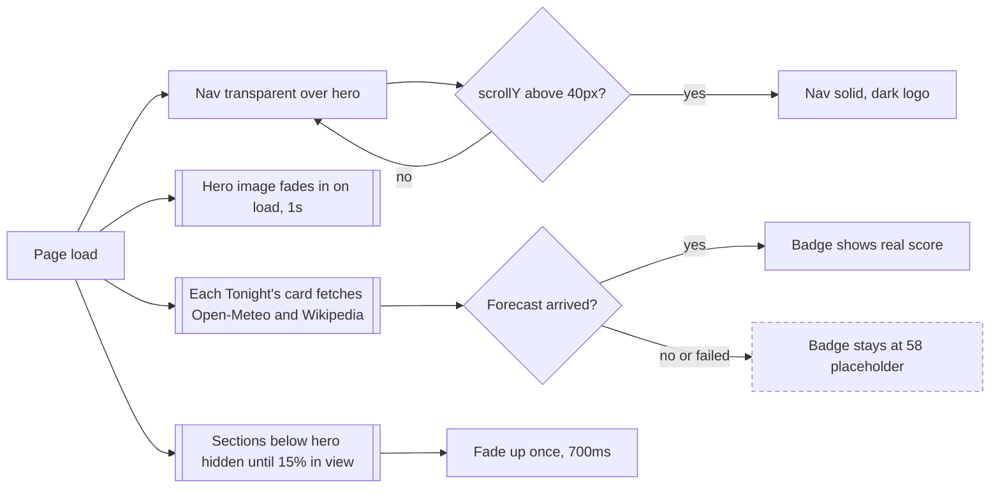

# 01 · First visit: landing page

> A first-time visitor lands on `/`, scrolls a marketing page with a live "Tonight's light" demo, and leaves for the app through any of about ten links, none of which carry the search they may have typed.

## Goal
Understand what Iter is, see proof that the light scoring is real, and get into the app (Explore or Trips). The hero "Where / When / Light" search is the primary promise of the page; this brief documents what it actually does.

## Entry points
- Direct visit to `/` (route outside AppShell): `src/main.tsx:27`.
- The Logo wordmark in any shell or landing header links to `/`: `src/components/ui/Logo.tsx:26` (used in `src/components/layout/AppShell.tsx:40`, `src/components/landing/LandingNav.tsx:46`, `src/components/landing/LandingFooter.tsx:18`).
- Production deep links to unknown paths are served `index.html` (`wrangler.jsonc:10`, `not_found_handling: single-page-application`), so landing is not the fallback for unknown URLs; see brief 11.

## Preconditions
- None required. No store state is read to render the page, except that each Tonight's-light card reads `savedSpotIds` to draw its bookmark (`src/components/SpotCard.tsx:89`).
- Network is needed for the hero photo (Wikimedia), the card photos (Wikipedia or Wikimedia), the cloud forecast (Open-Meteo) and the Google Fonts stylesheet (`index.html:11`).
- Document title is set on mount to `Vantage — Road trips planned around the light` and restored on unmount: `src/pages/Landing.tsx:14-16`. The same string is the static title in `index.html:7`. (Rename leftover.)

## Flow

Every exit from the landing page. The hero search is the only control that builds a URL with data, and Explore discards it.

Scroll and data behaviours that change what is visible.

## Walkthrough

1. **Landing page shell** · `/` · `src/pages/Landing.tsx:18-30`
   Renders, in order: LandingNav, then `<main>` with Hero, HowItWorks, TonightsLight, FeatureBento, DeviceMock, FinalCtaSection, then LandingFooter. The root is `overflow-x-hidden` (`:19`). There is no AppShell, so no tab bar or app top bar.

2. **LandingNav** · `src/components/landing/LandingNav.tsx:39-58`
   - Fixed to the top (`:15`, default `position: fixed`), `z-50`, with safe-area top padding.
   - Transparent (white text, over the hero photo) until `window.scrollY > 40` (`SOLID_AFTER`, `:13`; logic `:41`; scroll hook `src/components/landing/useReveal.ts:37-47`). After that it becomes `bg-surface-base/85` with blur and a bottom hairline, and the logo and links switch to dark.
   - Left: **Logo** (`:46`), links to `/`. Tapping it on the landing page is a link to the current URL, so nothing visibly happens; it does not scroll to top (no scroll handling in the repo beyond Spot and Explore).
   - Centre links **Explore** (`/explore`) and **Trips** (`/trips`) (`:11`, rendered `:47-51`). Their `active` is hard-coded `false`, so they never show a selected state.
   - Right: **Open app** with arrow, primary button to `/explore` (`:52-54`). Over the hero it uses a white fill with ink text (`INVERSE_BUTTON`, `:30`); once solid it uses the primary button style.
   - Mobile (<640px, the `sm:` breakpoint): the centre links are `hidden sm:flex` (`:47`); only Logo and Open app remain. Desktop (640px and up): all three. Bar height is 64px, and `md:h-nav-desktop` (72px) from 768px (`:45`).

3. **Hero** · `src/components/landing/Hero.tsx:25-67`
   - Full-bleed Yosemite "Tunnel View" photo (`:11-14`, `srcSet` 960w and 1920w) with a dark gradient scrim. It is invisible (`opacity-0`) until `onLoad` fires, then fades in over 1s (`:37-39`). If the image fails to load it stays hidden and the hero shows the plain dark `bg-surface-inverse` (`:30`).
   - Parallax: the photo translates down at 28% of scroll and zooms slightly, capped at 900px of scroll (`:17`, applied `:31`).
   - Eyebrow pill: `Prototype · For photographers who chase light` (`:48`).
   - Headline `Road trips, planned around the light.` with "light." in a gold gradient (`:49-51`). The line break after "planned" only appears from 640px up (`hidden sm:block`).
   - Body copy: "Vantage finds the places worth shooting, tells you exactly when the light will be right, and turns it into a road trip your friends can join." (`:53`; rename leftover).
   - Three ticks below the search card: `Real sun & moon math`, `Live cloud forecasts`, `AI location scouting` (`:19-23`, `:59-63`). They are plain text, not links.
   - Photo credit `Tunnel View, Yosemite · Photo: Diliff / Wikimedia Commons, CC BY-SA`, shown from 768px up only (`:66`).
   - Layout: Mobile (<768px) content is bottom-anchored (`justify-end`) with the display-lg headline. Desktop (768px and up) content is vertically centred with the display-2xl headline, and the section height is capped at the 5xl container width (`:30`, `:46`).
   - Hero text and card use the CSS `fade-up` animation (not `Reveal`), staggered by 0 / 120 / 250ms (`:47`, `:57`, `:59`). Content is visible after the animation; it is disabled under `prefers-reduced-motion` (`src/index.css:523-525`).

4. **HeroSearchCard (Where / When / Light)** · `src/components/landing/HeroSearchCard.tsx:91-141`
   - A `<form role="search">` (`:107-110`). Mobile (<768px): a stacked rounded card with an icon in front of each field. Desktop (768px and up): a single pill with hairline dividers.
   - **Where**: free text input, placeholder `Utah, Big Sur, Eastern Sierra…`, aria-label `Where`, starts empty (`:113`). No autocomplete, no geocoding, no validation.
   - **When**: native `<input type="date">`, default today, `min` today (`:119`). Past dates cannot be picked. Desktop width `md:w-48` (`:118`).
   - **Light**: chip row `Sunrise`, `Sunset`, `Night` (`:9-13`, `:126`); single-select, default `sunset` (`:91`). It cannot be deselected.
   - **Submit**: gold search button (`:130-139`). Mobile shows icon plus the label `Find the light`; desktop shows only the magnifier icon in a round button, with aria-label `Search spots`. Pressing Enter in the text field also submits.
   - On submit it builds `q` (only if non-empty after trim), `date` (if set) and `light` (always) and calls `navigate('/explore?q=...&date=...&light=...')` (`:97-104`). No loading state, no feedback; the route changes immediately.
   - **Confirmed: Explore ignores all three params.** A repo-wide search for `useSearchParams` and `location.search` finds no match. Explore initialises `filters` with `DEFAULT_FILTERS` and `dateStr` with `todayStr()` (`src/pages/Explore.tsx:43-44`), and `mode` with `'browse'` (`:49`). The visitor lands on the default map view with an empty search box, today's date and no light filter. See "Not as it looks".

5. **HowItWorks** · `src/components/landing/HowItWorks.tsx:16-30`
   Section `id="how"` (`:18`). Eyebrow `How it works`, heading `From “where?” to the shot in three steps.` Three cards: `01 Find`, `02 Time it`, `03 Go together` (`:7-11`). Static text: no links or buttons. Mobile: one column; from 768px (`md:grid-cols-3`, `:22`) three columns. The cards fade up in sequence, staggered 110ms (`:14`, `:24`). Nothing on the page links to `#how`.

6. **TonightsLight** · `src/components/landing/TonightsLight.tsx:24-55`
   - Eyebrow `Live · <weekday, month day>` built from the browser date and locale (`:27`, `:32`); heading `Tonight’s light`; body claiming the scores are "being calculated right now ... Not a mock-up." (`:35`).
   - Header action **See all spots** (outline button with arrow) goes to `/explore` (`:37-39`).
   - Six curated spots, hard-coded ids `horseshoe-bend, delicate-arch, tunnel-view, bixby-bridge, monument-valley, trona-pinnacles` (`:13`), padded from the curated list if any id is missing (`:19`). The user's custom spots never appear here.
   - Each is a connected `SpotCard` with `dateStr` = today (`:48`). It fetches the 7-day Open-Meteo forecast (`src/lib/hooks.ts:9-19`, `src/lib/weather.ts:9-23`) and the Wikipedia thumbnail (`src/lib/hooks.ts:28-39`).
   - **Tapping the card body** is a React Router `Link` to `/spot/<id>` (`src/components/SpotCard.tsx:82`): the visitor leaves for the Spot detail screen inside AppShell. No `onClick` is passed here, so the card is never a button.
   - **Tapping the bookmark** (top-right of the photo, `aria-label` `Save` / `Remove from saved`, `:50-58`) calls `preventDefault` and `stopPropagation`, so it does not navigate. It calls `toggleSaved(spot.id)` (`:98`), which prepends or removes the id in `savedSpotIds` (`src/store/index.ts:45-47`), persisted to localStorage. The icon fills when saved. There is no toast, no sign-in and no confirmation; the saved spot shows up on `/saved`.
   - Light badge (bottom-left of photo): `LightBadge` with score and label (`:60`). While the forecast is loading it shows a placeholder score of 58 ("No forecast yet — scored on sun geometry only", `src/lib/light.ts:53`) and updates when data arrives. If the forecast request fails the error is swallowed (`src/lib/hooks.ts:15`) and the 58 stays.
   - Photo: skeleton while the Wikipedia summary is resolving, then the image; gradient plus category icon as fallback (`src/components/explore/SpotImage.tsx:39-50`).
   - Under the cards: legend `Light Index 0–100` with Epic / Great / Good / Fair / Poor dots (`src/components/landing/LightIndexLegend.tsx:10-15`). Not interactive.
   - Mobile (<640px): a horizontal swipe rail with scroll-snap, cards at 80% width so the next one peeks (`:44-45`, `:47`). 640px and up: a 2-column grid; 1024px and up: 3 columns.
   - Fires up to 12 network requests on page load (6 forecasts, 6 Wikipedia summaries) as soon as the page renders, even though the section is far below the fold; the fetch is not tied to visibility.

7. **FeatureBento** · `src/components/landing/FeatureBento.tsx:27-40`
   Eyebrow `What’s inside`, heading `Everything a light-chaser checks at 4am, in one place.` Six tiles (`:11-25`): `Light Index`, `Sun & moon arcs`, `Cloud layers`, `Hidden gems via AI + web`, `Trip builder with drive times`, `Invite friends`. Each has an illustration (`Illustrations.tsx`) and body text. The tiles are `<article>` elements with no link or click handler (`src/components/landing/FeatureCard.tsx:107`). Mobile: stacked single column; 768px and up: a 6-column bento (`md:grid-cols-6`, `:33`) with spans 4/2, 2/4, 3/3. Tiles fade up on scroll with an 80ms offset on some (`:35`).

8. **DeviceMock (Coming to iPhone)** · `src/components/landing/DeviceMock.tsx:16-33`, `PhoneMock.tsx:15-85`
   Pill `Coming soon · iPhone & Mac`, heading `Built for the pocket you shoot from.`, body "This web prototype is the proof. The native app ..." and three feature rows: `Apple MapKit, natively`, `Live Activities for golden hour`, `Shortcuts & Siri` (`:9-13`). The phone is a static illustration (`aria-hidden`, `PhoneMock.tsx:17`): "Moab loop" Day 2 with four hard-coded stops and a fake `Golden · 38m` Dynamic Island, and a three-tab bar (Explore / Trips / Saved) that is not interactive. No waitlist, no "notify me" and no App Store link: the section is purely informational. Mobile: phone below the text (`order-2`); 768px and up: phone on the left, two columns (`:18-20`).

9. **FinalCta** · `src/components/landing/FinalCta.tsx:20-53`
   Dark panel `The light won’t wait. Neither should you.` with body `Open the map, pick a weekend, and see where it’s going to be good.` Two buttons: **Explore spots** (arrow) to `/explore` (`:34`) and **Plan a trip** to `/trips` (`:37`). Mobile: buttons stacked; 640px and up: side by side (`:33`). "pick a weekend" is copy only; no date control is on this panel.

10. **LandingFooter** · `src/components/landing/LandingFooter.tsx:13-28`
    Logo (links to `/`), line `Prototype · Built on Cloudflare · Data from Open-Meteo, Wikipedia, OSM` (`:19`), and links (`:4-10`): `Explore` `/explore`, `Trips` `/trips`, `Saved` `/saved` (React Router links) plus `Open-Meteo` (https://open-meteo.com/) and `© OpenStreetMap` (https://www.openstreetmap.org/copyright) as external anchors with `target="_blank"` and `rel="noreferrer"` (`:24`). Mobile: stacked; 768px and up: logo left, links right.

11. **Destination: Explore** · `/explore` · `src/pages/Explore.tsx`
    All of "Open app", nav "Explore", "See all spots", "Explore spots", footer "Explore" and the hero search land here. The visitor sees the default map with all spots and today's date; no hint of what they typed on the landing page. Continue in brief 02.

## Link and CTA index

| Control | Location | Destination | Source |
|---|---|---|---|
| Logo (nav) | Nav, left | `/` (no-op on this page) | `LandingNav.tsx:46`, `ui/Logo.tsx:26` |
| Explore | Nav, centre (640px and up) | `/explore` | `LandingNav.tsx:11` |
| Trips | Nav, centre (640px and up) | `/trips` | `LandingNav.tsx:11` |
| Open app | Nav, right | `/explore` | `LandingNav.tsx:52` |
| Search submit (Find the light) | Hero | `/explore?q&date&light` (params ignored) | `HeroSearchCard.tsx:103` |
| See all spots | Tonight's light header | `/explore` | `TonightsLight.tsx:37` |
| Spot card (x6) | Tonight's light | `/spot/<id>` | `SpotCard.tsx:82` |
| Bookmark (x6) | Tonight's light cards | No navigation; toggles saved | `SpotCard.tsx:56` |
| Explore spots | Final CTA | `/explore` | `FinalCta.tsx:34` |
| Plan a trip | Final CTA | `/trips` | `FinalCta.tsx:37` |
| Logo (footer) | Footer | `/` | `LandingFooter.tsx:18` |
| Explore / Trips / Saved | Footer | `/explore`, `/trips`, `/saved` | `LandingFooter.tsx:5-7` |
| Open-Meteo | Footer | external, new tab | `LandingFooter.tsx:8` |
| © OpenStreetMap | Footer | external, new tab | `LandingFooter.tsx:9` |

## Screen states

| Screen / section | Empty | Loading | Error | Offline / timeout | Success |
|---|---|---|---|---|---|
| Hero photo | n/a | Hidden (`opacity-0`) until `onLoad`, dark panel behind (`Hero.tsx:30,39`) | No handler: stays dark; headline still legible via scrim | Same as error | Fades in over 1s |
| Hero search | Empty Where is allowed; `q` is just omitted (`HeroSearchCard.tsx:100`) | None; navigates immediately | No validation or error states | Not applicable (no request) | Route change to `/explore?...` |
| Tonight's light cards | Never empty (6 curated, padded from list) | Photo skeleton; badge shows 58 placeholder until forecast lands | Forecast error swallowed (`hooks.ts:15`); badge stays at 58, no message | Same as error; photo falls back to gradient and category icon | Real score, photo, "Best at ..." line |
| Bookmark | n/a | None | Not handled | Local write, works offline | Icon fills, `aria-pressed` true; no toast |
| Reveal sections | n/a | Content hidden at `opacity-0`, shifted 24px down until in view (`useReveal.ts:33`) | Without `IntersectionObserver` or with reduced motion it reveals immediately (`:16`) | n/a | Fades up once, 700ms |
| Nav | n/a | n/a | n/a | n/a | Transparent to solid at scrollY above 40 |
| PhoneMock, bento, how-it-works | Static | None | None | None | Static content |

## Data

| Data | Read / write | Where it lives | Notes |
|---|---|---|---|
| Hero search `q`, `date`, `light` | Write (URL only) | Component state in `HeroSearchCard`, then the URL query | Never read back; lost on navigation |
| Curated spots (6 shown) | Read | `src/data/spots.ts` (bundled) | Ids listed at `TonightsLight.tsx:13` |
| 7-day forecast per spot | Read | Open-Meteo, cached per lat/lng in module memory for the session (`weather.ts:3-12`) | Failure silently ignored |
| Spot thumbnail and summary | Read | Wikipedia REST summary, cached in memory (`wiki.ts:15-18`) | 404 returns null, fallback art |
| `savedSpotIds` | Read and write | Zustand store, localStorage `vantage.v1` | Toggled from the card bookmark (`store/index.ts:45`) |
| Scroll position | Read | `window.scrollY` via `useScrollY` | Drives nav and hero parallax |
| Hero photo | Read | Wikimedia Commons CDN | Hard-coded URL (`Hero.tsx:11-14`) |
| Fonts | Read | Google Fonts (`index.html:11`) | Layout may shift on slow loads |

## Not as it looks
- **The hero search does nothing with its input.** "Where / When / Light" navigate to `/explore?q=...&date=...&light=...` (`HeroSearchCard.tsx:103`) but Explore never reads URL params (no `useSearchParams` anywhere in `src`). The typed place, chosen date and chosen light are discarded.
- **"Tonight's light" is live only for today, in the browser's locale.** The label uses the visitor's local date (`TonightsLight.tsx:27`) while each card scores that date in the spot's own timezone, so for a visitor far from the spot the "tonight" can differ.
- **"Not a mock-up" depends on the network.** On forecast failure the cards silently show a flat 58, which reads as a real "Fair/Good" score (`light.ts:53`).
- **Nav links never show active.** `active={false}` (`LandingNav.tsx:49`); harmless on a page that is not one of them.
- **`id="how"` is unused.** No nav link or CTA targets `#how` (`HowItWorks.tsx:18`).
- **Phone mock looks like a real app preview.** Its tabs and stops are not interactive and its data (Moab loop, Mesa Arch Light 91) is hard-coded (`PhoneMock.tsx:6-12`).
- **The "Coming soon" section has no action.** There is no waitlist or store link.
- **"Open app" implies an app separate from the site.** It simply goes to `/explore` (`LandingNav.tsx:52`).

## Tweak points

**Friction**
- Carry the hero search through: read `q`, `date`, `light` in Explore, or remove the Where/When/Light card in favour of a single "Open map" CTA. Today it is the most prominent control and it silently drops input (`HeroSearchCard.tsx:103`, `Explore.tsx:43-49`).
- Hero search has no place suggestions, so "Utah, Big Sur..." is a promise the search cannot keep even if params were read; Explore's own search does geocoding (see brief 02).
- Light chips cannot be cleared (`HeroSearchCard.tsx:126`), and the date picker blocks past dates but offers no range or "this weekend" shortcut, though the final CTA says "pick a weekend" (`FinalCta.tsx:31`).
- Tapping the Logo while on `/` does nothing; consider scroll-to-top (`LandingNav.tsx:46`).
- The mobile nav (<640px) has no Explore/Trips links; only "Open app" (`LandingNav.tsx:47`).
- Six forecast and six Wikipedia requests fire on first paint although the section is below the fold (`TonightsLight.tsx:46-50`); lazy-mount on view.

**Dead ends**
- Bento tiles and "How it works" cards look like cards but link nowhere (`FeatureCard.tsx:107`); each could deep-link to the matching app feature.
- DeviceMock "Coming soon" has no waitlist or notify action (`DeviceMock.tsx:16-33`).

**Missing states**
- No fallback or message if forecasts fail; the 58 placeholder reads as data (`hooks.ts:15`, `light.ts:53`).
- No feedback after bookmarking a card (no toast, no link to Saved), and no hint that bookmarks are device-only (`SpotCard.tsx:98`).
- No error state for the hero photo (`Hero.tsx:32-40`).

**Inconsistencies**
- Rename leftovers: document title and `index.html` title (`Landing.tsx:15`, `index.html:7`), meta description (`index.html:8`), hero body "Vantage finds the places ..." (`Hero.tsx:53`), Logo wordmark "Vantage" in nav and footer (`ui/Logo.tsx:23`).
- Footer says "Prototype · Built on Cloudflare" while the hero pill also says "Prototype" (`Hero.tsx:48`, `LandingFooter.tsx:19`): two prototype disclaimers.
- Footer links Saved but the nav and CTAs do not; "Saved" is a first-class tab in the app (`LandingFooter.tsx:7`).
- Landing uses its own nav and Logo tone logic separate from AppShell, so the wordmark, button style (white inverse) and heights differ between landing and app (`LandingNav.tsx:27-30`, `AppShell.tsx:20`).

**Open design questions**
- Should the landing page be the default route for returning users who already have trips? There is no redirect or "Continue your trip" state (`main.tsx:27`; see brief 10).
- Should the Tonight's-light cards open the Spot page (current) or Explore with the spot selected? Spot detail is inside the app chrome, so the visitor jumps from marketing into the full app mid-scroll (`SpotCard.tsx:82`).
- No `ScrollRestoration` is present in `src`, so returning from a card via Back relies on browser defaults.
