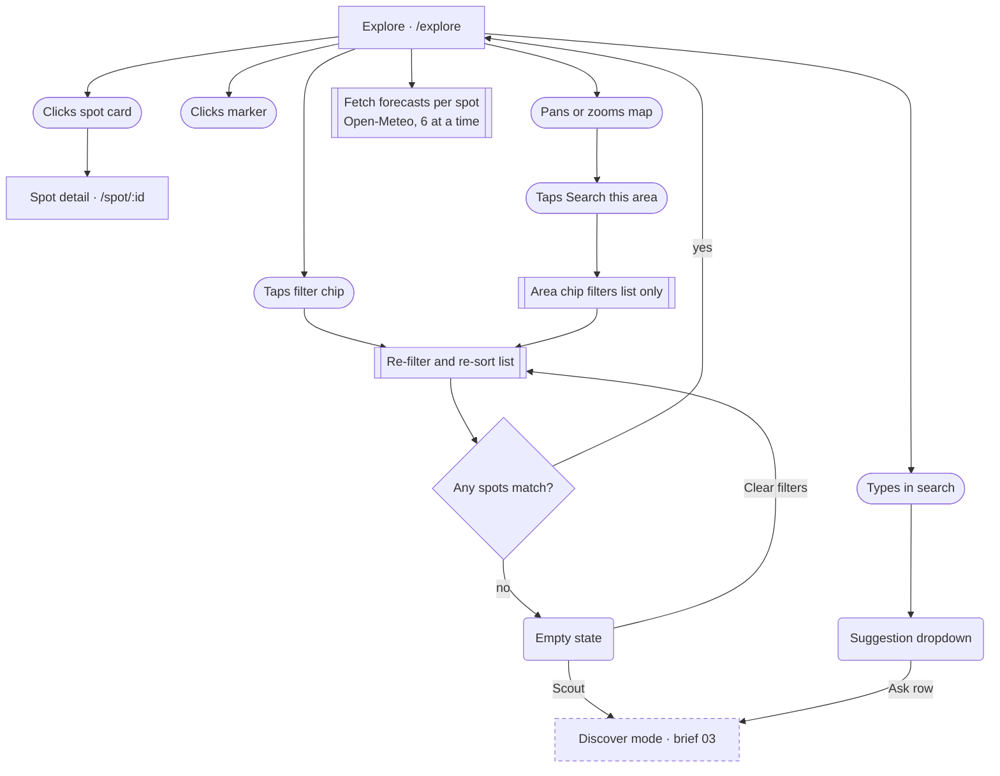
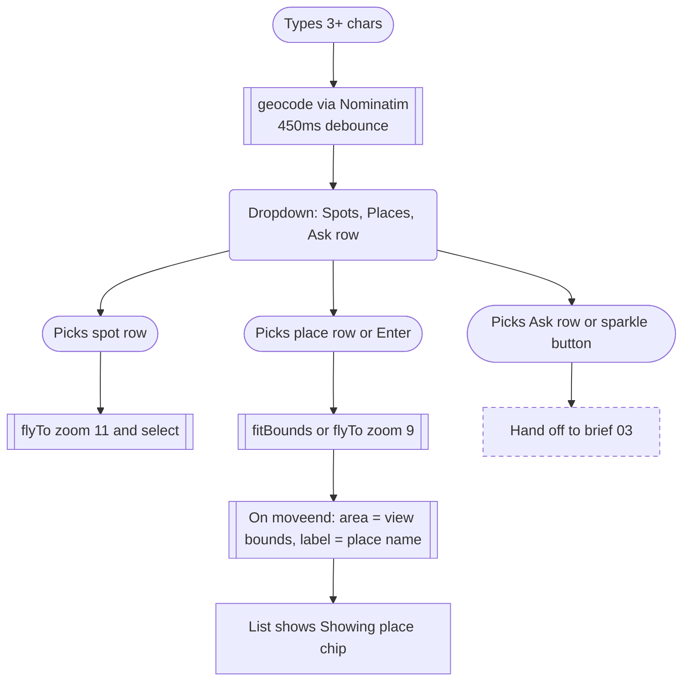
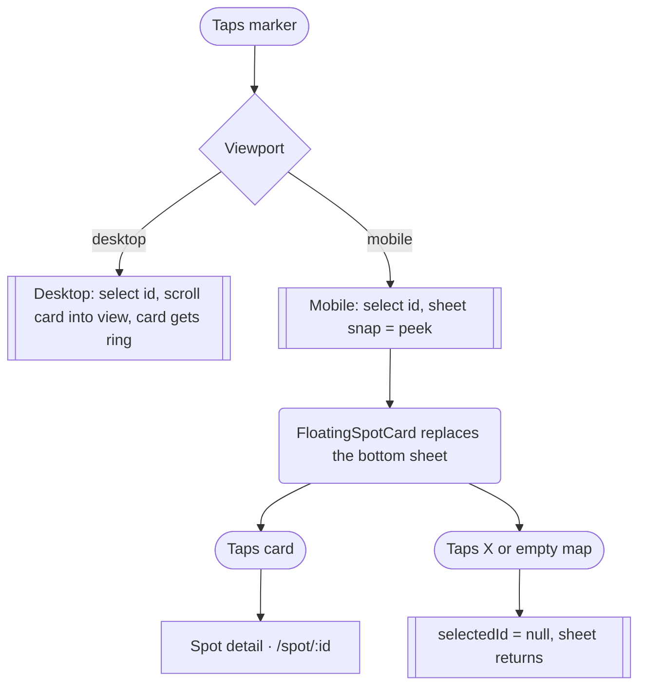

# 02 · Explore: browse the map

> On `/explore` the user scans curated and self-added spots as score pills on a map, narrows them with search and filter chips, and either opens a spot's detail page or (on mobile) previews it in a floating card.

## Goal
Find a photo spot with good light for a chosen day, by panning the map, searching a place or spot name, or filtering by category, light, hidden gems, sort and date.

## Entry points
- Bottom tab "Explore" on mobile, top tab "Explore" on desktop (AppShell, `src/components/layout/AppShell.tsx:9`).
- Landing hero search submits `navigate('/explore?q=&date=&light=')` (`src/components/landing/HeroSearchCard.tsx:103`). Explore ignores all three params (see Not as it looks).
- "Explore spots" / "Explore" links from the Saved page (`src/pages/Saved.tsx:33`, `:47`) and the Spot-not-found screen (`src/pages/Spot.tsx:45`).
- Back from a spot detail page (`src/pages/Spot.tsx:105` uses `navigate(-1)`): Explore remounts with default state.

## Preconditions
- Spots come from `useAllSpots()`: user-added/saved `customSpots` first, then `CURATED_SPOTS` (`src/store/index.ts:117`).
- Layout switch is `useMediaQuery('(min-width: 768px)')` (`src/pages/Explore.tsx:41`). >= 768px is "desktop" (split list + map); below is "mobile" (full-screen map + bottom sheet).
- Network is only needed for: map tiles (Carto Positron, `src/components/map/SpotMap.tsx:47`), Open-Meteo forecasts (Light Index), Wikipedia thumbnails (cards), Nominatim (place search).
- All Explore state is component state (`filters`, `dateStr`, `area`, `selectedId`, `snap`, ...; `src/pages/Explore.tsx:43-53`). Nothing is persisted or put in the URL.
- `mode` is `'browse'` by default (`:49`). This brief covers browse mode only; the AI "discover" mode is brief 03.

## Flow

Overview: search, chips and map movement all feed one filtered list; cards leave the page, the empty state hands off to AI discovery.

Search dropdown paths; the Ask path only starts AI discovery, documented elsewhere.

Marker selection on desktop vs mobile.

## Walkthrough

1. **Explore, first paint** · `/explore` · `src/pages/Explore.tsx:253` (desktop), `:309` (mobile)
   Map starts centred on the US (`[-110, 39]`, zoom 3.4; `src/components/map/SpotMap.tsx:109`). As soon as the first non-empty spot list arrives it fits all spots with max zoom 9, without animation (`SpotMap.tsx:185-189`). Padding keeps pins clear of floating UI (`Explore.tsx:32`, `:34`).
   Every spot's Light Index is computed for the selected date (`useLightScores`, `Explore.tsx:68`): forecasts are fetched per coordinate (rounded to 3 decimals) by 6 parallel workers, flushed to state every 120ms (`src/components/explore/useLightScores.ts:25-42`). Until a forecast lands the marker shows "···" (`src/components/map/MapMarker.tsx:61`) and the summary reads "Reading tonight's light…" (`BrowseResults.tsx:19`). If a fetch fails the key is released for a retry on the next spot-list change (`useLightScores.ts:39`); a failed spot never gets a number on its marker. The list cards behave differently: each `SpotCard` computes its own index through `useLightIndex` (`src/lib/hooks.ts:22-25`), which scores a missing forecast as sun geometry only (a flat 58 per window, `src/lib/light.ts:53`), so a card shows a "Good" badge of roughly 58-64 while loading and keeps it if the forecast fails. The list sort uses the same geometry-only scores until forecasts arrive.

2. **Desktop layout** · `src/pages/Explore.tsx:253-293`
   Left column (46% width, min 440px via `min-w-110`, max `max-w-200`) scrolls: sticky header with SearchBar and FilterBar (stacked, two rows), then a row with ResultsSummary and an outline "Add a spot" button (`:266`), then the optional AreaChip, then a 1-column (2 at `lg`) grid of SpotCards, then the "Not seeing your shot?" promo card. Right: the map in a rounded panel, controls bottom-right, "Search this area" top-centre. A Toast, when shown, is fixed at the bottom of the viewport (`:291`).

3. **Mobile layout** · `src/pages/Explore.tsx:309-361`
   Full-screen map (`fixed inset-0`). Top overlay: floating SearchBar plus a round "Add a spot" icon button (`:317`), and under it a single-row horizontally scrolling filter rail (`:319-323`) that is hidden while the sheet is at `full`. Bottom: draggable BottomSheet above the tab bar, or the FloatingSpotCard if a marker is selected.

4. **Search typing** · `src/components/explore/SearchBar.tsx:66-91`
   Placeholder: "Search spots, tags or anywhere on earth" (desktop) / "Search spots or places" (mobile). Each keystroke updates `filters.text` (`Explore.tsx:212`), which immediately filters both the list and the map markers by name, place, category and tags, all words must match (`filters.ts:43-48`). The dropdown opens when the field is focused and non-empty (`SearchBar.tsx:62`) and closes on outside pointerdown or Escape.
   Dropdown content (`SearchBar.tsx:113-147`):
   - "Spots" label and up to 4 matching spot rows (`:53`). Click: map flies to the spot at zoom 11 and selects it (`Explore.tsx:133-136`). The typed text is NOT cleared, so the list stays filtered by it.
   - "Places" label always shown. With < 3 chars: note "Keep typing to search places". With 3+ chars: "Looking up places…" while the 450ms-debounced Nominatim call runs, then up to 4 place rows, or "No places found" (`:132-137`). Click a place: text cleared, `fitBounds(bbox, 9)` or `flyTo(place, 9)`; after the map settles the view bounds become the Area filter labelled with the place name (`Explore.tsx:125-131`, `:117-123`).
   - Divider and a gold row `Ask Vantage: "<query>"` / "Scout the web + AI for photo spots" (`:139-145`). Click: hands the text to `runDiscover` which switches to discover mode (brief 03). The sparkle button inside the field (`AskButton`, "Ask Vantage" label on desktop, icon-only on mobile) does the same, including with an empty field.
   Enter (`:55-60`): if any spot matches the text, it only closes the dropdown and blurs; otherwise it navigates to the first geocoded place (fetching on demand). If nothing geocodes, nothing happens and there is no message.

5. **Filter chips** · `src/components/explore/FilterBar.tsx`
   - Date menu chip (calendar icon): Today, Tomorrow, then five weekday dates; first two show the date as a hint (`:34`). Chip is highlighted when not today. Changing it re-scores every spot, updates marker numbers, the summary line and each SpotCard's badge (`dateStr` is passed down).
   - Sort menu chip: "Best light" (default), "Most popular", "Nearest to map centre" (chip label shows "Nearest to map centre" with " to map centre" stripped, `:37`). Nearest uses the last `moveend` centre, which is first set by the automatic fit-to-spots when the map loads (`src/components/map/SpotMap.tsx:118-122,185`); without a centre it would fall back to light order (`filters.ts:71`).
   - "Hidden gems" toggle: keeps spots with `popularity < 50` (`filters.ts:64`).
   - Category chips (single-select): All, Landscape, Astro, Coast, Desert, Architecture, Waterfall, Forest, Urban (`filters.ts:18-28`). Clicking the active chip does not deselect; "All" resets.
   - Light chips (multi-select, OR logic): Sunrise, Sunset, Night, Blue hour (`filters.ts:30-35`). Midday and overcast exist in the data but cannot be filtered.
   Menus are portalled to `document.body`, close on outside pointerdown, Escape, resize or choosing an option (`ChipMenu.tsx:38-50`).
   Desktop: category chips on row 1, date/sort/gems/light on row 2 (`FilterBar.tsx:69-74`). Mobile rail order: date, sort, gems, divider, categories, divider, light (`:64`).
   Filters apply to the map markers too (`Explore.tsx:71-76`), except the area filter, which only limits the list.

6. **Results summary** · `src/components/explore/BrowseResults.tsx:12-23`
   Line 1: "N spots" (or "1 spot"), plus " in <area label>". Line 2: coloured dot, "<Light label> light tonight at <best spot name>" using the best READY score in the current list; "tonight" is used whenever the selected date is today, "tomorrow" for tomorrow, otherwise "on <date>" (`Explore.tsx:79-86`). Fallbacks: "Reading tonight's light…" when spots exist but no score is ready; "Nothing matches yet" when empty.

7. **Pan, zoom, "Search this area"** · `src/components/map/SpotMap.tsx:118-124`, `:268-272`
   A user-initiated move end (or zoom button, or locate) sets a dirty flag, which shows a white "Search this area" chip at the top-centre of the map (hidden during pick mode). Click: `setArea({bounds: current view, label: 'this area'})`, dirty cleared (`Explore.tsx:191`). The list then shows only spots inside the view, the summary reads "N spots in this area", and an AreaChip "Showing this area ×" appears (`BrowseResults.tsx:26-37`). Clicking the chip clears the area. Programmatic moves (fly to a spot or place) do not show the chip.
   Zoom +/- and a "Locate me" button sit bottom-right (desktop) or top-right under the filters (mobile) (`MapControls.tsx:16-22`). Locate asks the browser for a position (10s timeout, 5-minute cache); on success it drops a blue dot, flies to zoom 9 and sets dirty; on failure/no API it shows a small in-map note "Couldn't get your location" / "Location isn't available in this browser" for 2.6s (`SpotMap.tsx:221-242`).

8. **Markers** · `src/components/map/MapMarker.tsx:27-65`, `SpotMap.tsx:84-101`
   White pill: category icon, score dot, score number (or "···"). Hover (mouse) enlarges and shows the spot name; selected turns ink-black, larger and shows the name. A collision pass sorts markers by selected > hovered > score > popularity and collapses overlapping lower-priority pills to 14px dots (still clickable). Click on a marker selects it (`SpotMap.tsx:260`); it does not pan the map.
   Desktop: selection scrolls the matching grid card into view (smooth, `block: nearest`) and gives it a ring (`Explore.tsx:112-113`, `BrowseResults.tsx:77`). Hovering a CARD highlights its marker (`BrowseResults.tsx:72-73`); hovering a MARKER sets `hoveredId` but the list card shows no hover state.
   Click on empty map clears the selection (`SpotMap.tsx:125-130`).
   Mobile (<768px): selection sets the sheet snap to `peek` and swaps the BottomSheet for a FloatingSpotCard (see step 10).

9. **Spot cards (list)** · `src/components/SpotCard.tsx:41-105`
   Desktop grid card: photo (Wikipedia thumbnail, skeleton while loading, category icon fallback), top-right bookmark icon button (aria "Save" / "Remove from saved") that toggles `savedSpotIds` without navigating (`:56`), bottom-left LightBadge, name, place, "Best at <light>" with " · hidden gem" when popularity < 50. Clicking anywhere else is a router `Link` to `/spot/:id` (`:82`). `BrowseResults` passes no `onClick`, so the card always leaves Explore. Mobile sheet rows use the compact variant: 80px thumb, name, place, compact LightBadge, no bookmark (`:47`).
   Because the filters are component state, coming back via Back resets filters, area, date, selection and map position.

10. **Mobile BottomSheet** · `src/components/explore/BottomSheet.tsx`
    Three snaps: `peek` = 140px (handle, summary line and a hint of the first row; body does not scroll, `:92`), `half` = 52% of the space above the tab bar, `full` = that space minus a top gap so the floating search stays visible (`:8-21`). Initial snap is `peek` (`Explore.tsx:50`). Tap the handle at peek: goes to half (`:89`). Drag the handle/header: follows the finger, releases to the nearest snap, or one step in the flick direction when velocity > 0.5 px/ms (`:46-77`). Body shows AreaChip, the list, and the promo card. Filter rail is hidden at `full` (`Explore.tsx:319`).

11. **Mobile floating spot card** · `src/components/explore/FloatingSpotCard.tsx`, `Explore.tsx:326-335`
    Shown when a marker or search result is selected and pick mode is off. White rounded card above the tab bar with an X button. For a curated or user spot (the only kind in browse mode) the card is a compact `SpotCard`, a Link to `/spot/:id`; it has NO Save and NO "Add to trip" button (the `onTrip` prop is passed at `:334` but never rendered for non-discovered spots). Tap the X, or tap empty map, to dismiss; the BottomSheet then reappears.
    For discovered (AI/web) spots, which exist only in discover mode, the card is a `DiscoverCard` with "Add to my spots" (saves via `useSpotActions.saveSpot` as a `customSpot`, then Toast "Saved <name> to your spots" + "View" link to `/spot/:id`) and "Add to trip" (uses the active trip, or creates one named after the place; Toast "Added to <trip name>" + "Open trip" link) (`DiscoverCard.tsx:78-88`, `useSpotActions.ts:16-33`, `Explore.tsx:161-168`). Duplicate saves are no-ops returning the existing spot. Details in brief 03.

12. **Empty results** · `src/components/explore/BrowseResults.tsx:52-63`
    When the filtered list is empty (no spots match filters/text/area), an EmptyState replaces the list (and the promo card): icon, title "No spots here yet", body "Let Vantage scout <area label or 'this area'> for photo spots from the web and our model, or loosen your filters." Buttons: gold "Scout <area label or 'this area'>" starts AI discovery (`Explore.tsx:147-150`, brief 03); outline "Clear filters" resets all filters including search text AND the area (`Explore.tsx:174`; the date is not reset). The AreaChip remains above the empty state so the area can also be cleared individually.
    End of a non-empty list: the "Not seeing your shot?" promo card with "Ask" (same as Scout) and "Add" (starts add-spot pick mode, brief 04) (`ScoutPromoCard.tsx:12-17`).

13. **Toast** · `src/components/ui/Toast.tsx`, `Explore.tsx:95-100`
    Dark pill at bottom-centre, auto-dismisses after 3600ms, optional link pill, message truncated at 56vw. Used in browse flow only for add-spot and the discover actions. Mobile offset lifts it above the tab bar and either the floating card or the peeked sheet (`Explore.tsx:360`).

## Screen states

| Screen | Empty | Loading | Error | Offline / timeout | Success |
|---|---|---|---|---|---|
| Spot list | "No spots here yet" EmptyState with Scout + Clear filters (`BrowseResults.tsx:52`) | Cards render immediately; thumbnails are skeletons (`SpotCard.tsx:46`); summary "Reading tonight's light…" and markers "···" until forecasts land, while list cards already show a geometry-only badge (about 58) | No error UI. Failed forecasts leave the marker at "···" while the list card keeps a geometry-only "Good" badge (about 58) that looks like real data (`src/lib/light.ts:53`) | No offline UI; forecast/wiki fetches silently fail | Cards with LightBadge, summary names the best spot |
| Map | Always has curated spots; with zero filtered spots the map is just empty | Blank grey (`bg-surface-muted`) until tiles load | Tile/style failure: not handled | Tiles do not load; markers still render over blank map | Pills/dots, controls |
| Search dropdown | n/a (only opens with text) | "Looking up places…" (`SearchBar.tsx:132`) | Geocode errors are swallowed and become "No places found" (`geocode.ts:37`) | Same as error | Spot and place rows |
| Place search via Enter | n/a | None (no spinner) | No message if nothing found | Silent | Map flies; area chip appears |
| Locate | n/a | Locate button shows loading (`MapControls.tsx:21`) | In-map note "Couldn't get your location" | 10s timeout then same note (`SpotMap.tsx:239`) | Blue dot + fly to zoom 9 |
| Filter menus | n/a | n/a | n/a | n/a | Chip label/highlight updates |
| Bottom sheet / floating card | Sheet always present on mobile | n/a | n/a | n/a | See steps 10-11 |

## Data

| Data | Read / write | Where it lives | Notes |
|---|---|---|---|
| Curated spots | Read | `src/data/spots.ts` bundled | Via `useAllSpots` (`store/index.ts:117`) |
| Custom spots (user-added, saved AI spots) | Read | zustand `customSpots`, localStorage `vantage.v1` | Appear on map and list like curated spots |
| Saved bookmarks | Read / write | zustand `savedSpotIds`, `vantage.v1` | `toggleSaved` from SpotCard bookmark (desktop grid only) |
| filters, dateStr, area, selectedId, hoveredId, snap, pickMode, toast, mode | Read / write | Explore component state | Lost on navigation; not in URL (`Explore.tsx:43-53`) |
| Map centre / view bounds | Read | SpotMap -> Explore `center`, `area` | Used for "Nearest" sort and area filter |
| Forecasts | Read | Open-Meteo via `fetchForecast`, in-memory cache per coordinate | Shared with SpotCard's `useLightIndex` |
| Light Index per spot | Computed | `computeLightIndex` in `useLightScores` | Recomputed on date change |
| Place search results | Read | Nominatim `/search`, in-memory cache (`geocode.ts:14`) | 450ms debounce, min 3 chars |
| Thumbnails | Read | Wikipedia via `useSpotMedia` | Per card |
| Map tiles | Read | Carto Positron style | |
| Geolocation | Read | Browser API | Not stored |

## Not as it looks
- Landing's `?q&date&light` are never read. There is no `useSearchParams`/`URLSearchParams` read anywhere in `src` (only `HeroSearchCard.tsx:99` writes one). Explore always starts with empty text, `todayStr()` (`Explore.tsx:44`) and no light filter, so the "Where / When / Light" choices from the hero are lost.
- Summary says "tonight" whenever the date is today, even though the score is the whole-day Light Index for that date (`Explore.tsx:84`).
- "Search this area" filters the LIST only. Map markers outside the area stay visible (`Explore.tsx:71`, `:76` pass `area: null`).
- Mobile floating card for a curated spot looks like a preview but has no Save or Add to trip action; those only exist for discovered spots (`FloatingSpotCard.tsx:34-36`).
- Picking a spot from search does not clear the search text, so the list stays filtered to that text (`Explore.tsx:133-136`).
- Mobile compact cards have no bookmark; saving from the list is desktop-only (`SpotCard.tsx:47`).
- "Nearest to map centre" sorts by the centre of the initial fit around all curated spots (US West) until the user pans, which is rarely what a person means by nearest; there is no "near me" option (`filters.ts:71`, `SpotMap.tsx:185`).
- Rename leftovers quoted verbatim: "Ask Vantage" (button, aria-label, suggestion row), "Let Vantage scout…" and "Ask Vantage to scout anywhere" in the empty and promo cards.

## Tweak points

**Friction**
- Search, filters, area, date and map position are lost whenever a card is opened and the user returns (`Explore.tsx:43-53`; consider URL params, which would also fix the landing hand-off).
- Enter with a text that matches no spot and no place does nothing and says nothing (`SearchBar.tsx:57-60`).
- Mobile: tapping a marker replaces the whole sheet with a floating card; the user loses the list context and needs the X or an empty-map tap to get it back (`Explore.tsx:326-337`).
- Selecting a marker does not pan to it, so a marker near the edge under the search overlay stays hidden behind it (`SpotMap.tsx:260`).
- "Clear filters" also wipes search text and the area but not the date, which may surprise (`Explore.tsx:174`).

**Dead ends**
- The `onTrip` handler passed to FloatingSpotCard is unused for curated spots (`Explore.tsx:334`), so there is no way to add a curated spot to a trip from Explore at all; the user must open the detail page.
- No bookmark on mobile list rows or the floating card (`SpotCard.tsx:47`).
- Map tile failure leaves a blank map with no message.

**Missing states**
- No loading indicator or error for place search on Enter; no error when forecasts fail (marker shows "···" forever while the list card next to it shows a geometry-only "Good" score, so the two disagree; `src/components/SpotCard.tsx:87`, `src/lib/light.ts:53`).
- No "locating" feedback besides the button spinner; no permission-denied specific copy (`SpotMap.tsx:238`).
- Desktop list has no marker-hover highlight on cards (`Explore.tsx:189` sets `hoveredId` but the list ignores it).

**Inconsistencies**
- Light filter offers 4 of 6 `BestLight` values (`filters.ts:30-35`); add-spot offers all 6 (`AddSpotSheet.tsx:13-16`).
- Desktop category chips sit on their own row; mobile puts date/sort first, categories after (`FilterBar.tsx:64` vs `:70`).
- Breakpoints: Explore switches at 768px, the Add-spot Modal switches sheet/dialog at Tailwind `sm` (`Modal.tsx:13`).
- Toast anchors to the viewport on desktop rather than the map/list (`Explore.tsx:291`).
- Copy: "Vantage" brand leftovers (see Not as it looks).

**Open design questions**
- Should "Search this area" also filter markers, and should it auto-apply after a pan (Airbnb-style toggle)?
- Should a place pick keep its area chip when the user later pans away?
- Should the summary line say "tonight" or name the date, given scores cover the whole day?
