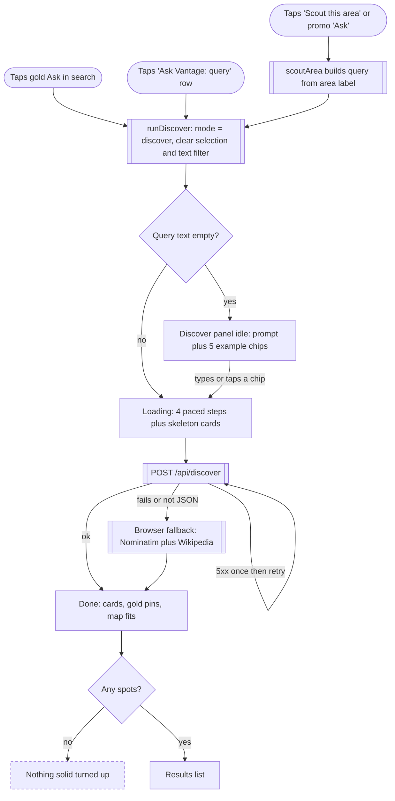
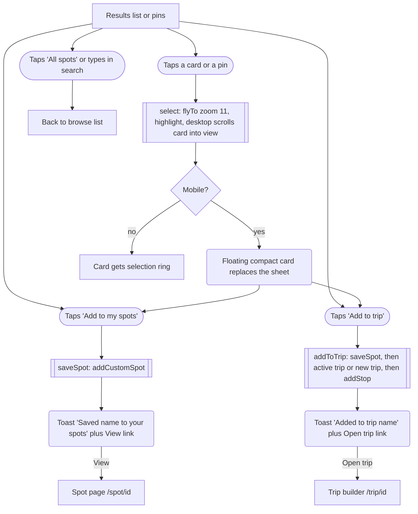

# 03 · AI scout (discover mode)

> From `/explore`, the user describes a shot (or scouts the current map area), waits through a paced loading checklist, gets up to 16 web and AI-suggested spots as cards and gold dashed map pins, and can save them or add them to a trip.

## Goal
Find photo spots that are not in the curated set (anywhere on earth), see them on the map, and keep the good ones by saving them to "my spots" (`customSpots`) and/or dropping them into a trip.

## Entry points
All entry points call `runDiscover` (`src/pages/Explore.tsx:138`), which switches `mode` to `'discover'`.

- **Gold "Ask Vantage" button inside the search field**, desktop (full label) and mobile (icon-only sparkle, `aria-label="Ask Vantage"`): `src/components/explore/SearchBar.tsx:77` (button defined at `:97`). Sends the current search text (may be empty).
- **"Ask Vantage: “<query>”" row** (sub-line "Scout the web + AI for photo spots") at the bottom of the search suggestions dropdown. Only visible while the field is focused and non-empty: `src/components/explore/SearchBar.tsx:139`, open condition `:62`.
- **Empty-results state**, button "Scout {areaLabel or 'this area'}" (gold) when the list has zero spots: `src/components/explore/BrowseResults.tsx:59`. Calls `scoutArea` (`src/pages/Explore.tsx:147`).
- **End-of-list promo card** "Not seeing *your* shot?" with an "Ask" button (next to "Add"), shown under any non-empty result list: `src/components/explore/ScoutPromoCard.tsx:16`, mounted at `src/components/explore/BrowseResults.tsx:82`. Also calls `scoutArea`.
- **Re-run from inside the panel**: example chips, the composer submit, "Try again", and Enter in the textarea all go back to `runDiscover` (`src/pages/Explore.tsx:228`).
- Not an entry point: pressing Enter in the search field does not ask. It tries "go to place" (`src/components/explore/SearchBar.tsx:55-60`). Landing hero search does not reach discover mode.

## Preconditions
- Route `/explore` (mode and discover state are component state; nothing is in the URL, `src/pages/Explore.tsx:49`).
- Works with or without the Worker. With the Worker (`/api/discover`) the user gets web plus AI results. Without it, a browser-only Wikipedia scout runs (see "Without the worker").
- Needs internet either way: Nominatim, Wikipedia, Open-Meteo are all called (from the Worker or from the browser).
- Layout breakpoint: `useMediaQuery('(min-width: 768px)')` (`src/pages/Explore.tsx:41`). Below 768px the panel lives in a draggable bottom sheet; at 768px and up it replaces the left list column.

## Flow

Entry, loading and results. The error state in the panel is effectively unreachable (see "Not as it looks").

Acting on a result and leaving discover mode.

## Walkthrough

1. **Explore, search field** · `/explore` · `src/components/explore/SearchBar.tsx:77`
   User types in "Search spots, tags or anywhere on earth" (desktop) or "Search spots or places" (mobile) (`:75`) and taps the gold Ask button, or picks the "Ask Vantage: “…”" row. Both pass the trimmed text to `runDiscover`.

2. **runDiscover** · `src/pages/Explore.tsx:138-145`
   Sets mode to discover, clears the selected item, clears the search-field text (`filters.text` = ''), scrolls the desktop list column to the top. Mobile (<768px): sheet snaps to `full` (`:142`). Only calls the API if the text is non-empty (`:144`); it passes the current map centre as `near`. With empty text the user lands on the idle panel.
   Desktop: the FilterBar disappears while in discover mode (`:259`). Mobile: the filter rail disappears too (`:319`). The date chosen earlier stays in effect for light scores.

3. **Discover panel, idle** · `src/components/explore/DiscoverPanel.tsx:47-70`
   Back button "All spots" (`:49`), gold sparkle tile, headline "Ask *Vantage*", copy "Describe the shot. We’ll read the map, scout the web for documented places and ask our model for hidden gems.", the composer (textarea, hint "Web + AI", round "Ask" submit that is disabled while empty, `PromptComposer.tsx:41-50`), and a "Try" row of 5 example chips (`:15-21`): "Moody coastal spots within 2 hours of Portland", "Milky Way locations near Moab", "Hidden waterfalls in the Columbia River Gorge", "Blue hour architecture in Chicago", "Fall colour sunrise spots in Vermont". Tapping a chip fills the box and runs immediately (`:64`). Enter submits, Shift+Enter inserts a line (`PromptComposer.tsx:32`). Desktop: textarea auto-focuses when idle (`:43`, `autoFocus={isDesktop}`).
   If the user came in through step 1 with text, the panel text is seeded from `d.query` (`:40-42`) and the loading state is already showing.

4. **Loading** · `src/components/explore/useDiscover.ts:20-41`, `DiscoverPanel.tsx:72-83`
   Status becomes `loading`; previous results and meta are cleared. A checklist (`ProgressSteps.tsx`) shows four labels: "Reading the map…", "Scouting the web…", "Asking the model…", "Checking the light…". The steps advance on fixed timers at 0.9 s, 2.6 s and 6.5 s (`useDiscover.ts:29`), independent of what the network is doing. The last step stays "current" until the answer arrives. Under it: skeleton cards (3 rows on mobile, 4 tiles on desktop). The composer shows a loading spinner on its submit button and stays editable.
   Mobile: the sheet header shows the current step label as its title and the query as its subtitle (`src/pages/Explore.tsx:303-304`), so progress is visible even when the sheet is at `peek`.
   Starting a new run aborts the previous request and clears its timers (`useDiscover.ts:23-24`).

5. **Network call** · `src/lib/discover.ts:21-55`, `worker/discover.ts:36`
   See "What the Worker does" below. Client time limit is 75 s total (`discover.ts:24`); a 5xx is retried once (`:34`).

6. **Results land** · `src/pages/Explore.tsx:63-66, 152-159`
   - Discovered spots whose normalised name equals a curated spot's name are dropped (`:63-66`). Saved discovered spots (in `customSpots`) are not dropped.
   - Map: in discover mode, curated/custom spots stay as normal pins and discovered spots are added as gold dashed pins with a sparkle icon (`src/components/map/MapMarker.tsx:54-58`; spots already in the discovered set are removed from the normal pin set, `Explore.tsx:71-76`).
   - The map fits to the result pins with `fitSpots(dSpots, 11)` (max zoom 11, animated 900 ms, `src/components/map/SpotMap.tsx:217, 291-294`). Padding is `MAP_PADDING_DESKTOP` / `MAP_PADDING_MOBILE` (`Explore.tsx:32-34`). One result only: flies to it at zoom up to 10.
   - Mobile: the sheet snaps to `half` (`:158`).
   - Light scores for the results are fetched from Open-Meteo (`useLightScores`, `Explore.tsx:67-68`); desktop cards show a light badge on the photo once ready. Mobile compact rows show no light badge.

7. **Discover panel, results** · `DiscoverPanel.tsx:95-137`
   - Heading: "{n} spots near {place}" (e.g. "9 spots near Portland") or "{n} spots" if no place was resolved (`:99`). Not pluralised: one result reads "1 spots". Zero results reads "Nothing solid turned up".
   - Ghost button "New search" resets to idle, clears the text, focuses the textarea (`:101`).
   - Sub-line with counts "{n} from the web" (globe) and "{n} from AI" (sparkle), plus "· Gold dashed pins on the map" (hidden below the `sm` breakpoint, `:109`).
   - If the browser fallback was used: grey note "The AI scout didn’t answer in time or isn’t reachable here (plain vite dev — run npm run dev:worker alongside it). Showing web results found directly from Wikipedia." The parenthetical only appears when the hostname is localhost, 127.x or 192.168.x (`:112-117, 142`).
   - Cards: desktop 2-column grid of photo cards (`variant="full"`); mobile single column of 96px-thumb rows (`variant="compact"`) (`:121`).
   - Each card (`DiscoverCard.tsx`): photo (spot `image`, else Wikipedia thumb via `wikiTitle`), "Web" (blue) or "AI" (gold) chip (`SourceChip.tsx`; overlay on the photo in desktop, beside the name on mobile), name, place line with category icon, "Why {reason}" (2 lines mobile, 3 lines desktop), then two buttons.

8. **Select a result** · `src/pages/Explore.tsx:169-172, 109-115`
   Tap the card photo or name (`DiscoverCard.tsx:48, 61`), or tap a gold pin (`onSelect={select}`, `:188`).
   - Card tap: map flies to the spot (zoom 11, `:170`) then selects.
   - Pin tap: selects only (no extra fly).
   - Desktop: card gets a selection ring and scrolls into view smoothly; a hovered card highlights its pin and vice versa (`hoveredId`, `:187-189`). There is no detail panel; the spot page is only reachable after saving.
   - Mobile: `select` sets the sheet to `peek` (`:114`) but when something is selected the sheet is not rendered at all; a compact floating card above the tab bar (`FloatingSpotCard.tsx:33-35`) replaces it, with an "X" ("Close") button. Closing clears the selection and the sheet returns at `peek` (it does not return to `half` where the user was).

9. **Add to my spots** (the Save action) · `DiscoverCard.tsx:78`, `src/pages/Explore.tsx:161-164`, `src/components/explore/useSpotActions.ts:16-23`
   Button label "Add to my spots" (outline, bookmark-plus icon). Calls `saveSpot`: if a custom spot with that id exists it is returned unchanged; otherwise `addCustomSpot` stores a `Spot` made from the discovery (drops `why` and `confidence`, keeps `source` 'web' or 'ai', sets `notes` to the AI's own notes if any, else "Why Vantage suggested it: {why}", `useSpotActions.ts:11-14`). This goes into `customSpots` in the persisted store, not into `savedSpotIds` (bookmarks).
   Result: toast (3.6 s, `Explore.tsx:29`) "Saved {name} to your spots" with a "View" link to `/spot/{id}`. The button becomes a "Saved" chip with an arrow that links to the same Spot page (`DiscoverCard.tsx:73-76`).

10. **Add to trip** · `DiscoverCard.tsx:80-89`, `Explore.tsx:165-168`, `useSpotActions.ts:26-33`
    Button "Add to trip" (primary, route icon). Behaviour:
    - Saves the spot into `customSpots` first (same as step 9), so "Add to trip" also silently saves it. The card flips to "Saved" even though the toast only mentions the trip.
    - Target trip = the active trip (`activeTripId`) if it exists in `trips`. If not, a new trip is created (`createTrip`, which also makes it active): name `"{place} light trip"` where `{place}` is `d.meta.place.name` from the last discovery (`Explore.tsx:166`), else `"{first part of spot.place} trip"`. Defaults from the store: start date today, 3 days (`src/store/index.ts:49-62`).
    - Adds a stop on day 0 (first day) with session = the spot's first `bestLight` entry, unless that spot is already a stop in the trip (`useSpotActions.ts:31`).
    - Toast "Added to {trip name}" with link "Open trip" to `/trip/{id}`.
    - Once the spot is in the active trip, the button reads "In trip" and is disabled (`DiscoverCard.tsx:80-88`, `useSpotStatus` `useSpotActions.ts:38-42`).

11. **Leave discover mode** · `src/pages/Explore.tsx:229, 212, 127, 245`
    - "All spots" back button (top of panel): `mode` = browse, selection cleared, mobile sheet to `peek`.
    - Typing anything in the search field while in discover mode switches back to browse (`:212`).
    - Picking a place from the search dropdown (`goToPlace`, `:125-131`) or saving a dropped pin (`:245`) also sets browse.
    - Discovery results are kept in memory in `useDiscover`. Opening discover mode again with an empty Ask (gold button with empty field) shows the previous results and query. Gold pins disappear in browse mode (`mapDiscovered` undefined, `:77`). Any discovered spot that was saved is now an ordinary spot (source 'web' or 'ai') in the browse list and map.

## What the Worker does (`POST /api/discover`)
Route: `worker/index.ts:19`. Code: `worker/discover.ts`.

1. Validate: non-POST returns 405, invalid JSON 400, empty query 400 (`:37-41`). Query trimmed and cut to 300 chars.
2. Parse the query text locally (no AI): theme words, a radius from phrases like "2 hours" (80 km/h) / miles / km, strip time phrases like "this weekend", and pick a place text (`parseQuery`, `:94-122`).
3. Geocode the place with Nominatim, 7 s limit (`geocodeLoose`, `:45, 129`). Tries a simplified text first (removes words like "coast", "area") then the raw text. Uses the result's bounding box for the radius (15 to 200 km). If geocoding fails or finds no place, falls back to the browser's `near` (map centre) and names it "the map area" (`:46`). Radius defaults to 30 km, clamped 3 to 250 (`:47`).
4. Time zone lookup via Open-Meteo, 5 s limit (`:49, 152`).
5. Two signals in parallel (`:51-54`):
   - **Web** (15 s limit): up to 9 sample points across the radius, each a Wikipedia geosearch (10 km radius, 50 hits) returning description, thumbnail and article length. Filters out towns, schools, people, roads etc. with regexes, scores by photo-ish words, theme match, thumbnail, article length and distance, keeps the top 12, fetches REST summaries, returns up to 10 with `source: 'web'`, `id: web-{pageid}` (`webScout`, `:205-267`).
   - **AI** (50 s limit): Workers AI, system prompt "You are Vantage, an expert location scout…" asking for 6 to 8 real spots as strict JSON (`:308-323`). Up to 3 sequential attempts: Llama 3.3 70B fp8-fast with JSON schema, the same without schema, then Llama 3.1 8B (`:357-361`). First attempt that parses to at least one spot wins, capped at 8, `source: 'ai'`, `id: ai-{slug}` (`:362-375, 378-405`). If the `AI` binding is missing it returns nothing (`:348`).
6. Drop AI spots further than `radiusKm * 2 + 60` km from the centre (hallucination guard, `:57-60`).
7. Merge: duplicates (same normalised name, same wiki title, or within 0.4 km) keep the web record but take the AI's category, light, facing, notes, blurb and "why" ("… Also well documented on Wikipedia."). Result is interleaved AI, web, AI, web…, de-duplicated by id, capped at 16 (`merge`, `:430-451`).
8. Response: `{ spots, meta: { web, ai, place?, radiusKm } }`, `cache-control: no-store` (`:63-71`). There is no caching (no KV, no edge cache); every Ask re-runs everything. No rate limiting or auth.
9. Failure modes: each signal swallows its own errors and timeouts into an empty list, so the Worker nearly always answers 200. If both signals fail it returns `{ spots: [], meta }` with 200. Only an uncaught exception reaches the 500 handler (`worker/index.ts:22`). User-Agent sent to Wikimedia and Nominatim is `Vantage/0.1 prototype` (`worker/discover.ts:28`).

Client side wrapper (`src/lib/discover.ts`):
- Retry once on any 5xx (`:34`); treats non-OK or non-JSON content-type as failure (`:36`); hand-sanitises each spot and fills defaults (`:64-67`; spots without finite lat/lng or a name are dropped).
- If the Worker answered but `meta.web` is 0 and a place was resolved (Wikimedia sometimes throttles shared Worker IPs), the browser runs its own Wikipedia scout around that place and merges the extras (`:42-47`). No banner is shown in that case.

## Without the worker (plain `vite dev`)
- Vite proxies `/api` to `http://localhost:8787` (`vite.config.ts:11`). With no Worker running, the proxy fails (inferred: Vite answers with a 5xx), the client retries once, then falls back (`discover.ts:34, 50-53`). If the proxy is not applied and the SPA fallback returns HTML with 200, the JSON content-type check also sends it to the fallback (`:36`). Run the Worker with `npm run dev:worker` (`package.json:8`, `wrangler dev --port 8787`).
- Fallback = `browserWebScout` (`src/lib/discover.ts:118-148`): extracts a place from the query with a simple regex (`placeFrom`, `:74`), geocodes via Nominatim, runs 5 Wikipedia geosearches around it (about 13 to 17 km offsets, 10 km radius each), filters with word lists, ranks (photo first, then distance), keeps 10, adds Wikipedia extracts. No AI step, so "from AI" always reads 0. `meta.offline = true`, which shows the grey note in step 7.
- If no place can be found and the map centre is unavailable it returns zero spots, still flagged offline.
- Not verified here: whether `wrangler dev` can reach the AI binding on this machine (depends on Cloudflare login). In that case the Worker answers web-only and no banner is shown.

## Screen states

| Screen | Empty | Loading | Error | Offline / timeout | Success |
|---|---|---|---|---|---|
| Discover panel (idle) | Empty composer, 5 example chips (`DiscoverPanel.tsx:59-70`) | n/a | n/a | n/a | n/a |
| Discover panel (loading) | n/a | 4 paced step labels plus skeleton cards; submit button spinner (`:72-83`) | n/a | Client aborts after 75 s and falls back to the browser scout (`discover.ts:24`) | n/a |
| Discover panel (error) | n/a | n/a | Info icon + "The scout couldn’t reach the web just now. Check your connection and try again." + "Try again" (`useDiscover.ts:38`, `DiscoverPanel.tsx:85-93`). Practically unreachable (see Not as it looks) | Same as error | n/a |
| Discover panel (done, 0 results) | Heading "Nothing solid turned up" and "Try naming a place — “waterfalls near Asheville”, “sunset beaches around San Diego”." (`:99, 118-120`). No count line. "New search" still shown | n/a | n/a | Offline note appears if the browser fallback ran | n/a |
| Discover panel (done, results) | n/a | n/a | n/a | Grey note when fallback ran (`:112`) | Heading, counts, cards (`:95-137`) |
| Map | No results: no gold pins | Normal pins stay; no loading indicator on the map | Not handled | Not handled | Gold dashed pins, `fitSpots` animation (`Explore.tsx:152-159`) |
| Mobile sheet header | idle/error: "Ask Vantage" + "Describe the shot you’re after" | Current step label + query | Same as idle (no error indication) | n/a | "{n} spots near {place}" + query (`Explore.tsx:303-304`) |
| Floating card (mobile, selected result) | n/a | n/a | n/a | n/a | Compact card with "Add to my spots" / "Add to trip" (`FloatingSpotCard.tsx`) |
| Toasts | n/a | n/a | None for save/trip failures (store writes cannot fail) | n/a | "Saved {name} to your spots" [View]; "Added to {trip}" [Open trip] (`Explore.tsx:163, 167`) |

## Data

| Data | Read / write | Where it lives | Notes |
|---|---|---|---|
| `mode`, `snap`, `selectedId`, `hoveredId`, toast | R/W | Component state in `Explore` (`Explore.tsx:43-53`) | Lost on navigation. Not in the URL. |
| Query, status, step, spots, meta, error | R/W | Component state via `useDiscover` (`useDiscover.ts:9-15`) | Lost on leaving `/explore`. Survives switching browse/discover. Not cached between asks. |
| Discovery response | R | Cloudflare Worker `/api/discover`, which calls Nominatim, Open-Meteo, Wikipedia (search + REST summary), Workers AI | No caching, `no-store` (`worker/discover.ts:34`). |
| Fallback data | R | Browser calls to Nominatim, Open-Meteo, Wikipedia (`src/lib/discover.ts`) | Geocode results cached per session in memory (`src/lib/geocode.ts:15`). |
| Light scores for results | R | Open-Meteo forecast via `useLightScores`, in-memory cache | Uses the Explore `dateStr`; date picker is hidden in discover mode. |
| Saved spot | W | Zustand `customSpots`, persisted `vantage.v1` (`store/index.ts:44`) | Not `savedSpotIds`. Same id replaces, never duplicates. Newest first. |
| Trip and stop | W | Zustand `trips`, `activeTripId`, persisted `vantage.v1` (`store/index.ts:49-76`) | New trip becomes active. Trip syncs to KV only when the trip builder is open (see flow docs for trips). |

## Not as it looks
- **Progress steps are theatre.** The four labels advance on timers (0.9 / 2.6 / 6.5 s), not on real events, and "Asking the model…" shows even in the browser fallback where no model is called. "Checking the light…" is not part of the discover call at all (`useDiscover.ts:28-29`).
- **The error state is practically unreachable.** `discover()` only throws if the browser fallback itself throws, but every step in the fallback swallows its own errors (`geocode`, `geoPages`, `extract` all catch). A total network failure instead ends as "done" with 0 spots and the offline note. The copy "couldn’t reach the web" and the "Try again" button are in the panel but rarely appear (`useDiscover.ts:35-39`, `src/lib/discover.ts:50-53`).
- **The offline banner does not cover every degraded case.** It only shows when the browser fallback ran. If the Worker answered but the AI timed out or failed, the user gets web-only results with "0 from AI" and no explanation. The banner text "didn’t answer in time" suggests otherwise (`DiscoverPanel.tsx:112-117`).
- **"Add to trip" also saves the spot** (it appears in "my spots" and on the Saved page) but the toast only mentions the trip (`useSpotActions.ts:27, 163-167`).
- **Toast says "Added to {trip}" even if the spot was already a stop** (nothing is added then). The button is disabled for the active trip in that case, so this is rare in the UI (`useSpotActions.ts:31`).
- **Save swaps the mobile floating card.** After "Add to my spots" the spot exists in `customSpots`, `selected` resolves to the stored `Spot` (no `why` field) before the discovery record, so `selectedIsDiscovered` becomes false and the floating card changes from the discover card to the plain SpotCard (no "Why" line, no Save/Trip buttons) (`Explore.tsx:88-92, 326-335`).
- **Closing the panel does not cancel a running search.** "All spots" only flips the mode. When results arrive later the map still re-fits to them and (mobile) the sheet jumps to `half`, even though the user is looking at the browse list and no gold pins are drawn (`Explore.tsx:152-159, 229`).
- **"This area" scouting sends a literal place name.** For an unnamed map area `scoutArea` sends "Best photo spots in this area" (`Explore.tsx:149`). The Worker's parser picks "this area" as the place text and tries Nominatim with it (and with "this") before falling back to the map centre (`worker/discover.ts:107-114, 129-135`; the browser fallback does the same, `discover.ts:74-76`). Whether Nominatim returns something unrelated for those strings was not tested.
- **Place name can read "the map area".** When the query has no usable place and the map centre is used, the header reads "{n} spots near the map area" and a new trip is named "the map area light trip" (`worker/discover.ts:46`, `Explore.tsx:166`).
- **Hidden fields.** `confidence` and `popularity` come back for every spot but are never shown; `popularity` only influences pin collision priority. `facing` is stored with the saved spot.
- **Result de-duplication against curated spots is by name only** (`Explore.tsx:63-66`), and in the worker by name/wiki title/400 m (`worker/discover.ts:433`).
- **Search text is wiped.** Starting discover clears the search field, so the question now lives only in the panel textarea (`Explore.tsx:141`).
- **Enter does not ask** in the search field, only the gold button or dropdown row does.

### Rename leftovers ("Vantage")
Visible to the user:
- Gold button label and aria-label "Ask Vantage" (`src/components/explore/SearchBar.tsx:103, 107`)
- Suggestions row "Ask Vantage: “…”" (`SearchBar.tsx:143`)
- Panel headline "Ask *Vantage*" (`DiscoverPanel.tsx:53`)
- Mobile sheet header "Ask Vantage" (`src/pages/Explore.tsx:303`)
- Empty-state body "Let Vantage scout {area} for photo spots…" (`BrowseResults.tsx:58`)
- Promo card "Ask Vantage to scout anywhere — or drop your own pin." (`ScoutPromoCard.tsx:13`)
- Saved-spot note "Why Vantage suggested it: …" stored in the spot's notes (`useSpotActions.ts:13`), shown wherever notes are shown
- Fallback AI strings "Suggested by Vantage" and "Suggested by the Vantage scout." used as default place/blurb (`worker/discover.ts:390, 397`)
- The AI sees "You are Vantage…" (`worker/discover.ts:308`) and the Wikimedia User-Agent is "Vantage/0.1 prototype" (`:28`)

Internal / comments: `src/lib/discover.ts:18`, `DiscoverPanel.tsx:25`, `PromptComposer.tsx:18`, `MapMarker.tsx:24`, Landing and shell strings are covered in other briefs.

## Tweak points

**Friction**
- Tapping "Ask" with a typed query clears the search field; the user then edits in a different box (the panel textarea). Consider keeping them in sync or hiding the search field in discover mode (`src/pages/Explore.tsx:141`).
- Loading takes up to roughly a minute in the worst case (7 s geocode, 50 s AI, plus retries) with no way to cancel except starting a new search; the composer submit stays enabled but there is no stop control (`worker/discover.ts:30, 45`, `src/lib/discover.ts:24`, `PromptComposer.tsx:41-50`).
- After selecting a result on mobile the sheet vanishes and comes back at `peek`; the user loses their scroll position and half-open list when they close the floating card (`src/pages/Explore.tsx:114, 326-337`).
- No way to see more about an unsaved result (no detail view, no photo carousel, no notes); the Spot page only exists after saving (`DiscoverCard.tsx:73-78`).
- "Add to trip" with no active trip silently creates a "{place} light trip" with default 3 days and today's date; the user is not asked and only learns from the toast (`useSpotActions.ts:30`, `src/store/index.ts:49-62`).
- Fixed example chips are Portland / Moab / Columbia Gorge / Chicago / Vermont regardless of where the user is looking (`DiscoverPanel.tsx:15-21`).

**Dead ends**
- Zero results: "Nothing solid turned up" with a suggestion to name a place, but the textarea is the only way forward; no example chips, no "scout the map area" shortcut (`DiscoverPanel.tsx:118-120`).
- The error panel and its "Try again" button are almost unreachable; a real total failure shows "0 spots" instead (`useDiscover.ts:38`).

**Missing states**
- No cancel/stop for a running search; closing the panel does not abort (`src/pages/Explore.tsx:229`).
- No map loading indicator or empty-state hint on the map while scouting.
- No indication of partial failure when only the AI part failed (Worker answered web-only) (`DiscoverPanel.tsx:112`).
- No "already saved" or "undo" on the toasts; no way to remove a saved discovery except elsewhere.
- Results are not remembered after leaving `/explore`; no history of past asks (`useDiscover.ts`).

**Inconsistencies**
- "1 spots" is not pluralised in the panel heading and the mobile header, while browse uses singular/plural (`DiscoverPanel.tsx:99`, `Explore.tsx:303`, vs `BrowseResults.tsx:15`).
- Two similar verbs on one card: "Add to my spots" vs "Saved"; the Spot page and Saved page use other terms (`DiscoverCard.tsx:78`). Terminology around "my spots", "Saved", "Your added spots" needs a decision.
- The mobile sheet header shows "0 spots near X" for empty results while the panel says "Nothing solid turned up" (`Explore.tsx:303` vs `DiscoverPanel.tsx:99`).
- Desktop result cards show a light badge; mobile compact rows do not (`DiscoverCard.tsx:50-54`).
- Selecting by card flies the map to zoom 11, selecting by pin does not move it (`Explore.tsx:169-172`).
- The "· Gold dashed pins on the map" legend hint is hidden below 640px (`hidden sm:inline`), i.e. on phones, which is where the sheet covers the map and the hint would matter most (`DiscoverPanel.tsx:109`).
- Promo card button says just "Ask" while the empty state says "Scout {area}"; both run the same `scoutArea` and send the same canned query (`ScoutPromoCard.tsx:16`, `BrowseResults.tsx:59`).
- Mobile Add-spot "+" button and other controls stay visible in discover mode, but the filter rail does not (`Explore.tsx:317-323`).

**Open design questions**
- Should Save and Add to trip be one action, since "Add to trip" already saves? Or should the toast say both happened (`useSpotActions.ts:26-33`)?
- Should the "N from the web / N from AI" provenance and the "Why" text have a trust cue (confidence is returned but hidden)? (`worker/discover.ts:263, 402`)
- Should a long wait show real stages (geocoding, web, model) instead of timed theatre, or progressive results as the web signal returns before AI?
- Should discover live in the URL (`/explore?ask=…`) so results and the query are linkable and survive reload?
- What should "scout this area" ask when the area is unnamed ("this area")? Reverse-geocode a name first, or send coordinates only (`Explore.tsx:147-150`)?
- Replace "Ask Vantage" with the final product voice (Iter) in all 9 places above, including the AI system prompt and the stored note text.
