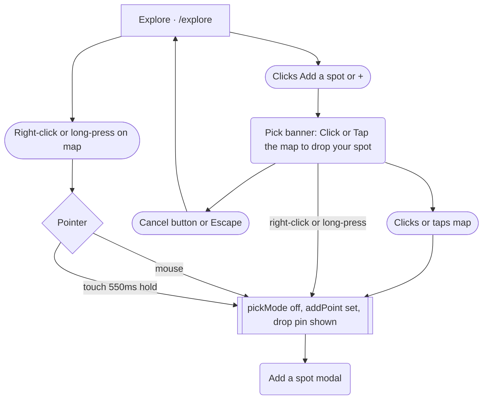
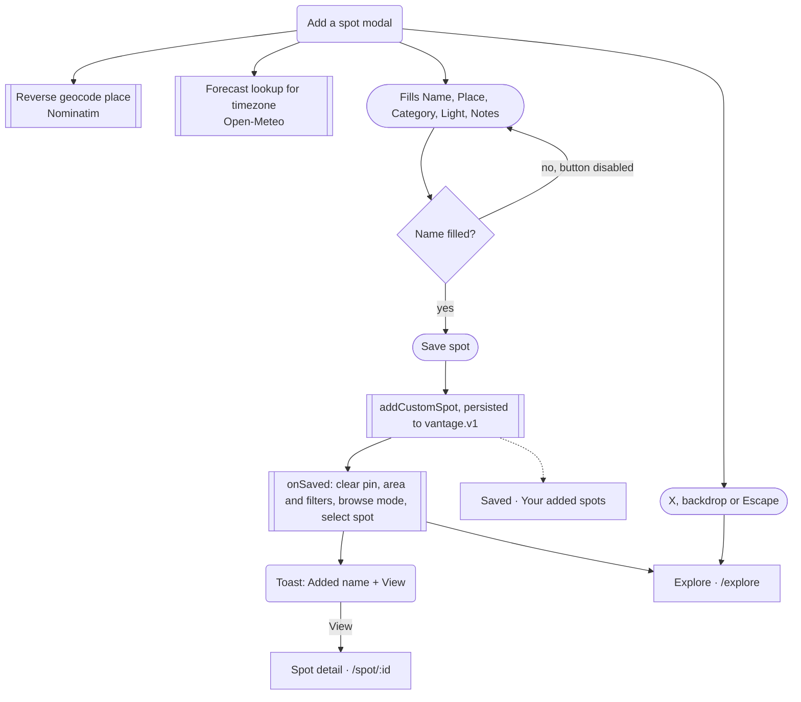

# 04 · Add your own spot

> The user drops a pin on the Explore map (via "Add a spot" pick mode, or by right-click / long-press), fills in a short form, and the spot is stored locally and appears on the map, in the list, on the Saved page and as its own detail page.

## Goal
Record a photo location that is not in the curated set, with a name, category, best light and notes, so it can be found on the map, opened, saved and used in trips.

## Entry points
- Desktop (>= 768px), browse mode only: outline "Add a spot" button next to the results summary (`src/pages/Explore.tsx:266`). It is not rendered in discover mode (desktop discover branch, `:281-283`).
- Mobile (< 768px): round "+" icon button (aria-label "Add a spot") beside the search pill (`src/pages/Explore.tsx:317`). It is shown in both browse and discover mode.
- "Add" button on the end-of-list promo card "Not seeing your shot?" (`src/components/explore/ScoutPromoCard.tsx:17`, wired at `Explore.tsx:278`, `:350`). Only rendered when the list is non-empty (`BrowseResults.tsx:82`); the empty state has no Add button.
- Without pick mode: right-click on the map (desktop) or press-and-hold (touch) anywhere on the map (`src/components/map/SpotMap.tsx:137`, `:142-150`).
- All three buttons call `startAdd` (`Explore.tsx:175`).

## Preconditions
- On `/explore`. The map must be mounted; there is no other place to add a spot.
- No account or network is required to save. Network is used only to pre-fill the place name (Nominatim reverse geocode) and the timezone (Open-Meteo); both have fallbacks.
- Spots are stored in the zustand `customSpots` array, persisted to localStorage `vantage.v1` (`src/store/index.ts:44`). They are per-browser and are not synced to the Worker/KV.

## Flow

Two ways to reach the form: pick mode (explicit) or a direct right-click / long-press (works any time).

Form and save. The new spot also shows up on the Saved page the next time it is opened.

## Walkthrough

1. **Start** · `/explore` · `src/pages/Explore.tsx:175`
   `startAdd` sets `pickMode = true`, clears the current selection, and on mobile snaps the BottomSheet to `peek`. The map cursor becomes a crosshair (`SpotMap.tsx:211`).

2. **Pick mode banner** · `src/components/explore/PickModeBanner.tsx:5-14`, placed at `Explore.tsx:201-205`
   Dark inline Toast, top-centre of the map (desktop `top-4`; mobile below the search and filter rail), with a pin icon, copy "Click the map to drop your spot" (desktop, `pointer='mouse'`) or "Tap the map to drop your spot" (mobile, `'touch'`) and a "Cancel" pill. The choice of word follows viewport width (`isDesktop`), not actual input device. While in pick mode the "Search this area" chip is hidden (`SpotMap.tsx:268`) and, on mobile, a selected-spot floating card is suppressed (`Explore.tsx:326`).
   Leaving pick mode without adding: the "Cancel" button (`Explore.tsx:203`) or the Escape key (window keydown listener, `:102-107`). Clicking the "+" / "Add a spot" button again does nothing visible (state is already true).

3. **Pick the location** · `src/components/map/SpotMap.tsx:125-130`
   In pick mode any map click calls `onLongPress({lat,lng})` (the prop is reused for both paths). Clicks that land on a marker are ignored by the map click handler (`t.closest('.vm-marker')`, `:127`), but the marker's own click still selects that spot and pick mode stays on (`:260`). Panning by dragging is unaffected. Parent handler: `setPickMode(false); setAddPoint(p)` (`Explore.tsx:192`). A dark drop-pin marker is placed on the map at that point (`SpotMap.tsx:199-209`, `MapMarker.tsx:68-70`). The map does not pan or zoom to the pin.

4. **Long-press path (no pick mode)** · `SpotMap.tsx:131-150`
   - Desktop: browser right-click (`contextmenu`) is intercepted (`preventDefault`) and treated as a pick at that point.
   - Touch: `touchstart` with a single finger starts a 550ms timer (`LONG_PRESS_MS`, `:51`); moving more than 8px or lifting cancels it; multi-touch cancels.
   - A shared guard ignores a second press within 800ms (`:132-136`).
   - It works in browse or discover mode, and also while pick mode is on. It calls the same `onLongPress` handler, so pick mode is turned off and the sheet opens. There is no hint in the UI that this gesture exists (the banner only appears in pick mode).

5. **Add a spot form** · `src/components/explore/AddSpotSheet.tsx:66-87`, mounted at `Explore.tsx:237-250` (rendered in both layouts)
   A `Modal` titled "Add a spot", `presentation="auto"`: bottom sheet below Tailwind `sm`, centred dialog from `sm` up (`src/components/ui/Modal.tsx:13`). Close with the X button, backdrop click, or Escape (`Modal.tsx:43`); closing calls `onClose` which clears the pin (`Explore.tsx:240`). Nothing asks for confirmation, and typed text is discarded.
   Contents, top to bottom:
   - Location summary card (`LocationSummary`, `:91-104`): pin disc, then "Finding the place…" with a spinner while the reverse geocode is pending, then the resolved place, or "Dropped pin" if it returned nothing; under it the coordinates to 4 decimals and, once known, the timezone (e.g. "America/Denver").
   - "Name" input, autofocused, placeholder "e.g. Secret ridge overlook". Required.
   - "Place" input, placeholder "Looking it up…" while loading, otherwise "Town, region". Pre-filled from reverse geocode; if the user has typed before the lookup returns, their text is kept (`setPlace((cur) => cur || p || '')`, `:39`). Optional.
   - "Category" chips (single-select, default Landscape): Landscape, Astro, Coast, Desert, Architecture, Waterfall, Forest, Urban (`CATEGORY_OPTIONS` minus "All", `:73`).
   - "Best light" chips (multi-select, default Sunset): Sunrise, Sunset, Blue hour, Night, Overcast, Midday (`:13-16`).
   - "Notes" textarea, 3 rows, placeholder "Access, parking, the composition, what lens…". Optional.
   - Full-width "Save spot" button, disabled until the trimmed name is non-empty (`:85`). Pressing Enter does not submit (inputs are not in a `<form>`).
   Background lookups on open (`:35-42`): `reverseGeocode` (Nominatim `/reverse`, zoom 12, cached; `src/lib/geocode.ts:43-60`) and `fetchForecast` for the IANA timezone (falls back to a longitude-derived `Etc/GMT±N` if the forecast fails, `:19-22`, `:40`). Name and notes are reset each time a new point is opened (`:38`).

6. **Save** · `AddSpotSheet.tsx:46-64`
   Builds a `Spot`:
   - `id`: `user-<slug of name, max 32 chars>-<4 random chars>`
   - `name`: trimmed
   - `place`: trimmed text, or `"<lat 3dp>, <lng 3dp>"` if blank
   - `lat`/`lng`: 5 decimals
   - `timezone`: looked-up timezone, else longitude estimate (so a very quick save uses the estimate)
   - `category`; `tags: ['my-spot']`
   - `bestLight`: selected values, or `['sunset']` if none selected (silent fallback)
   - `blurb`: first sentence of the notes (split after a period + whitespace), else "A spot you found yourself."
   - `notes`: trimmed notes or undefined
   - `popularity: 15` (so it counts as a hidden gem), `source: 'user'`
   Then `addCustomSpot` (prepends and replaces any same-id entry, `store/index.ts:44`) and `onSaved`. There are no further validation rules: duplicate names, spots in the ocean, or spots next to existing ones are all accepted. There is no error path on save.

7. **After save, on Explore** · `Explore.tsx:241-248`
   In order: pin removed; area filter cleared; all filters reset to defaults (text, category, light, gems, sort); mode forced to `browse`; `select(id)`; Toast `Added <name>` with a "View" link to `/spot/<id>` (3.6s, `TOAST_MS`). The date chip and the map position are left as they were; the map does not move.
   - Desktop: the new card's list position depends on its Light Index (it is sorted with everything else), and the list scrolls it into view with a smooth `scrollIntoView` (`select`, `:112-113`); its grid card gets the selection ring. The marker appears on the map as a selected (ink) pill, showing "···" until its forecast arrives.
   - Mobile: `select` sets the snap to `peek` and the BottomSheet is replaced by the compact FloatingSpotCard for the new spot (link to `/spot/<id>`, no Save / Add to trip buttons); the Toast sits above that card (`Explore.tsx:326`, `:360`).
   - The spot is a normal member of `useAllSpots()` so it takes part in search ("my-spot", name, place), filters (category, light, "Hidden gems" because popularity 15) and the area filter.

8. **Where it lives afterwards**
   - Spot detail `/spot/user-...` (`src/pages/Spot.tsx`): title block shows the popularity tier badge ("Hidden gem" for 15), category badge, a "Your spot" badge (`src/components/spot/SpotTitleBlock.tsx:29`), the place, and a `my-spot` tag chip. The blurb is shown in large type and the notes in a Callout (`Spot.tsx:117-118`). No photo (no `image`/`wikiTitle`), so the hero uses the category fallback art (`SpotHero.tsx:17`). Light timeline, weather and "Add to trip" work as for any spot, using the saved timezone.
   - Saved page `/saved`: a section "Your added spots" ("Places you found and added to Vantage.") lists all `customSpots` newest first (`src/pages/Saved.tsx:52-58`). The header counts them as "· N added by you" (`:26`), but that count also includes AI/web spots saved from discovery, since both live in `customSpots`.
   - It is NOT in the bookmark list: `savedSpotIds` is untouched, so the bookmark on its card is unfilled and it does not appear in the top Saved grid (`Saved.tsx:18`, `:37`).
   - Trips: any trip's add-stop and the spot page "Add to trip" can pick it like any spot.

## Screen states

| Screen | Empty | Loading | Error | Offline / timeout | Success |
|---|---|---|---|---|---|
| Pick mode | n/a | n/a | No hint if the click hits a marker (selects it instead) | Works offline (map tiles may be missing) | Banner, crosshair, then form |
| Add a spot modal | Name empty: "Save spot" disabled; other fields have defaults | Place: "Finding the place…" + spinner, Place input placeholder "Looking it up…"; timezone appears when forecast returns | Reverse geocode failure: location card shows "Dropped pin", Place left blank (falls back to coordinates at save). Forecast failure: timezone from longitude. No visible message either way | Same as error; user can still save | Spot saved, modal closes |
| Save | Name required only | None (synchronous) | Not handled (e.g. localStorage quota) | Fully offline-capable | Toast "Added <name>" + "View" |
| Explore after save | n/a | New marker shows "···" until forecast loads | Same as browse | n/a | Selected marker/card, filters reset |
| Spot detail (user spot) | No photo: fallback art; no notes: no Callout | Standard forecast loading | Unknown id: "Spot not found" (`Spot.tsx:38`) | n/a | Full detail page |
| Saved | Section only appears if `customSpots.length > 0` | n/a | n/a | n/a | "Your added spots" grid |

## Data

| Data | Read / write | Where it lives | Notes |
|---|---|---|---|
| `pickMode`, `addPoint` | Read / write | Explore component state (`Explore.tsx:51-52`) | Lost on navigation |
| Form fields (name, place, category, light, notes, tz) | Read / write | AddSpotSheet component state | `category` and `light` are not reset between adds (see Tweak points) |
| Reverse-geocoded place | Read | Nominatim `/reverse`, in-memory cache keyed to 4 decimals | Short "Town, Region" format |
| Timezone | Read | Open-Meteo forecast response, or longitude estimate | Stored on the spot |
| `customSpots` | Write | zustand, localStorage `vantage.v1` | Prepended; id prefix `user-`; not synced to KV; no edit or delete action exists in the store |
| `savedSpotIds` | Not touched | zustand | Distinct from `customSpots` |
| Toast | Write | Explore component state | 3.6s |

## Not as it looks
- The map click handler is named `onLongPress` for both pick-mode clicks and real long-presses (`SpotMap.tsx:34-35`, `:128`); there is a single code path into the form.
- "Click the map" vs "Tap the map" in the banner depends on viewport width, not on whether the device has a touch screen (`Explore.tsx:203`).
- Desktop "Add a spot" disappears in discover mode; mobile "+" does not (`Explore.tsx:262` vs `:317`).
- Selecting no "Best light" chip still saves, silently as Sunset (`AddSpotSheet.tsx:56`).
- "Your added spots" on Saved is not just spots the user added by hand: AI/web spots saved from discovery are in the same list and count (`Saved.tsx:26`, `:52`; `useSpotActions.ts:16-23`).
- The spot's mobile preview card has no Save or Add to trip buttons, so the toast "View" link or tapping the card are the only ways onward (`FloatingSpotCard.tsx:36`).
- Rename leftover: Saved section subtitle says "Places you found and added to Vantage." (`Saved.tsx:54`); page title and tab title on the spot page append " · Vantage" (`Spot.tsx:69`).

## Tweak points

**Friction**
- The right-click / long-press shortcut is undiscoverable; there is no coach mark or hint, and the pick banner is the only guidance (`SpotMap.tsx:131-150`).
- The pin can be placed only by clicking the map, with no search-for-a-place or "use my location" shortcut inside the form; a mis-click needs the form closed and pick mode restarted (adjusting the pin is not possible once the form is open).
- On mobile the form is a bottom sheet over the map; a pin placed in the lower part of the screen may end up behind it, and the map is not recentred on the pin (`SpotMap.tsx:199-209`).
- Enter does not submit; "Save spot" must be clicked (`AddSpotSheet.tsx:70`, `:85`).
- After saving, filters, area and mode are all reset, even though the user may have been mid-search; the map does not fly to the new spot (`Explore.tsx:241-248`).
- Category and light selections carry over from the previous add because the effect only resets name, notes, place and tz (`AddSpotSheet.tsx:38`).

**Dead ends**
- No way to edit or delete a custom spot anywhere (store has only `addCustomSpot`, `store/index.ts:18`); a mistaken entry persists forever.
- No photo upload; the spot always shows fallback art (`Spot.tsx` / `SpotHero.tsx:17`).
- Not synced between devices (localStorage only).

**Missing states**
- No confirmation before discarding a half-filled form on X / backdrop / Escape.
- No visible error when reverse geocoding fails (only "Dropped pin") and no retry.
- No validation beyond a non-empty name: no duplicate or proximity check, no max length shown.

**Inconsistencies**
- Banner copy "Click/Tap" follows viewport, not input type (`Explore.tsx:203`).
- Desktop add button is browse-only, mobile is always on (`Explore.tsx:262-283` vs `:317`).
- Best light chip set in the form (6 options, `AddSpotSheet.tsx:13`) differs from the Explore filter (4 options, `filters.ts:30`), so Overcast/Midday spots cannot be filtered for.
- "Hidden gem" is forced by `popularity: 15` rather than chosen (`AddSpotSheet.tsx:59`); the user has no say.
- Modal switches sheet/dialog at Tailwind `sm`, Explore's layout at 768px.

**Open design questions**
- Should the add flow be a two-step "confirm pin position" before the form, with a draggable pin?
- Should "Your added spots" be separated from AI-saved spots, and should user spots be bookmarkable or auto-bookmarked?
- After saving, should the map fly to the spot and keep the user's filters instead of resetting them?
