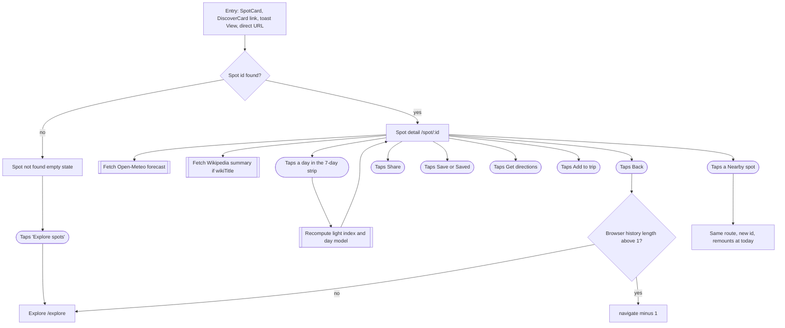
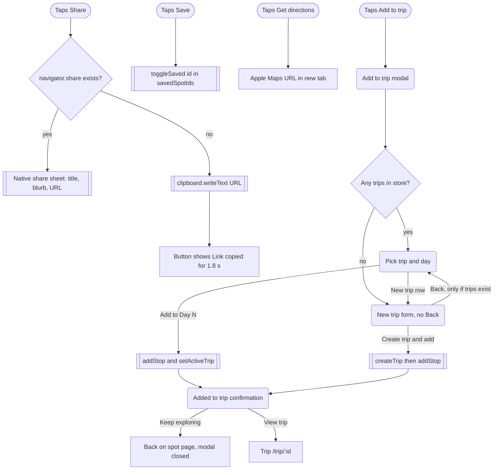

# 05 · Spot detail: light, weather, timing, and acting on a spot

> The user opens `/spot/:id`, reads when the light will be good at that place on any of the next 7 days, then saves it, shares it, gets directions, or adds it to a trip (existing or new) through a modal.

## Goal
Decide whether and when to shoot a specific spot (golden hour, blue hour, night sky, weather), then commit: bookmark it, send it to someone, navigate there, or drop it into a trip day.

## Entry points
All `/spot/` links found in `src` (excluding styleguide and design). Every one lands on the same page with the date reset to today (see "How a date change updates everything").

- Any `SpotCard` (grid or compact) is a router `Link` to `/spot/${spot.id}`: `src/components/SpotCard.tsx:82`. It is rendered in:
  - Explore results list/grid: `src/components/explore/BrowseResults.tsx:77`
  - Explore floating card on the map for a selected curated/saved spot (mobile and desktop): `src/components/explore/FloatingSpotCard.tsx:36`
  - Saved page, both "saved" and "your spots" grids: `src/pages/Saved.tsx:40`, `src/pages/Saved.tsx:56`
  - Landing "Tonight's light" section: `src/components/landing/TonightsLight.tsx:48`
  - This page's own Nearby tiles: `src/pages/Spot.tsx:157` via `src/components/spot/NearbySpotTile.tsx:11`
- Explore AI-discovery card, only after the spot is saved: the "Saved" secondary button becomes a link: `src/components/explore/DiscoverCard.tsx:74`.
- Explore toast "View" link after saving a discovered spot (`src/pages/Explore.tsx:163`) or adding a spot by map pin (`src/pages/Explore.tsx:247`).
- Direct URL, refresh, or a shared link (the Share button copies `window.location.href`, `src/pages/Spot.tsx:82`).
- Not an entry point: `src/components/trip/AddStopSheet.tsx:19` renders a `SpotCard` with `onClick`, which turns it into a `<button>` that adds a stop (`SpotCard.tsx:80`), so it never navigates. No `/spot/` link was found in `src/components/trip/*`; trip stops do not link to the spot page.

## Preconditions
- The id must resolve in `useSpot(id)`: curated spots plus `customSpots` from the persisted store (`src/store/index.ts:117-125`). A discovered (AI) spot that was never saved is not in either list, so its id is "not found" on a fresh load.
- Network is optional. Sun/moon/light-window times are computed locally (SunCalc, `src/lib/astro.ts`). Weather needs Open-Meteo; photo and "About" text need Wikipedia.
- Page width: sm 640 (header labels, 2-column nearby grid, 16:9 hero), md 768 (AppShell switches tab bar to top nav), lg 1024 (two-column layout with sticky action card replaces the bottom bar).

## Flow

Page-level flow. Share, save, directions, and Add to trip are expanded in the second diagram.

Action branches. No toast is shown on this page; the only confirmation surfaces are the "Link copied" label, the Save button state, and the modal's final step.

## Walkthrough

1. **Route resolve** · `/spot/:id` · `src/pages/Spot.tsx:31-36`
   `useSpot(id)` runs first. If nothing matches, the whole page is replaced by "Spot not found" (step 2). Otherwise `SpotDetail` mounts with `key={spot.id}` (line 35), so moving from one spot to another remounts everything and resets all local state (selected date, modal, copied flag).

2. **Spot not found** · `/spot/:id` · `src/pages/Spot.tsx:38-48`
   Empty state with map-pin icon, title "Spot not found", body "It may have been removed, or the link is incomplete." and a primary "Explore spots" link to `/explore`. No header bar, no back button, and the document title is not updated.

3. **Header bar** · `src/components/spot/SpotHeaderBar.tsx:20`, wired at `src/pages/Spot.tsx:103-109`
   - Back (left). Mobile (<640px, `sm`): icon-only 44px button; from `sm` up a ghost button labelled "Back" (`SpotHeaderBar.tsx:16-17,23`). Handler: `window.history.length > 1 ? navigate(-1) : navigate('/explore')` (`Spot.tsx:105`). It tests the browser's total history length, not whether the previous entry is inside Iter. A tab opened from an external site has length above 1, so Back leaves Iter; a fresh tab on the spot URL has length 1, so Back goes to `/explore`. Returning to Explore remounts it, and its filters, date and selection are component state (`src/pages/Explore.tsx:43-53`), so they reset.
   - Share (right). Label "Share", icon Share2. Handler `share` (`Spot.tsx:81-87`): if `navigator.share` exists it opens the native sheet with `{ title: spot.name, text: spot.blurb, url }`; otherwise `navigator.clipboard.writeText(url)`, sets `shared`, and clears it after `COPIED_MS` = 1800 ms (`spotTokens.ts:131`). While `shared` the button shows a Check icon and "Link copied" (aria-label too, `SpotHeaderBar.tsx:27-28`). The native-share path shows no feedback of its own. Any thrown error (user cancels, clipboard blocked) is swallowed silently by `catch { /* cancelled */ }` (line 86).
   - Save / Saved (right). `aria-pressed` toggle; label "Save" or "Saved", icon Bookmark filled and scaled 110% when saved (`SpotHeaderBar.tsx:30-35`). Calls `toggleSaved(spot.id)`, which prepends the id to `savedSpotIds` or removes it (`src/store/index.ts:45-47`). It is persisted in `vantage.v1` and immediately reflected on every SpotCard and the Saved page. No toast.

4. **Hero photo** · `src/components/spot/SpotHero.tsx:25`, data from `useSpotMedia` (`src/lib/hooks.ts:28-39`)
   Aspect ratio 4:3 below 640px, 16:9 from `sm`, 2:1 from `lg` (`SpotHero.tsx:30`). Image source priority: `spot.image` first, else the Wikipedia thumbnail rewritten to 1200px (`hooks.ts:36`, `wiki.ts:41-45`). While the Wikipedia lookup is pending or the image is downloading, a shimmer skeleton shows (`SpotHero.tsx:31`); the image fades/scales in on load. If the image URL fails (`onError`) or there is no image and no pending lookup, category gradient art with a category icon is shown (`SpotHero.tsx:37,43-51`). See "Not as it looks" for the case where the lookup itself fails.

5. **Title block** · `src/components/spot/SpotTitleBlock.tsx:21`
   Badges: popularity tier (Iconic at 85 and above, Popular at 60 and above, otherwise Hidden gem; line 16), category, and "Your spot" when `spot.source === 'user'`. Then the name as h1, place with pin, elevation in feet when present, and tag chips. Document title becomes "{name} · Vantage" (`Spot.tsx:69`, rename leftover) and the page scrolls to top on spot change (line 68).

6. **Blurb, note, About** · `Spot.tsx:116-124`
   Blurb in serif display type. If `spot.notes` exists, a neutral Callout shows it (`Callout.tsx:43`). If the Wikipedia extract loaded, an "About" accordion (closed by default, `AboutAccordion.tsx:20`) holds the extract and a "Read on Wikipedia" link (new tab). Spots without `wikiTitle` never show the accordion.

7. **When to shoot: 7-day date strip** · `src/components/spot/DateStrip.tsx:10`, `Spot.tsx:126-129`
   Section title "When to shoot", subtitle "All times local to the spot · {tz city}". Seven tabs (`FORECAST_DAYS = 7`, `Spot.tsx:27`) starting at today in the spot's timezone (`spotToday`, `dayModel.ts:9`). Each tile shows weekday or "Today", day-of-month, weather icon, high temperature in Fahrenheit, and a coloured dot plus that day's Light Index (`RailTile.tsx:71-99`). Tiles show a skeleton icon and "—" until the forecast arrives. Selecting a tile sets local `date` state (`Spot.tsx:58`). The rail scrolls horizontally on narrow widths.

8. **Light timeline** · `src/components/spot/LightTimeline.tsx:46`, `Spot.tsx:131-133`
   24-hour bar for the selected day in the spot's timezone: sky colour by sun altitude, sunrise/solar-noon/sunset labels above, Dawn and Dusk labels below, tick marks at golden-hour boundaries, then a panel with high cloud (area), low cloud (bars), and rain-chance droplets from 15% (the percentage number shows from `sm`). On today only, a "Now" marker updates each minute (`LightTimeline.tsx:32-40,132`). Legend underneath. With no hourly data the cloud panel reads "Cloud forecast available up to 7 days out" (line 128).

9. **Light Index card** · `src/components/spot/LightIndexCard.tsx:35`, `Spot.tsx:135-137`
   Big ring with the 0-100 score and label, overline "Light index · {Today or date}", heading "{label} light", a one-line verdict (see "Light Index" below), then one row per light window sorted by time, each with title (e.g. "Evening golden hour"), time range, the reason text (two-line clamp), a 0-100 bar, and a "Best" badge on the top window. When there are no windows (polar day or night) the card says "The sun doesn't set or rise here on this date — no twilight windows." (line 54).

10. **Sun & moon** · `src/components/spot/SkyArc.tsx:20,148`, `Spot.tsx:139-143`
    Azimuth-by-altitude arc of sun and moon paths with compass letters and sunrise/sunset markers. If the spot has a `facing` bearing, a shaded "Your frame · N° DIR" wedge appears and the sunrise/sunset notes classify as in frame (within 40 degrees), behind you (130 degrees and more), or side light (`SkyArc.tsx:51-58`). Below it a fact grid: Sunrise, Sunset, Golden hour, Blue hour, Moonrise, Moonset, Moon phase with % illuminated, and "Dark sky" (astronomical night window, shortened to when the moon is down if the moon is over 30% lit; "Bright moon up all night" when no 30-minute dark stretch exists; hidden when there is no astronomical night) (`dayModel.ts:81-102`).

11. **Hourly weather** · `src/components/spot/WeatherStrip.tsx:12`, `Spot.tsx:145-148`
    Horizontal rail of hour tiles for the selected date, golden/blue hours tinted. On today it highlights "now" and smooth-scrolls to it; on other days it scrolls to the first golden/blue hour (`WeatherStrip.tsx:21-26,33-34`). See Screen states for loading and error copy.

12. **Nearby spots** · `Spot.tsx:72-76,150-160`
    The 4 nearest other spots (curated plus custom) within 150 km, titled "Nearby spots" with subtitle "Stack another location into the same day.". If none are within 150 km it falls back to the 4 closest overall, titled "Closest spots" with "Nothing within 150 km yet — here are the nearest.". Tiles are compact SpotCards with distance in miles bottom-right (`NearbySpotTile.tsx:11`) and their score computed for the selected date (`dateStr={date}`). Tapping one navigates to that spot's page, which remounts at today.

13. **Action surface** · `src/components/spot/SpotActions.tsx`
    - Desktop (>=1024px, `lg`): right column 360px wide (`Spot.tsx:112`), `<aside hidden lg:block>` containing `SpotActionCard`, sticky at `top: nav-h (72px) + 24px` (`Spot.tsx:163-165`). Card contents: score ring, overline date, "{label} light", "Best window" fact (title and time range), verdict sentence, full-width "Add to trip" button, outline "Get directions" link, and Sunrise/Sunset facts (`SpotActions.tsx:23-44`).
    - Mobile and tablet (<1024px): `SpotActionBar` fixed to the bottom, hidden at `lg` (`SpotActions.tsx:52`). Below 768px it sits above the tab bar (`bottom: tab-h + safe-area`); from 768px up it sits at `bottom-0` (no tab bar there). It shows a small ring, "{label} light · {dateLabel}", the best window title and start time (or "No twilight windows"), an icon-only directions button (aria-label "Get directions"), and the "Add to trip" button (`SpotActions.tsx:48-67`). The page reserves bottom padding for it (`Spot.tsx:102`).
    - Get directions is a plain anchor to `https://maps.apple.com/?daddr={lat},{lng}`, opens in a new tab (`Spot.tsx:97`, `SpotActions.tsx:36,61`). No fallback for non-Apple devices; the web Apple Maps page opens.

14. **Add to trip modal: choose** · `src/components/spot/AddToTripModal.tsx:147`, opened at `Spot.tsx:170`
    Title "Add to trip". Each time it opens (`useEffect` on `open`, lines 160-167) it resets: step is "pick" if any trips exist, otherwise "new"; preselected trip is the active trip, else the first; new-trip form defaults to name "{last comma segment of place} trip" (falls back to spot name), start date = the date currently selected on the page, 3 days.
    - Trip list: radio rows with trip name and "{start} – {end} · N stop(s)" (`tripRangeLabel`, line 75), plus a dashed "New trip" row (line 96).
    - "Which day?": a tab rail of the chosen trip's days ("Day 1", date). The default day is the index of the page's selected date within the trip's range, otherwise Day 1 (lines 170-174). If the spot is already a stop in that trip, a note appears: "Already in this trip — adding again creates a second stop." (line 110); it does not block.
    - Primary button "Add to Day N" (disabled with no trip selected) calls `addStop(trip.id, spot.id, day, session)` and `setActiveTrip(trip.id)` (lines 179-184).
    - Session written with the stop: the best window's kind mapped through `SESSION` (blue windows to `blue-hour`, golden-morning to `sunrise`, golden-evening to `sunset`, night to `night`; lines 19-21,177), falling back to the spot's first `bestLight`. So the session depends on the selected date's weather-scored best window.

15. **Add to trip modal: new trip** · `AddToTripModal.tsx:118`
    Title "New trip". Fields: "Trip name" (placeholder "Utah in October"), "Start date", "Days" stepper (1 to 21) and a range summary (`TripFields.tsx:14-15,28-42`). Buttons: "Back" (only if trips already exist) and "Create trip & add". Enter inside an input also submits. Confirm creates the trip with `name.trim() || 'Untitled trip'` and the clamped day count (`createTrip` also sets it as the active trip, `store/index.ts:63`), then adds the stop to the day matching the selected date if inside the new range, else Day 1 (lines 185-191). There is no day picker in this step.

16. **Add to trip modal: done** · `AddToTripModal.tsx:131`
    Modal title becomes "Added to trip". Check illustration, heading "Day N of {trip name}", body "{spot name} is on the plan.", secondary "Keep exploring" (closes the modal, user stays on the spot page), and primary "View trip" link to `/trip/{id}` (navigates; the spot page unmounts). The modal closes on Escape or backdrop click at any step (`src/components/ui/Modal.tsx:43,69`). Nothing writes to Cloudflare KV here; syncing starts only when the trip is opened in the TripBuilder.

## How a date change updates everything
State is a single `date` string in `SpotDetail` (`Spot.tsx:58`). On change, `light` and `day` are recomputed (`Spot.tsx:61-62`) and these update:
- Timeline and Light Index sections remount through `key={'tl' + date}` / `key={'li' + date}` and replay the `fade-up` animation (`Spot.tsx:131,135`).
- Sun & moon section heading subtitle, arc, and fact grid (`Spot.tsx:139-143`); the "Now" markers disappear when the date is not today.
- Hourly weather rows change to that date and the rail re-scrolls (`WeatherStrip.tsx:21-26`).
- Action card/bar: score, label, date label ("Today" or e.g. "Sat, Oct 4"), best window, verdict, sunrise, sunset (`Spot.tsx:89-99`).
- Nearby tiles' light scores recompute for the same date (`Spot.tsx:157`).
- Add to trip modal receives the new `dateStr` and `bestKind`; the default trip day and session follow it (the effect re-runs on `dateStr`, `AddToTripModal.tsx:170-174`).
- Not changed: the day tiles' own scores (all seven are always computed, `DateStrip.tsx:11`), hero, title, blurb.
- The selected date is not in the URL and not stored. It resets on reload, on opening another spot (remount via `key`), and when arriving from any entry point. A date picked in Explore is not carried over either: `SpotCard` links to `/spot/${id}` with no query (`SpotCard.tsx:82`).

## Light Index (plain language)
Defined in `src/lib/light.ts`; the sun maths in `src/lib/astro.ts` (SunCalc); the day layout in `src/components/spot/dayModel.ts`.

1. For the selected date (anchored at local noon in the spot's timezone, `astro.ts:62`), find up to five windows: morning blue hour (dawn to sunrise), morning golden hour (sunrise to end of golden hour), evening golden hour, evening blue hour (sunset to dusk), and a night window (start of astronomical night plus 3 hours) (`light.ts:28-36`).
2. Score each window 5-100 from the forecast at the window's midpoint hour (`light.ts:52-89`):
   - Golden hour likes some mid/high cloud (20 to 65%) with little low cloud (92 points); heavy low cloud (over 60%) gives 30; thick overcast 38; a bare sky 70; otherwise about 62-78. Moderate low cloud (31 to 60%) subtracts 12.
   - Blue hour is forgiving: 80 for under 60% cloud, 66 for 60-90%, 52 for overcast.
   - Night wants clear sky (84 under 15% cloud, 58 up to 40%, 28 above) then adjusts for the moon: minus 30 for a moon above the horizon more than 50% lit, minus 12 for 20-50%, plus 8 for a dark sky.
   - Any window: rain chance over 60% subtracts 35, over 30% subtracts 12; visibility under 5 km subtracts 20.
   - Each score comes with a short human reason string, shown in the card rows and reused in the verdict.
3. Add a small nudge for windows the spot is known for: +5 on both golden windows if the spot's `bestLight` includes sunrise or sunset, +5 on blue windows for `blue-hour`, +6 on night for `night` (`light.ts:38-46`).
4. Day score = 70% of the best window plus 30% of the average of all windows, rounded (`light.ts:48`).
5. Label and ring/dot colour bands (`light.ts:91-112`, tokens `src/index.css:65-69`): Epic 88-100 (rose), Great 74-87 (gold), Good 58-73 (green), Fair 40-57 (sky blue), Poor 0-39 (slate).
6. Verdict sentence (`LightIndexCard.tsx:25-32`): "Shoot the {window title lowercased} — {reason}." or, below 40, "Tough day for light — {reason}. The {window} is your best bet."; with no windows, "No usable light windows at this latitude today."

### When the forecast fails
Verified: yes, it falls back to geometry only. `useForecast` sets `error` and leaves `forecast` undefined (`hooks.ts:9-19`), `computeLightIndex(spot, date, undefined)` still builds all windows from SunCalc, and each window gets a flat 58 with the reason "No forecast yet — scored on sun geometry only." (`light.ts:53`). Consequences:
- With the preference nudges the day score lands around 58-64, always labelled "Good", for every spot and every day. The ring, dots in the date strip, nearby badges, and the action card all show this flat "Good", not a real rating.
- The verdict then reads like "Shoot the evening golden hour — no forecast yet — scored on sun geometry only." (the copy says "yet" even when the request has failed, not just when it is loading).
- The same happens during loading, so scores visibly jump when the forecast arrives.
- Sun/moon times, timeline gradient, sky arc and fact grid are unaffected.
- The hourly weather section shows its own error text (Screen states). Date-strip tiles keep their loading skeleton and "—" forever because they key off `daily` being absent (`DateStrip.tsx:15,23`, `RailTile.tsx:87-91`). The timeline cloud panel shows "Cloud forecast available up to 7 days out", which is misleading in the error case (`LightTimeline.tsx:128`).
- No retry control and no timeout on the fetch. The failed promise is evicted from the module cache, so reopening the spot refetches (`weather.ts:53`).

## Screen states

| Screen | Empty | Loading | Error | Offline / timeout | Success |
|---|---|---|---|---|---|
| Spot page (route) | "Spot not found" empty state with "Explore spots" (`Spot.tsx:38-48`) | None at route level; spots are local data | See Weather rows | Page renders; local astronomy works offline | Full page |
| Hero | Category gradient art when no image and no pending lookup (`SpotHero.tsx:37`) | Shimmer while Wikipedia lookup is pending or the image downloads (`SpotHero.tsx:31`) | Image `onError` falls back to category art (`SpotHero.tsx:34`). A failed Wikipedia lookup does not (see Not as it looks) | No timeout | Photo fades in |
| About accordion | Not rendered without an extract (`Spot.tsx:119`) | Not rendered while pending | Not rendered (failures are swallowed, `wiki.ts:32`) | Not rendered | Collapsed "About" with Wikipedia link |
| Date strip | Not applicable (always 7 days) | Per-tile skeleton icon and "—" until forecast arrives (`RailTile.tsx:87-91`) | Stays in the loading look permanently; Light Index dot still shows flat geometry score | Same as error | Icon, high in F, score |
| Light timeline | "Cloud forecast available up to 7 days out" in cloud panel when no hourly rows (`LightTimeline.tsx:128`) | Same text (no skeleton) | Same text | Same text | Cloud and rain overlay |
| Light Index card | "The sun doesn't set or rise here on this date — no twilight windows." (`LightIndexCard.tsx:54`) | Flat 58 per window with "No forecast yet" reasons, then updates | Same flat fallback | Same flat fallback | Scored windows |
| Sky arc and facts | Dark sky fact hidden with no astronomical night (`SkyArc.tsx:163`); sun markers hidden if times invalid | Not applicable (local compute) | Not applicable | Works offline | Full arc and grid |
| Hourly weather | "Hourly forecast only reaches 7 days out." if the date has no rows (`WeatherStrip.tsx:30`) | 8 skeleton tiles (`WeatherStrip.tsx:28`) | "Weather is unavailable right now — light times above are still accurate." (`WeatherStrip.tsx:30`) | Same as error; hangs in loading if the request never settles | Hour tiles |
| Nearby | Section hidden if there are no other spots (`Spot.tsx:150`) | Tile photos and badges load independently | Not handled | Not handled | 4 tiles |
| Share | Not applicable | None | Silent (caught and ignored, `Spot.tsx:86`) | Clipboard needs a secure context; failure is silent | "Link copied" for 1.8 s, or native sheet |
| Add to trip modal | No trips: opens directly on "New trip" with no Back (`AddToTripModal.tsx:163,200`) | None (synchronous store writes) | Not handled; no validation beyond empty name falling back to "Untitled trip" | Not applicable | "Added to trip" step |

## Data

| Data | Read / write | Where it lives | Notes |
|---|---|---|---|
| Spot by id | Read | Curated `src/data/spots.ts` plus `customSpots` in zustand `vantage.v1` | `useSpot`, `src/store/index.ts:122` |
| `savedSpotIds` | Read and write (Save toggle) | zustand, localStorage `vantage.v1` | `toggleSaved` prepends new ids (`store/index.ts:45`). Separate from `customSpots`; a discovered spot can be in `customSpots` without being bookmarked |
| Trips, `activeTripId` | Read (modal list); write (`addStop`, `createTrip`, `setActiveTrip`) | zustand, localStorage `vantage.v1` | `addStop` clamps day to `t.days - 1` (`store/index.ts:74`). Existing-trip path sets the trip active; `createTrip` sets it too |
| Stop session (`sunrise`, `sunset`, `blue-hour`, `night`) | Write | Inside the trip stop | Derived from the selected date's best window (`AddToTripModal.tsx:177`) |
| Selected date | Read and write | Component state in `SpotDetail` (`Spot.tsx:58`) | Lost on navigation and reload; not in URL |
| Forecast (7-day hourly and daily) | Read | Open-Meteo `api.open-meteo.com/v1/forecast`, in-memory module cache per lat/lng (3 decimals) for the session | `src/lib/weather.ts:9-55`; hook `src/lib/hooks.ts:9` |
| Wikipedia summary (extract, thumbnail, URL) | Read | `en.wikipedia.org/api/rest_v1/page/summary/{title}`, in-memory cache | `src/lib/wiki.ts:15`; only for spots with `wikiTitle` |
| Sun, moon, light windows | Computed | Local, SunCalc | Not network dependent; DST-safe local-midnight math in `dayModel.ts:12` |
| Share URL | Read | `window.location.href` | Includes only the path; no date or state |
| Copied flag | Write | Component state | Resets after 1800 ms |
| Directions URL | Read | Built from spot `lat,lng` | Apple Maps, `daddr` param |

## Not as it looks
- Wikipedia failure leaves the hero shimmering forever. `useSpotMedia` reports `loading` while `wikiTitle` is set, there is no `spot.image`, and `wiki` is still null (`hooks.ts:38`). `fetchWikiSummary` resolves `null` on any non-OK response or network error (`wiki.ts:19,32`), and `null` keeps `wiki` null, so `loading` never clears and the category fallback art (only rendered when `!loading`, `SpotHero.tsx:37`) never shows. Affects spots that have `wikiTitle` but no `image`, when offline or when the article is missing.
- Failed forecast looks like a real "Good" rating. See "When the forecast fails": the number, ring colour and verdict are placeholders, and only the hourly strip admits it (`WeatherStrip.tsx:30`).
- Date-strip tiles never leave their loading look after a failed forecast (`DateStrip.tsx:23`).
- Back may leave the app or do nothing useful: `history.length > 1` counts any browser history, including pages before Iter (`Spot.tsx:105`).
- "Keep exploring" in the done step only closes the modal; it does not navigate to Explore (`AddToTripModal.tsx:138`).
- Adding to a trip does not tie the stop to the calendar date selected on the page. The date only picks a default day index; if the selected date is outside the chosen trip's range the default silently becomes Day 1 (`AddToTripModal.tsx:170-174`), and the "New trip" step has no day choice.
- Nearby tiles show scores for the selected date (`Spot.tsx:157`), but tapping one opens that spot at today, not that date.
- Share on a device with `navigator.share` gives no on-page confirmation, and a cancelled share is indistinguishable from a failure (both swallowed).
- Wikipedia thumbnail is only used when `spot.image` is absent (`hooks.ts:36`); a poor `spot.image` always wins.
- Directions is Apple Maps only, regardless of device.
- Rename leftovers in copy: browser tab title "{name} · Vantage" and "Vantage" reset on unmount (`Spot.tsx:69`).

## Tweak points

**Friction**
- Date selection is not persisted or passed in. A date chosen in Explore, in Nearby tiles, or via a shared link does not reach the spot page; consider a `?date=` param (`Spot.tsx:58`, `SpotCard.tsx:82`).
- Back should prefer an in-app previous page rather than `history.length` (`Spot.tsx:105`), and Explore state (filters, selection, map view) is lost on return (`Explore.tsx:43-53`).
- Add to trip, new-trip branch has no day control and defaults the start date to the viewed date, so users cannot choose a day without creating first (`AddToTripModal.tsx:118-129,185-191`).
- Share gives no feedback on the native path and swallows clipboard errors (`Spot.tsx:81-87`).
- The Save and Add to trip results have no toast or inline confirmation on the page; "Added to trip" lives only inside the modal (`Spot.tsx:107`, `AddToTripModal.tsx:131`).

**Dead ends**
- "Spot not found" has a single exit and no header, so no Back (`Spot.tsx:38-48`).
- After a failed forecast there is no retry affordance anywhere (`WeatherStrip.tsx:30`, `hooks.ts:15`).
- Trip stops do not link back to the spot page, so the only way from a trip to a spot's detail is via Explore or Saved (no `/spot/` link in `src/components/trip`).

**Missing states**
- Wikipedia lookup failure (infinite hero skeleton): `src/lib/hooks.ts:38`, `src/components/spot/SpotHero.tsx:31,37`.
- Forecast error is not surfaced on the Light Index card, date strip or action surfaces; consider a "Weather unavailable" badge instead of a flat "Good" (`light.ts:53`, `DateStrip.tsx:23`).
- No loading state or timeout for the Wikipedia/Open-Meteo requests beyond skeletons (`weather.ts:23`).
- Nearby tiles have no error or loading state of their own beyond SpotCard's.
- Add to trip has no error path or duplicate prevention (`AddToTripModal.tsx:110`).

**Inconsistencies**
- Loading and error both produce the same "No forecast yet" reason text (`light.ts:53`).
- Timeline empty copy "available up to 7 days out" is wrong for the error case (`LightTimeline.tsx:128`).
- Mobile bar says "No twilight windows" while the Light Index card says "The sun doesn't set or rise here..." and the verdict says "No usable light windows at this latitude today." for the same condition (`SpotActions.tsx:59`, `LightIndexCard.tsx:27,54`).
- Directions is the only Apple-specific link in an otherwise device-neutral app (`Spot.tsx:97`).
- Rename leftover: document title "· Vantage" (`Spot.tsx:69`).
- Header actions are text buttons from `sm` (640px) but the AppShell nav changes at `md` (768px) and the action surface at `lg` (1024px); three different breakpoints on one screen (`SpotHeaderBar.tsx:16-17`, `SpotActions.tsx:52`, `Spot.tsx:112`).

**Open design questions**
- Should the Light Index show "unavailable" rather than a neutral 58 when there is no weather data, and should the preference nudges (+5/+6) apply in that state? (`light.ts:38-48`)
- Should Add to trip default to the trip day that matches the viewed date, and warn when the date falls outside the trip? (`AddToTripModal.tsx:170-174`)
- Is Save (bookmark) distinct enough from "Add to trip" for users, given the separate `savedSpotIds` vs `customSpots` concepts shown on the Saved page? (`Spot.tsx:63-64`)
- Should the sticky desktop card and the mobile bar show the same content (the bar omits verdict and sunrise/sunset)? (`SpotActions.tsx:23,48`)
