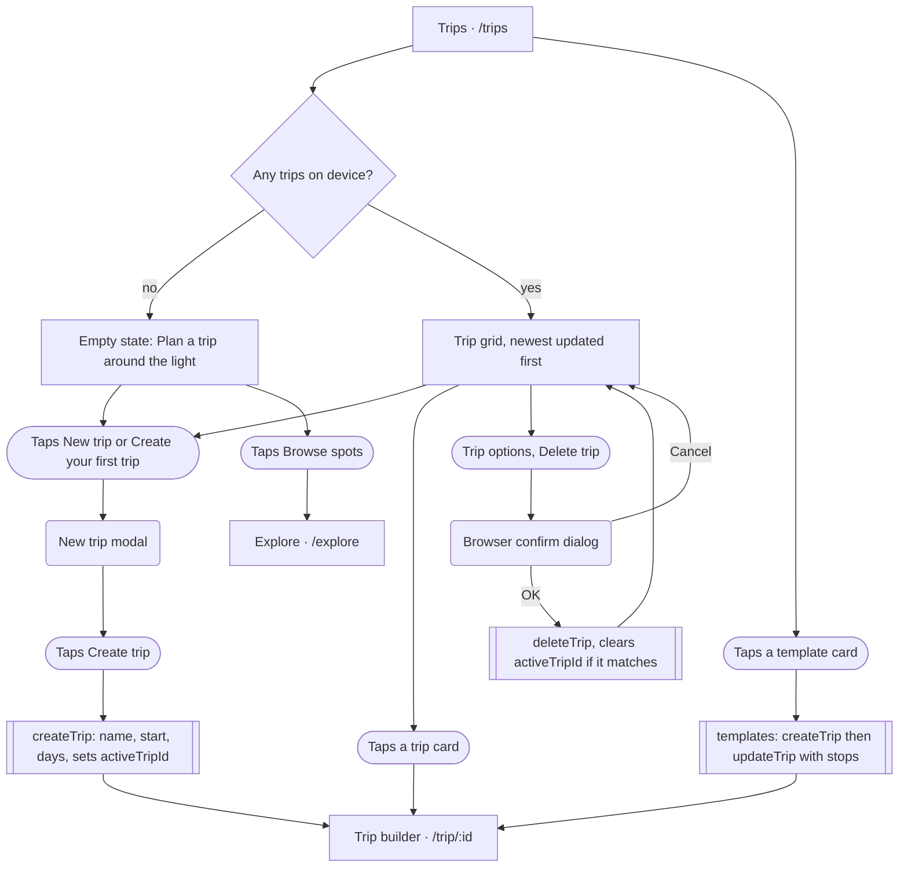
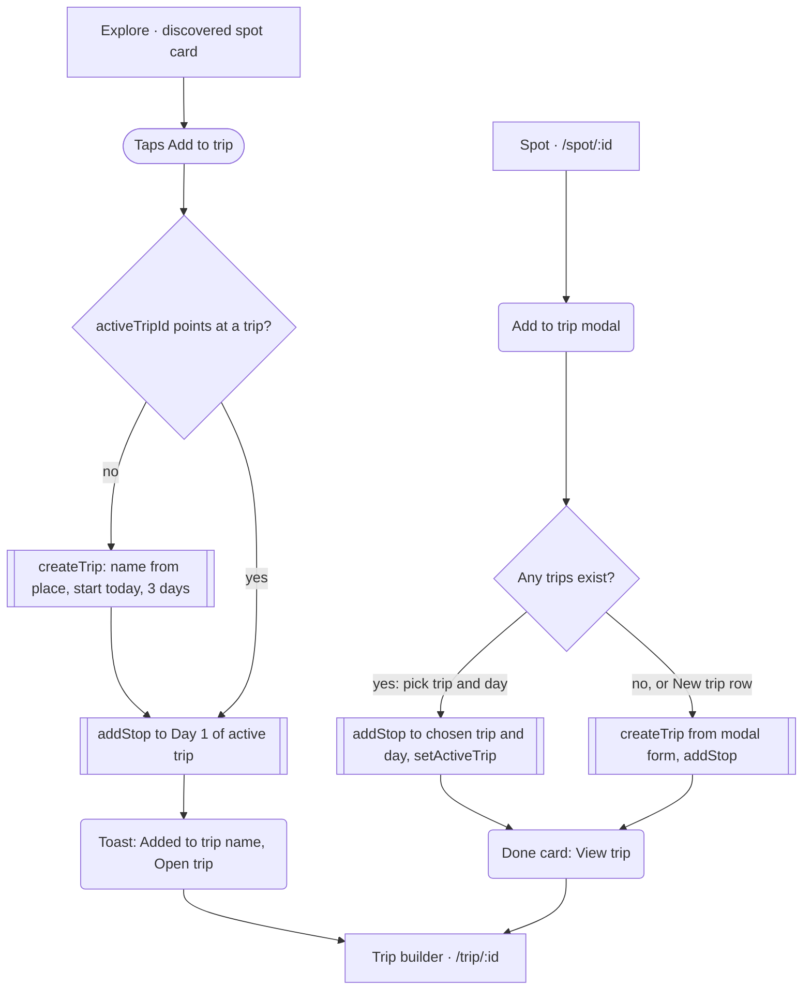

# 06 · Trips list and create trip

> The Trips page lists every trip stored on this device, and offers three ways to make one: the "New trip" form, a one-tap template, or an implicit trip created by "Add to trip" elsewhere in Iter.

## Goal
See existing trips, open one, delete one, or start a new one (blank or from a template) and land in the trip builder (see brief 07).

## Entry points
- Mobile bottom tab bar, "Trips" tab, to `/trips`: `src/components/layout/AppShell.tsx:11` (tab list), `:71` (`MobileTabBar`). Hidden at md+ (`md:hidden`, `:59`; mounted at `:105`).
- Desktop (md+, >=768px) top bar tab "Trips": same `APP_TABS`, `src/components/layout/AppShell.tsx:11`, rendered in `DesktopTopBar` (`:37`).
- Desktop top bar button "Plan a trip" (outline, map icon) links to `/trips`: `src/components/layout/AppShell.tsx:47`. It does not open the form; it only navigates to the list.
- Landing nav link "Trips": `src/components/landing/LandingNav.tsx:11` (`LINKS`), rendered at `:48`, hidden below `sm` (640px, `:47`).
- Landing final CTA button "Plan a trip" (outline) to `/trips`: `src/components/landing/FinalCta.tsx:37`.
- Landing footer link "Trips": `src/components/landing/LandingFooter.tsx:6`.
- TripBuilder "Back to trips" button in the Trip-not-found state, and desktop-only "All trips" ghost button: `src/pages/TripBuilder.tsx:42`, `:157`.
- Join page "Go to my trips": `src/pages/Join.tsx:83` (brief 08).
- Not entry points, but they create trips without visiting this page: Explore "Add to trip" on a discovered spot (`src/components/explore/useSpotActions.ts:30`) and the Spot page "Add to trip" modal "New trip" mode (`src/components/spot/AddToTripModal.tsx:186`). Covered in "Other ways a trip gets created" below.
- Empty states elsewhere: Saved page empty states link to `/explore`, not to Trips (`src/pages/Saved.tsx:33`, `:47`). No other empty state links to `/trips` in the current build.

## Preconditions
- Works fully offline; trips live in the zustand store persisted to localStorage `vantage.v1` (`src/store/index.ts`). First visit has `trips: []` (`src/store/index.ts:40`).
- Templates always show: both templates resolve against the built-in curated spots (all 7 Southwest Loop candidates and all 4 Eastern Sierra candidates exist in `src/data/spots.ts`), so they pass the `>= 2` stops filter (`src/pages/Trips.tsx:30`).
- Cover photos and the "Best light" line need network (Open-Meteo forecast via `useTripLight`, spot media via `useSpotMedia`); without it they degrade (see Screen states).

## Flow

Main Trips flow: list, create (form or template), open, delete.

Implicit creation paths that bypass the Trips page.

## Walkthrough

1. **Trips list (has trips)** · `/trips` · `src/pages/Trips.tsx:56`
   Header: overline "Your road trips", H1 "Trips", primary "New trip" button with a plus icon (`:60-63`). Below, a grid of `TripCard`s (1 column, 2 from `sm`, 3 from `lg`; `:80`), sorted by `updatedAt` descending (`:33`), so editing a trip floats it to the top. Below the grid, always, the "Start from a template" section (`:45-53`).
2. **Trip card** · `src/components/trip/TripCard.tsx:24`
   The whole card is a `Link` to `/trip/:id` (`:30`). Contents: 16:10 cover photo of the first stop's spot (`:32`; skeleton while loading, a Route icon on gradient as fallback, `src/components/trip/TripCover.tsx:25-35`), member avatar stack bottom-left and date chip bottom-right (`:35-36`, format "Oct 3 – 7" or "Oct 30 – Nov 2", `src/components/trip/tripUtils.ts:162`), a "..." Trip options button top-right (`:39`), then name (truncated), "N stops · N days" (`:51`) and a "Best light: Day N at Spot name" line with a score-coloured dot (`:55`). With no stops it reads "No stops yet — add a few to see the light" (`:58`).
   The options button sits in a wrapper that stops click propagation and default (`:38`), so opening the menu does not navigate.
3. **Delete trip** · `src/components/trip/TripCard.tsx:39-46`, `src/components/trip/PopoverMenu.tsx:31`
   The menu has one item, "Delete trip" (danger tone, trash icon). Selecting it calls the browser-native `confirm('Delete "<name>"?')` (`TripCard.tsx:44`); OK calls `deleteTrip` (`src/pages/Trips.tsx:81`, `src/store/index.ts:69`), Cancel does nothing. There is no undo and no toast. The menu closes on outside click, Escape, or selection.
4. **Trips list (empty)** · `src/pages/Trips.tsx:66-79`
   When `trips.length === 0`, the grid is replaced by `TripEmptyState` (sunken panel): title "Plan a trip around *the light*" (italic accent), body "Line up sunrises and sunsets across days, see the drive between each, and invite friends to plan with you.", primary large button "Create your first trip" (opens the same modal as "New trip", `:72`), outline large button "Browse spots" (navigates to `/explore`, `:73`), and three `FeatureCard`s: "Light per stop", "Real drive times", "Plan together" (`:13-17`, `src/components/trip/FeatureCard.tsx:31`). The "New trip" header button is still visible at the same time.
5. **New trip modal** · `src/components/trip/TripFormModal.tsx:27`
   Title "New trip" (mode create, `:46`). Fields:
   - "Trip name": text input, autofocused, placeholder "Utah in October", empty by default (`:48`).
   - "Start date": native date input, required, default tomorrow (`addDays(todayStr(), 1)`, `:29`). Clearing it is ignored (`:52`), so the date cannot become empty.
   - "Days": stepper, default 3, min 1, max 21 (`MAX_TRIP_DAYS`, `:11`; stepper `:59`).
   - Live summary line "<start> – <end> · N days" (`:63`).
   - Submit "Create trip" (full width, `:64`). Enter in the name field also submits (`<form onSubmit>`, `:47`).
   State resets to defaults every time the modal opens (`:31-37`).
   Mobile (<640px, the `sm` breakpoint the modal uses): bottom sheet with drag-handle look; from `sm` up, centred dialog (`src/components/ui/Modal.tsx:39,44-58`). Close via X, backdrop click, or Escape.
6. **Submit** · `src/pages/Trips.tsx:90`, `src/components/trip/TripFormModal.tsx:39-42`
   Validation is only normalisation: a blank name becomes "Untitled trip" (`:41`). There is no error state. `createTrip` builds the trip (random 10-char id, empty stops, the local user as `owner`, a 6-char uppercase `shareCode`), prepends it to `trips` and sets `activeTripId` to it (`src/store/index.ts:49-65`, line 63 for `activeTripId`). The modal closes and the app navigates to `/trip/:id` (brief 07).
7. **Template section** · `src/pages/Trips.tsx:45-53`, `src/components/trip/TripCard.tsx:74`
   Heading "Start from a template", sub "Classic routes, pre-timed for the best light. Edit everything after." Two horizontal cards, each: spot cover square, "Template" overline with sparkle icon, "<name> · N days", up to three place names joined by " · " (falling back to the blurb), and an underlined "Use" label. Mobile: stacked column; from `sm` a row that scrolls horizontally (`:48`).
   - Southwest Loop · 5 days, 7 stops (`src/components/trip/tripUtils.ts:184-194`).
   - Eastern Sierra · 3 days, 4 stops (`:197-205`).
8. **Use a template** · `src/pages/Trips.tsx:35-43`
   Tapping anywhere on the card calls `applyTemplate`: `createTrip({ name: template.name, startDate: tomorrow, days: template.days })` (`:37`), then `updateTrip` writes the resolved stops (each a random stop id, spot id, `day` clamped to the last day, and the template's session if any, `:38-41`), then navigates to `/trip/:id` (`:42`). No confirmation, no form: the user cannot rename or change dates before landing in the builder. Start date is always tomorrow (device local date plus one day). `activeTripId` is set by `createTrip`. The `busy` prop on `TemplateCard` exists but is never passed here, so there is no double-tap guard; two quick taps create two trips.

## Other ways a trip gets created (entry context)
- **Explore, discovered spot, "Add to trip"** (`src/components/explore/DiscoverCard.tsx:80-88`, handler `src/pages/Explore.tsx:165`, logic `src/components/explore/useSpotActions.ts:26-33`): adds the spot to the active trip's Day 1 with the spot's first `bestLight` as session; if there is no active trip it first creates one named "<place> light trip" (or "<first part of place> trip"), start date today (store default), 3 days. A toast "Added to <name>" with link "Open trip" appears. The button turns into disabled "In trip" when the spot is already in the active trip. Discovered spots are also saved into `customSpots` (`:27`).
- **Spot page "Add to trip"** (`src/components/spot/SpotActions.tsx:35,64` opens `AddToTripModal`, `src/pages/Spot.tsx:98,170`): modal titled "Add to trip" (pick existing trip and day, button "Add to Day N") or "New trip" (name, start date defaulting to the selected spot date, days; button "Create trip & add", `src/components/spot/AddToTripModal.tsx:125`). When there are no trips it opens directly in "New trip" mode (`:163`). Finishes with an "Added to trip" card with "Keep exploring" and "View trip" (`:131-140`). Existing-trip path calls `setActiveTrip` (`:182`); the new-trip path gets it from `createTrip`.

## Screen states

| Screen | Empty | Loading | Error | Offline / timeout | Success |
|---|---|---|---|---|---|
| Trips list | Panel with "Create your first trip" + "Browse spots" + 3 feature cards (`src/pages/Trips.tsx:66`) | None for the list itself (store is synchronous). Cover images show a shimmer skeleton (`src/components/trip/TripCover.tsx:31`); the Best light line is blank-then-filled once forecasts land (`TripCard.tsx:27`) | Not handled | Works from localStorage. Without network covers fall back to the Route icon and light uses sun geometry only | Grid of cards |
| Trip card | "No stops yet — add a few to see the light" (`TripCard.tsx:58`) | Cover skeleton | Not handled | Same as above | Card opens builder |
| Template section | Hidden if fewer than 1 template resolves (not reachable with curated data) (`Trips.tsx:45`) | None | Not handled | Same | Trip created, navigates |
| New trip modal | Blank name allowed (becomes "Untitled trip") | None | None; no validation messages. Date cannot be cleared; days clamped 1..21 | n/a (local only) | Closes, navigates to builder |
| Delete | n/a | None | Not handled | n/a | Card disappears, no toast |

## Data

| Data | Read / write | Where it lives | Notes |
|---|---|---|---|
| `trips` | R (list), W (create, delete) | zustand store, localStorage `vantage.v1` | Newest-updated first on this page; new trips are prepended in the store (`src/store/index.ts:63`) |
| `activeTripId` | W by `createTrip`; cleared by `deleteTrip` if it matches | same store | Determines the target of Explore "Add to trip" and the preselected trip in the Spot modal (`src/components/spot/AddToTripModal.tsx:164`) |
| `customSpots` / curated spots | R (`useAllSpots`) | store + `src/data/spots.ts` | Used for covers, templates and the best-light line |
| Template definitions | R | `TEMPLATES` in `src/components/trip/tripUtils.ts:182` | Hard-coded; candidate spot ids, first existing wins (`:208`) |
| Forecast for "Best light" | R | Open-Meteo via `fetchForecast`, `useForecasts` (`tripUtils.ts:58`) | One request per distinct spot location per card |
| Spot media (cover) | R | `useSpotMedia` (`src/lib/hooks.ts:28`), Wikipedia/other per that hook | Not read in detail for this brief |
| `shareCode` | W at create | trip object | Not shown on this page; first synced when the builder opens (brief 08) |
| Modal form values | R/W | component state | Lost on close |

## Not as it looks
- "Plan a trip" (desktop top bar and landing final CTA) does not start planning; it only opens the Trips list. The form is one more click away (`src/components/layout/AppShell.tsx:47`, `src/components/landing/FinalCta.tsx:37`).
- "Delete trip" only removes the local copy. Nothing calls the Worker to delete the shared KV record (no DELETE request exists in `src/lib/sync.ts` or `worker/`), so a deleted trip's invite code keeps working until the 90-day TTL, and a collaborator who still has it open can keep editing it.
- Deleting a trip also does not clear it from other devices: trips are per device unless joined by code.
- Template "Use" is a one-tap create-and-navigate; the section sub-copy "Edit everything after." is accurate, but it creates a real trip immediately and does not ask for dates.
- Template start date is fixed at tomorrow while the Explore-implicit trip starts today and the form defaults to tomorrow; three different defaults.
- The "Best light" line chooses the highest score among all stops using the stop's targeted window if any (`tripUtils.ts:135-142`); it does not mean "best day to go" in a forecast sense and it uses sun geometry only beyond the 7-day forecast, with no "est." marker on the card (the marker only exists in the builder).
- `TemplateCard`'s `busy` prop is wired in the component but unused by the page (`src/pages/Trips.tsx:51`).

## Tweak points

**Friction**
- Deleting uses a native browser `confirm()` that is unstyled and shows the raw trip name in straight quotes; every other destructive action in the app (e.g. removing a stop) has no confirm at all. `src/components/trip/TripCard.tsx:44`.
- The only way to delete is a small "..." button over the cover; there is no delete inside the builder and no rename or duplicate on the card. `src/components/trip/TripCard.tsx:39-46`.
- Templates are below the fold on desktop when there are 3+ trips, and the user cannot preview a template's stops before creating a trip; a mis-tap creates a trip that must then be deleted. `src/pages/Trips.tsx:45`, `:35`.
- Creating a trip asks for dates up front, but the date input has no min and allows past dates. `src/components/trip/TripFormModal.tsx:50-52`.
- Day stepper to 21 forces many taps for a long trip; no number entry. `src/components/trip/TripFormModal.tsx:59`.

**Dead ends**
- Empty-state secondary action "Browse spots" and the builder's "Explore spots" send the user to Explore with no path back to the just-started trip other than the Trips tab. `src/pages/Trips.tsx:73`.
- No Trips link from the Saved page empty states, so a user with saved spots is not nudged toward planning. `src/pages/Saved.tsx:33,47`.

**Missing states**
- No toast or confirmation after delete or create. `src/pages/Trips.tsx:81,90`.
- No error state if localStorage is full or blocked. Not handled.
- Trip cards show no sync/share status, so users cannot tell which trips are shared. `src/components/trip/TripCard.tsx:49-60`.

**Inconsistencies**
- Default start date differs by entry: form and templates use tomorrow, Explore implicit trip uses today (`src/store/index.ts:55` default via `todayStr()`), the Spot modal uses the spot's selected date (`src/components/spot/AddToTripModal.tsx:166`).
- Default trip names differ: blank becomes "Untitled trip", Explore uses "<place> light trip", the Spot modal pre-fills "<region> trip".
- Two parallel create forms exist with the same limits (1..21 days) but separate code: `TripFormModal` and `TripFields` (`src/components/spot/TripFields.tsx:14-15`).
- "Plan a trip" label appears on the desktop button and the landing CTA, while the primary on-page button says "New trip" and the empty state says "Create your first trip".

**Open design questions**
- Should "Plan a trip" open the New trip form directly, or stay a list link?
- Should templates ask for a start date (or default to the next weekend) rather than always tomorrow?
- Should deleting remove the shared copy, or at least warn that collaborators still have access?
- Should the Trips page expose the active trip concept (it silently drives "Add to trip" targets elsewhere)?
