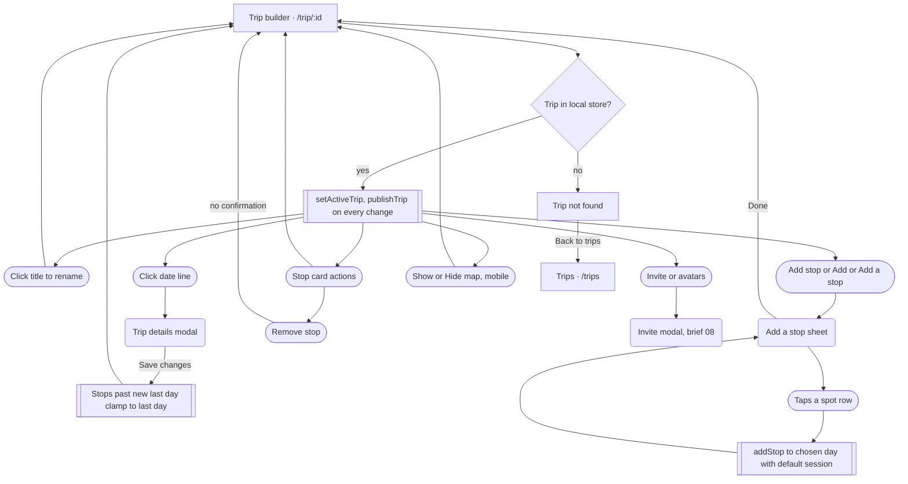
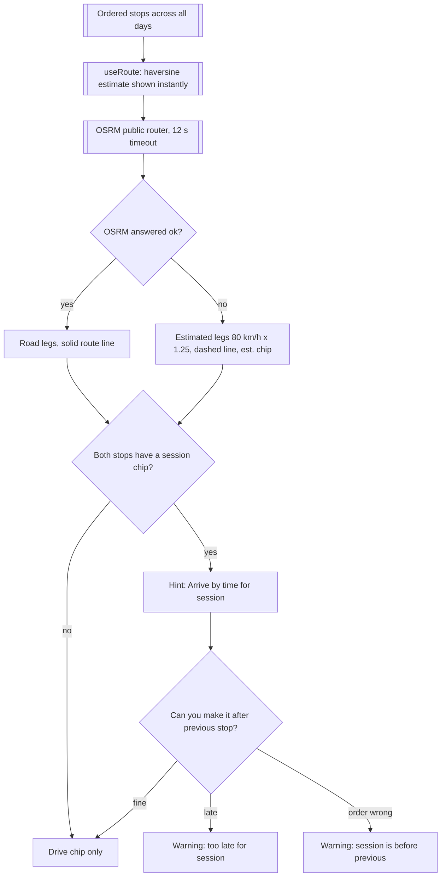

# 07 · Trip builder

> Build and edit a trip at `/trip/:id`: rename it, change dates and length, add spots per day, reorder them, pick a light session for each stop, read the drive times between stops, and watch it all on a map.

## Goal
Turn a list of spots into a day-by-day shooting itinerary that is feasible (drive times vs. light windows) and can be shared (sharing itself is brief 08).

## Entry points
- Trips list: tap a trip card (`src/components/trip/TripCard.tsx:30`), "New trip" form submit (`src/pages/Trips.tsx:90`), or a template card (`src/pages/Trips.tsx:42`). See brief 06.
- Explore toast after "Add to trip" on a discovered spot: "Added to <trip name>" with link "Open trip" (`src/pages/Explore.tsx:167`).
- Spot page "Add to trip" modal, final card "View trip" (`src/components/spot/AddToTripModal.tsx:139`).
- Join page after accepting an invite, or "Open ... on this device" (`src/pages/Join.tsx:64`, `:81`). Brief 08.
- Direct URL or reload of `/trip/:id` (state comes from localStorage).

How stops reach a trip without the builder (context):
- **Explore, discovered spot, "Add to trip"** (`src/components/explore/DiscoverCard.tsx:80-88`, logic `src/components/explore/useSpotActions.ts:26-33`): appends to Day 1 of the active trip (or creates one first), session = the spot's first `bestLight` value, skipped silently if the spot is already in that trip. Curated spots on Explore have no add-to-trip button (`src/components/explore/FloatingSpotCard.tsx:36`).
- **Spot page "Add to trip"** (`src/components/spot/SpotActions.tsx:35`, `:64`; modal `src/components/spot/AddToTripModal.tsx:147`): choose trip and day, or create a new trip; the day defaults to the day matching the date being viewed (`:172`); session = the best light window kind being viewed (`:177`). The same spot can be added twice (the modal only warns, `:110`).

## Preconditions
- A trip with this `id` exists in the local store (`src/pages/TripBuilder.tsx:32`). Otherwise the Trip-not-found screen shows.
- Network is optional. Without it: no map tiles (CARTO basemap), no OSRM road routing (falls back to estimates), no forecasts (light uses sun geometry, shown as "est."), no sync (badge says "Saved on device").
- Breakpoints used: `lg` = 1024px (`useMediaQuery`, `src/pages/TripBuilder.tsx:54`) switches map layout and the "All trips" button; `sm` = 640px toggles the header "Add stop" button; `md` = 768px for app chrome (desktop top bar vs. mobile tab bar) and stop-card action visibility.

## Flow

Builder overview: open, rename, edit basics, add stops, per-stop actions.

How drive segments, hints and warnings are decided (`src/pages/TripBuilder.tsx:286-306`).

## Walkthrough

1. **Open the builder** · `/trip/:id` · `src/pages/TripBuilder.tsx:30`, `:49`
   On mount the trip becomes the active trip (`setActiveTrip`, `:64`), which changes where Explore "Add to trip" sends spots. The trip is published to the Worker on every change to the trip or its custom spots (`publishTrip`, `:71`); that includes the first render, so merely opening a trip triggers a save (the "Saving..." chip appears briefly). A 20 s / on-focus pull of collaborators' edits runs while open (`:72-89`). Details in brief 08.
2. **Trip not found** · `src/pages/TripBuilder.tsx:34-45`
   Shown when the id is unknown (deleted, other device, mistyped URL). Plain tone, icon, title "Trip not found", body "It may have been deleted, or it lives on another device. Ask for an invite link to join it here.", one button "Back to trips". The page fits within AppShell (nav still visible). No attempt to look the id up on the server.
3. **Header: title, sync, dates, people** · `src/pages/TripBuilder.tsx:160-177`
   - Title (`EditableTitle`, `src/components/trip/TripHeader.tsx:21`): an H1 with tooltip "Click to rename". Click turns it into an input with a bottom border; Enter or blur commits, Escape cancels (`:26`, `:31`). A blank name or an unchanged name is discarded silently. Commit calls `updateTrip` (`TripBuilder.tsx:162`).
   - `SyncBadge` (`TripHeader.tsx:52-60`, placed `TripBuilder.tsx:163`): nothing while idle; "Saving..." with spinner; "Synced" with check; "Saved on device" with cloud-off icon and tooltip "Sharing works once deployed".
   - Date line (`:165`): a text button "<Oct 3 – 7> · N days" with a pencil icon; opens the edit modal (step 4).
   - Avatar stack (button, aria-label "Members", up to 5 shown) and outline "Invite" button both open the invite modal (`:170`, `:173`; brief 08).
   - "Add stop" primary small button, shown from `sm` (640px) up only (`:175`).
   - Desktop (`lg`, >=1024px): ghost "All trips" back button above the header navigates to `/trips` (`:157`, `hidden ... lg:inline-flex`). Below `lg` there is no back button on the page; users use the tab bar (mobile) or top-bar tabs (md+).
4. **Edit dates / days** · `src/pages/TripBuilder.tsx:274`, `:132-135`, `src/components/trip/TripFormModal.tsx:27`
   Modal "Trip details" with name, start date, days stepper (1 to 21), live range summary, button "Save changes". Pre-filled from the trip.
   - Changing the start date only changes the dates shown and the dates used for light and forecast. Stops keep their day numbers.
   - Reducing days: every stop whose day is past the new last day is moved onto the new last day (`:133`). They are not deleted and there is no warning or confirmation. They land after the existing stops of that day (ordering is by array index within a day, `src/components/trip/tripUtils.ts:50`). Raising the days again does not restore their old days.
   - Increasing days adds empty days.
   - Saving updates `updatedAt` (the trip moves to the top of the Trips list) and syncs.
5. **Trip summary tiles** · `src/pages/TripBuilder.tsx:180-191`, `src/components/trip/TripStat.tsx:8`
   Only when the trip has at least one stop. Three tiles: "Distance" (`N mi`, rounded, miles only), "Driving" (`2h 10m`, or an em dash when 0), "Best light" (`Day N`, sub-line the spot name, score-coloured dot). Distance and Driving dim to 50% opacity while road routing loads (`src/components/ui/StatTile.tsx:25`). Totals include the overnight legs between days (all legs of the single route, `:114`).
6. **Empty trip** · `src/pages/TripBuilder.tsx:194-202`
   With zero stops the days list is replaced by an empty state: title "Where's the first light?", body "Add spots to each day. We'll time the drive between them and score the light for every stop.", primary "Add a stop" (opens the sheet on Day 1) and outline "Explore spots" (navigates to `/explore`). No day headers are shown in this state, so you cannot add to a specific day except by using the day chips inside the sheet.
7. **Day sections** · `src/pages/TripBuilder.tsx:204-248`, `src/components/trip/DayHeader.tsx:20`
   One section per day (all days, empty or not, once the trip has any stop). `DayHeader` is sticky (top of viewport on mobile, below the nav at `lg`, `DayHeader.tsx:22`): colour dot (one of 10 day colours, cycles after 10, `tripUtils.ts:154`), "Day N · Sat, Oct 4", a one-line summary (`daySummary`, `TripBuilder.tsx:312-324`: e.g. "2h 10m driving · 96 mi · first light 6:52 AM · last light 7:41 PM", or the window name when only one stop has light data), and an outline "Add" button (opens the sheet pre-set to that day, `DayHeader.tsx:30`). The day's driving figure includes the leg arriving at its first stop, i.e. the overnight drive from the previous day.
   A day with no stops shows a dashed button "Nothing planned — add a stop" (`DayHeader.tsx:45`), which opens the sheet for that day.
8. **Add a stop sheet** · `src/components/trip/AddStopSheet.tsx:29`, mounted only while open (`src/pages/TripBuilder.tsx:273`)
   Modal titled "Add a stop" (bottom sheet below `sm`, centred dialog above, `src/components/ui/Modal.tsx`). Sticky top: search field (autofocused, placeholder "Search spots, parks, arches…", matches name, place, category, tags, case-insensitive substring, `:41`) and day chips "Day N Ddd" for every trip day (`:63-67`). Below, every spot in the app (curated plus the user's custom spots) as compact `SpotCard` rows with a "+" indicator (`:15-26`); no sorting by distance, light or relevance beyond the underlying list order. Light on the cards is for the selected day's date.
   - Tapping a row adds the spot immediately to the chosen day, appended after that day's existing stops, with `session` set to the spot's first `bestLight` if that is sunrise, sunset, blue hour or night, otherwise no session (`:44-55`, `tripUtils.ts:41`). The row's indicator turns to a solid check; the sheet stays open so several can be added.
   - Spots already in the trip get an "In trip" badge (`:23`, `:77`) but can still be added again (a second stop is created). Tapping an already-added row adds yet another.
   - Empty search result: icon, title `No spots match "<query>"`, body `Try a park, state or style like "arch" or "astro".` (`:72-74`).
   - Sticky footer button: "Done" or "Done · N added" (counts taps, including duplicates; `:83`). The X, backdrop and Escape also close; all clear the search and the added state.
   - No way to add a custom/AI spot from here; discovery lives on Explore.
9. **Stop card** · `src/components/trip/StopCard.tsx:55`
   Layout: thumbnail with a day-coloured number badge (1..N across the whole trip), spot name and place, three icon buttons, light readout, session chips, a footer row with a day select and "Add note".
   - Tap the card: selects it (border + shadow, map eases to its pin and highlights it, `TripBuilder.tsx:117`, `:227-231`). Selection does not open anything else and is lost on reload.
   - Icon buttons "Move up", "Move down", "Remove stop" (`:96-98`). Below `md` always at full strength; from `md` at 60% opacity until hover/focus (`:95`).
   - Move up/down: swaps within the day; at the first stop of a day "up" moves it to the end of the previous day, and at the last of a day "down" moves it to the start of the next day (`TripBuilder.tsx:122-131`). Up is disabled for the very first stop of Day 1; down for the last stop of the last day (`:229-230`). There is no drag and drop.
   - **Remove stop: immediate, no confirmation, no undo, no toast** (`TripBuilder.tsx:235` calls `removeStop`).
   - Light readout: score-coloured dot, window text such as "Golden hour 6:52–7:41 PM" (`tripUtils.ts:111`), "· 87", and a small "est." when the date is beyond the 7-day forecast (tooltip "Beyond the 7-day forecast — scored on sun geometry only", `:108`). Without a chosen session the readout shows the day's best window. With a session chosen, "Be set up by 6:52 PM" appears (`:114`): sunrise and sunset anchor 45 min before the window end, golden AM / blue hour 15 min before the start, night 30 min (`tripUtils.ts:98-104`).
   - Session chips (`StopCard.tsx:18`): "Sunrise", "Golden AM", "Sunset", "Blue hour", "Night". Tap to select, tap the active chip again to clear (`:22`). Changing it re-scores the card and the drive hints.
   - "Move to day" select, options "Day N · Sat, Oct 4" (`:126-133`). Moving puts the stop at the end of the target day (`TripBuilder.tsx:234`, index 999).
   - "Add note" reveals a textarea (placeholder "Parking, lens, who's driving, backup plan…"). The note is saved on blur, not on typing (`:143`); a note that already exists opens automatically.
   - If the spot id no longer resolves, the card is a dashed box: "This spot isn't in your catalogue anymore." with a ghost "Remove" button (`:63-69`). This is the only fallback for spots that a collaborator added but whose data did not arrive.
10. **Drive segments** · `src/components/trip/StopCard.tsx:167`, logic `src/pages/TripBuilder.tsx:286-306`
    Between every pair of consecutive stops (including across days), on a dotted rail:
    - Chip "2h 10m · 96 mi" with a car icon. A tiny "est." follows when that leg is estimated and routing is done; a spinner "Routing" shows while the road router is loading; an em dash if the leg is missing (`StopCard.tsx:173-174`).
    - "overnight" label when it is the first stop of a later day (`:176`).
    - Hint "Arrive by 6:52 AM for sunset" when the arriving stop has a session chosen (`TripBuilder.tsx:293`).
    - Warning (gold text with triangle) only when both the previous and the next stop have a session chosen:
      `"<Session> at <Spot B> is before <session> at <Spot A> — move one to another day."` when B's arrive-by is earlier than A's finish; or
      `"Leaving after <session>, you'd reach <Spot B> around 8:15 PM — 25m too late for <session>."` when departure plus drive misses B's arrive-by (`:299-302`).
    - Routing source (`src/lib/routing.ts`): the instant estimate (straight-line x 1.25 at 80 km/h) is shown first, then replaced with OSRM public demo router results (`:19`, `:81-92`), 12 s timeout (`:47`). Any failure silently falls back to the estimate for the whole route and marks it estimated. Results are cached in memory per coordinate set (`:25`).
    - Footnote when estimated and routing is done: "Drive times are straight-line estimates at 80 km/h — the road router didn't respond." (`TripBuilder.tsx:251-253`).
11. **Map** · `src/components/trip/TripMap.tsx:27`, `src/pages/TripBuilder.tsx:137-139`
    CARTO Positron basemap, numbered day-coloured pins, route line (solid when from OSRM, dashed when estimated, `:54`, `:69`), zoom +/- buttons top-right (`TripMapControls`). Fits to all pins with 60px padding (max zoom 10); a single stop flies to zoom 8 (`:97-102`). Tapping a pin selects the stop, scrolls its card to the centre (`select(id, true)`), and opens a popup with the name and "Day N · Session" (`:94`). If the trip has no stops the map stays at a US-wide view.
    - Desktop (`lg`, >=1024px): two columns; the map is a sticky right column (46% width, 50% at `xl`) with a `DayLegend` chip row bottom-left listing the days in use (hidden if fewer than two days have stops, `DayLegend.tsx:9`). `src/pages/TripBuilder.tsx:142`, `:257-263`.
    - Mobile (<1024px): map on top, 40vh tall, then the itinerary. A floating outline button "Hide map" (chevron up) straddles its bottom edge; after hiding, the button reads "Show map" and sits in the page (`:144-153`). Hiding unmounts the map (`mapOpen && map`, `:146`), so showing it again rebuilds it and re-fits the pins. No day legend on mobile.
    - Crossing 1024px (rotating a tablet, resizing) swaps which branch renders (`:144` vs `:257`) and therefore remounts the map.
12. **Sticky action bar (mobile)** · `src/pages/TripBuilder.tsx:267-270`, `src/components/trip/StickyActionBar.tsx:16`
    Fixed above the mobile tab bar, gradient background, hidden at `lg` (`className="lg:hidden"`). Large primary "Add stop" (opens the sheet on Day 1) and outline "Invite". Between `sm` and `lg` the header "Add stop" button and this bar's button are both visible. Content has bottom padding 8rem to clear the bar (`:156`).

## Screen states

| Screen | Empty | Loading | Error | Offline / timeout | Success |
|---|---|---|---|---|---|
| Builder (no stops) | "Where's the first light?" with Add a stop / Explore spots (`TripBuilder.tsx:194`) | Not applicable (store is sync) | Not handled | Works | n/a |
| Trip not found | The whole screen is this state (`:34`) | None | Not handled | Same | n/a |
| Stop card | Missing-spot card with "Remove" (`StopCard.tsx:63`) | Skeleton for light exists (`:111`) but light is computed synchronously for every resolvable spot, so it is effectively never shown | Not handled | Light falls back to sun geometry with "est." | Light readout + chips |
| Drive segment | Em dash when leg missing (`StopCard.tsx:173`) | Spinner "Routing" and dimmed totals (`:174`) | Silent fallback to estimates | After 12 s abort falls back to estimates, footnote shown (`TripBuilder.tsx:251`) | Road times |
| Map | Default US view, no pins | Blank grey (`bg-surface-muted`) until tiles arrive | Not handled (no message if tiles or style fail) | Blank/grey map, pins and route still drawn once the style loads (not verified offline) | Pins + route |
| Add a stop sheet | `No spots match "<q>"` (`AddStopSheet.tsx:72`) | None | Not handled | Works; light on cards may be estimate | Row indicator turns to check; "Done · N added" |
| Edit basics modal | n/a | None | No validation errors; a blank name becomes "Untitled trip" (`TripFormModal.tsx:41`) | n/a | Closes, list re-renders |
| Header sync badge | Hidden when idle | "Saving..." | "Saved on device" (any PUT failure) | Same as error | "Synced" |

## Data

| Data | Read / write | Where it lives | Notes |
|---|---|---|---|
| Trip (name, startDate, days, stops, members, shareCode) | R/W | zustand store, localStorage `vantage.v1` | `updateTrip`, `addStop`, `removeStop`, `updateStop`, `moveStop` in `src/store/index.ts:66-107`; every write bumps `updatedAt` |
| `activeTripId` | W on open | same store | `setActiveTrip` at `TripBuilder.tsx:64` |
| Selected stop, sheet open/day, edit modal open, map open, note draft | R/W | component state | Lost on navigation/reload; map open defaults to true |
| Trip sync (PUT, 20 s pull, focus pull) | R/W | Cloudflare KV via `/api/trips/:shareCode` | `src/lib/sync.ts`, brief 08. Debounce 900 ms (`sync.ts:12`) |
| Custom spots for stops | R/W | store `customSpots`, sent along in the PUT, merged on pull | `TripBuilder.tsx:67-80` |
| Forecast per stop | R | Open-Meteo via `useForecasts` (`tripUtils.ts:58`) | 7-day horizon; one request per distinct location |
| Light windows and scores | R | computed from sun geometry + forecast (`src/lib/light.ts`) | `stopLight`, `tripUtils.ts:89` |
| Driving legs and route geometry | R | OSRM public demo router, in-memory cache | `src/lib/routing.ts`; fallback estimate 80 km/h x 1.25 |
| Map tiles | R | CARTO Positron style `basemaps.cartocdn.com` | `TripMap.tsx:18`; no key |
| Spot photos | R | `useSpotMedia` (`src/lib/hooks.ts:28`) | Thumb used on stop cards |

## Not as it looks
- Opening a trip uploads it. The sync effect fires on mount, so just viewing a trip creates or refreshes the shared copy and shows "Saving..." (`src/pages/TripBuilder.tsx:71`; `src/lib/sync.ts:23` skips only if the identical body was already sent this session).
- "Saved on device" is the offline badge for any failure of the PUT, including a local dev server without the Worker. The tooltip "Sharing works once deployed" is the only explanation (`TripHeader.tsx:55`).
- The default session in the Add stop sheet never produces "Golden AM": `defaultSession` returns only sunrise, sunset, blue-hour or night, so the follow-up patch that would set the Golden AM flag is dead code (`src/components/trip/AddStopSheet.tsx:49-53`; `tripUtils.ts:41`). Golden AM can only be chosen by tapping the chip.
- Stops added from Explore get the spot's raw first `bestLight` as session (`useSpotActions.ts:31`), which can be "midday" or "overcast"; those values map to no chip, so the card shows no selected session and no arrive-by hint (`tripUtils.ts:24-32`).
- Day-length reduction does not delete stops; it piles them onto the last day, silently (`TripBuilder.tsx:133`).
- Warnings are only produced when both stops have a session chip. Two untagged stops 8 hours apart show no warning, and the arrive-by hint appears only on the arriving stop's segment.
- Warnings compare absolute times, so for stops on different days they will effectively never fire; they are same-day checks in practice. (Inferred from the date arithmetic at `TripBuilder.tsx:295-303`.)
- The estimate footnote says "straight-line estimates at 80 km/h" but the estimate multiplies distance by 1.25 for road wandering (`src/lib/routing.ts:22`).
- The loading skeleton on a stop's light readout (`StopCard.tsx:111`) is not reachable in practice.
- "Add stop" in the header and "Add" on each day header both exist; the header one always targets Day 1.
- With the map hidden on mobile, selecting a stop card only changes its border; there are no pins to highlight.
- Distances are miles only, with no unit setting (`TripBuilder.tsx:182`, `src/lib/utils.ts:33`).

## Tweak points

**Friction**
- Remove stop has no confirm and no undo; one mis-tap on the trash icon next to the move arrows (60% opacity until hover from `md`) loses the stop and its note. `src/pages/TripBuilder.tsx:235`, `src/components/trip/StopCard.tsx:98`.
- Reordering is arrow-only and moves one position at a time; moving a stop across days by arrows is possible but not discoverable, and the day select appends to the end. `TripBuilder.tsx:122-131`, `:234`.
- Add stop sheet: a long unsorted list of every spot, no filter by region or "near this trip", no sort by light for the chosen day, and it re-adds duplicates. `src/components/trip/AddStopSheet.tsx:39-43`, `:75-79`.
- Adding from the header or empty state always targets Day 1; users must change chips each time. `TripBuilder.tsx:175`, `:200`, `:268`.
- The note is only saved on blur; tapping the day select or leaving the page mid-typing can lose it. `StopCard.tsx:143`.
- Dates and days are edited by clicking a small text line with a faint pencil; discoverability is low. `TripBuilder.tsx:165-168`.
- No back affordance on mobile and tablet below 1024px except the tab bar. `TripBuilder.tsx:157`.

**Dead ends**
- Trip not found offers only "Back to trips"; there is no field to paste an invite code. `TripBuilder.tsx:42`.
- Empty trip: "Explore spots" leaves the builder with no easy way to return to adding to this trip other than the active-trip behaviour. `TripBuilder.tsx:201`.
- Custom/AI spots cannot be added from the builder at all. `AddStopSheet.tsx:29`.

**Missing states**
- No confirmation or toast for remove, date shrink, or trip edits; no undo anywhere. `TripBuilder.tsx:132-135`.
- Map has no error or offline message when tiles fail. `TripMap.tsx:47`.
- No warning for days with no stops, or for a day that is over-packed (only per-pair timing warnings). `TripBuilder.tsx:286`.
- No conflict message when a collaborator's pull replaces local changes. `TripBuilder.tsx:78-82`.
- No "est." marker on the trip-level "Best light" tile or Best light line when the forecast is missing. `TripBuilder.tsx:184-189`.

**Inconsistencies**
- Three different breakpoints in one screen: `sm` for the header add button, `md` for stop-card action opacity, `lg` for layout and back button. `TripBuilder.tsx:54`, `:175`, `:157`; `StopCard.tsx:95`.
- Two add entry points on mid-size screens (header and sticky bar). `TripBuilder.tsx:175`, `:268`.
- Drive times: miles shown but OSRM data in km and the estimate copy says km/h. `TripBuilder.tsx:252`.
- "Move to day" appends to the end while the day-picker in the Add sheet also appends, but arrow moves across days insert at start/end by direction, producing different ordering rules. `TripBuilder.tsx:234`, `:125`, `:130`.
- Desktop shows the day legend and mobile does not, though pins are coloured by day on both. `TripBuilder.tsx:261`.

**Open design questions**
- Should shrinking days ask the user what to do with the displaced stops?
- Should session choice be a required step (it unlocks hints and warnings), or inferred more often?
- Should arrows give way to drag and drop?
- Should the sync badge be tied to a visible "Share" status for people who never open Invite?
- Should the map persist across the Show/Hide toggle instead of remounting?
