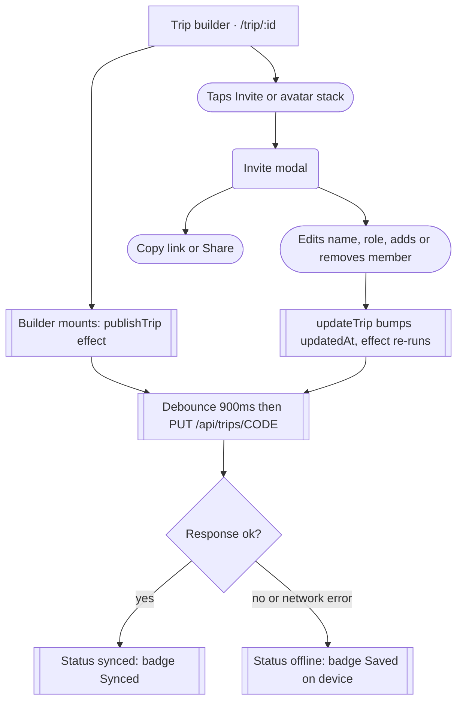
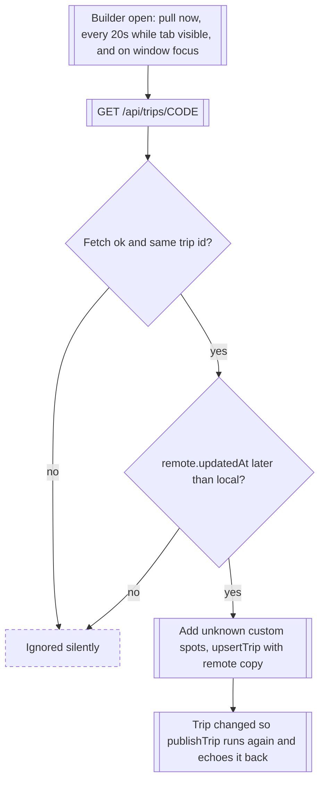

# 08 · Invite and sync

> The trip owner opens the Invite modal in the trip builder, copies or shares a `/join/CODE` link, and the builder quietly mirrors the trip to Cloudflare KV so other devices can fetch it and keep pulling edits.

## Goal
Share a trip with friends so they can see and edit the same itinerary without accounts, and keep every device's copy roughly in step.

## Entry points
- `/trip/:id` header: avatar stack button (aria-label "Members") opens the modal. `src/pages/TripBuilder.tsx:170`
- `/trip/:id` header: "Invite" outline button, all widths. `src/pages/TripBuilder.tsx:173`
- `/trip/:id` mobile sticky bar: "Invite" button, shown below the `lg` breakpoint (1024px, `lg:hidden`). `src/pages/TripBuilder.tsx:269`
- No invite control exists on `/trips` (TripCard), the spot page, or anywhere outside the builder. Grep of `InviteModal` finds a single usage: `src/pages/TripBuilder.tsx:272`.

## Preconditions
- A trip exists in the local store and the builder is open on it (the modal is rendered inside `Builder`, `src/pages/TripBuilder.tsx:272`).
- For the link to resolve for anyone else: the Worker with KV is reachable at `/api/trips/*` (production, or `wrangler dev` on :8787 behind the Vite proxy, `vite.config.ts:10`).
- QR image needs the internet (third-party host `api.qrserver.com`, `src/components/trip/InviteModal.tsx:146`).

## Flow

Publishing starts when the builder mounts and repeats after every trip change, independent of whether the modal is ever opened.

Pull replaces the whole local trip; there is no merge, and failures never surface in the UI.

## Walkthrough
1. **Trip builder header** · `/trip/:id` · `src/pages/TripBuilder.tsx:160-177`
   Owner sees the title with a SyncBadge at its right (`:163`), the date line, then the avatar stack and "Invite" button. On mount a publish is scheduled (`:71`), so within about 1 second the badge goes "Saving…" then "Synced" (or "Saved on device" if the PUT failed). Mobile (<1024px): an extra "Invite" button sits in the sticky bottom bar (`:269`). Desktop (>=1024px): only the header buttons.

2. **Invite modal** · `/trip/:id` (modal) · `src/components/trip/InviteModal.tsx:139`
   Title "Invite friends", subtitle "Anyone with the link can join and plan with you." (`:140`). Closing returns to the builder; nothing is committed on close.

3. **Link block** · `src/components/trip/InviteModal.tsx:143-157`
   - QR code 96px of the link, alt "QR code for the invite link" (`:146`).
   - Read-only field "Invite link" holding `{window.location.origin}/join/{shareCode}` (`:100`); focus selects all (`:28`).
   - "Copy link" button: writes to clipboard, falls back to `execCommand('copy')` on the selected field, then shows "Copied" with a check for 1800ms (`:109-118`, button label `:32`). The "Copied" state shows even if both copy methods fail, because `setCopied(true)` runs regardless.
   - "Share" outline button: only rendered when `navigator.share` exists (`:105`, `:33`). Typically iOS/Android and Safari; absent on most desktop Chrome/Firefox. Shares title = trip name, text = `Join my photo trip "NAME" on Vantage` (`:120`), url = link. Cancel is swallowed.
   - Caption "Code ABC123" in widely tracked letters (`:153`). When sync state is `offline`, it appends " · link goes live once deployed".

4. **Your name** · `src/components/trip/InviteModal.tsx:159-165`
   Input label "Your name", hint "Shown to everyone on this trip. No account needed.", placeholder "e.g. Alex Rivera". Starts empty if the user is still the default 'You' (`:103`). Saves on blur, Enter, or the "Save" button (disabled when empty or unchanged). Effect: `setUserName(n)` (global user) and, if the user is a member of this trip, that member's `name` and `initials` are updated on this trip only (`:122-127`). Other local trips keep the old name until the user saves it again while they are open.

5. **On this trip** · `src/components/trip/InviteModal.tsx:167-181`
   Heading "On this trip" plus a count ("1 person" / "n people"). Each row: avatar, name (with " (you)" for the local user), a role hint line ("Full control" owner, "Can edit stops" editor, "Can view" viewer, `:10`).
   - If the viewer is the owner (or not a member at all, `:107`) every non-owner row has a role select (Editor / Viewer) and an "x" remove button labelled "Remove NAME" (`:70-72`). The owner row and all rows seen by a non-owner show read-only capitalised role text (`:74`).
   - Role change: `updateTrip` with the new member list (`:128`). Remove: `removeMember` then a redundant empty `updateTrip` (`:136`). Both bump `updatedAt` and so trigger a publish.
   - No confirmation on remove.

6. **Add by name** · `src/components/trip/InviteModal.tsx:183-190`
   Input "Add someone by name" with hint "For friends who aren't on Vantage yet — they'll show up on the plan." and an "Add" button (Enter also works). Calls `addMember(trip.id, name, 'editor')` (`:130-135`, store `src/store/index.ts:100`). This creates a **local placeholder person**: a new random id, the next colour, role editor. No invitation, message, or link is generated for them; nobody can later "claim" that row. It is a name chip on the plan, synced as part of `members` to anyone who has the trip. Note the hint is not wrong, but "invite" in the modal title and this field read as if it sends something.

7. **Background sync while the builder stays open** · `src/pages/TripBuilder.tsx:66-89`
   - Push: `publishTrip(trip, customSpots)` fires on every change to `trip` or its custom spots (`:71`). It is debounced 900ms (`src/lib/sync.ts:11`), skipped if the JSON body equals the last successfully sent body (`:27`). Status shows Saving then Synced or Saved on device.
   - Pull: runs once on mount, every 20s only when the tab is visible (`:86`), and on window `focus` (`:87`). It replaces the local trip when `remote.id === local.id` and `remote.updatedAt > local.updatedAt` (string comparison of ISO timestamps, `:78`). Custom spots in the payload are added to the local store first (`:79-80`). Errors are swallowed (`:83`).

## Sync facts, stated plainly
- **When is a trip first uploaded?** The first time the builder is opened for it. The only upload calls are `publishTrip` in `src/pages/TripBuilder.tsx:71` (builder mount) and `publishTripNow` in `src/pages/Join.tsx:63` (joining). Creating a trip (`createTrip`, `src/store/index.ts:49`), adding stops from Explore/Spot (`src/components/explore/useSpotActions.ts:30`, `src/components/spot/AddToTripModal.tsx:186`) or using a template do not touch KV; if the user ends up in the builder, upload happens then.
- **Created and shared before opening the builder?** Not reachable through the UI: the link and QR only exist inside the builder's modal, and the builder uploads on mount. Someone who reconstructs the link by hand (code from `localStorage`) before the builder was ever opened would get "Invite not found" (404 JSON) on the recipient side. Also relevant: the upload is skipped for any trip whose builder is never opened, even if it has stops.
- **First-open race:** the first upload is delayed 900ms, so a link copied and opened within that window can 404.
- **Deleting a trip locally:** `deleteTrip` only filters the local array (`src/store/index.ts:69`; invoked from `src/components/trip/TripCard.tsx:44` after a `confirm()`; also `src/pages/Trips.tsx:81`). Nothing is sent to the Worker. The KV entry survives until its TTL lapses, the link keeps working for others, and the deleter can even re-join via the old link. The Worker exposes no DELETE (`worker/trips.ts:42` returns 405 for anything but GET/HEAD/PUT/POST).
- **TTL:** 90 days (`worker/trips.ts:9`), reset on every successful PUT (`:38`). Reads do not extend it. A trip nobody has had open for 90 days expires and becomes "Invite not found"; reopening the builder re-creates it from the local copy.
- **Size limit:** 512 KB measured with `text.length` (characters, not bytes) (`worker/trips.ts:10`, `:31`). Also max 200 stops and 100 members (`:52-53`). Violations return 413/400; the client treats any non-OK as `offline` and shows "Saved on device" with no reason (`src/lib/sync.ts:37`).
- **Share code:** 6 characters from the alphabet `abcdefghijkmnpqrstuvwxyz23456789` (32 characters, no `l o 0 1`), upper-cased (`src/lib/utils.ts:4-14`), about 1.07 billion combinations. Worker accepts `[A-Z0-9]{4,16}` (`worker/trips.ts:11`). Example: `K7P2QX`. KV key is `trip:CODE` (`:19`).
- **Auth:** none. Anyone who knows or guesses a code can GET it or PUT over it. The Worker does not check ownership, trip id, or `updatedAt` on write (`worker/trips.ts:29-39`); it only checks the body shape and that `shareCode`, if present, matches the URL.
- **Conflicts (two people editing at once):** whole-document, last PUT to arrive wins. Each editor's change is pushed 900ms after their edit as the full trip. Each client then pulls and adopts the remote copy only if its `updatedAt` is newer than local. Practical results: (a) if A edits stop 1 and B edits stop 2 within the same ~20s window, whichever PUT lands second overwrites the other's change at KV; the loser then sees the winner's version after the next pull and their edit is gone with no notice; (b) a pull can overwrite local edits made in the last <900ms before they were pushed; (c) ordering depends on device clocks because `updatedAt` is set client-side (`src/store/index.ts:67`); (d) a stale device opening the builder pushes its old copy after 900ms unless its mount-time pull returns first and cancels the timer; the pull-then-upsert path happens to avoid that in the common case, but a pull slower than 900ms lets the stale copy win at KV. "Last-write-wins by updatedAt" is true only for the client's pull; the server is plain last-arrival-wins.
- **Roles are labels only.** Nothing in the codebase gates editing on `role` (grep for `.role` finds only InviteModal and types). A "Viewer" can still add, move and delete stops, rename the trip, and open the same Invite modal. Only the owner sees role selects and remove buttons, and that is purely UI.
- **Remove member does not revoke anything.** The removed person's device still holds the trip, and the link still works for them or anyone else.

## Screen states
| Screen | Empty | Loading | Error | Offline / timeout | Success |
|---|---|---|---|---|---|
| Invite modal link/QR | Always has a code | QR image lazy-loads (`loading="lazy"`, `:147`), no placeholder | QR image fails: broken image with alt text; nothing else changes | Caption gains " · link goes live once deployed" only when sync state is `offline` (`:153`) | "Copied" for 1800ms (`:116-117`) |
| Invite modal members | Never empty (owner row exists) | None | No validation errors; empty or whitespace names disable the buttons | None | Row appears or disappears instantly |
| SyncBadge (`src/components/trip/TripHeader.tsx:52`) | `idle`: renders nothing | "Saving…" with spinner | Not distinguished from offline (400, 413, 500 all look the same) | "Saved on device" with cloud-off icon; tooltip (`title`) "Sharing works once deployed" on hover only (`:55`) | "Synced" with check; stays until the next change |
| Pull | n/a | No indicator | Silent (`TripBuilder.tsx:83`) | Silent | Itinerary changes under the user with no toast or highlight |

## Data
| Data | Read / write | Where it lives | Notes |
|---|---|---|---|
| `trip.shareCode` | Write at creation | Zustand `vantage.v1` (`src/store/index.ts:59`) | Never regenerated; no "revoke link" |
| Trip JSON incl. members, stops, custom spots | PUT (debounced) / GET | KV `trip:CODE`, 90 day TTL refreshed on PUT | Adds `syncedAt` server-side; client strips `spots` and `syncedAt` on pull (`TripBuilder.tsx:81`) |
| Sync status per trip | Write by sync module | In-memory module state (`src/lib/sync.ts:12-15`) | Lost on reload; `idle` until first publish; `lastSent` also in memory so each page load re-PUTs once |
| User name | Write (`setUserName`) | Zustand `vantage.v1` `user.name` | Default 'You' |
| Members | Write (`addMember`, `removeMember`, `updateTrip`) | `trip.members`, synced | Placeholder members have random ids |
| Copied flag | Local | Component state | Resets on close |
| QR image | Read | api.qrserver.com | Sends the invite link (a secret-ish capability) to a third party |

## Not as it looks
- "Invite friends" and "Add someone by name" suggest a real invitation; Add by name only inserts a local name row. No notification, no claim flow.
- "Viewer" role and "Can view" hint are not enforced anywhere.
- "Remove" does not revoke access; the link stays valid for everyone.
- "Synced" means the last PUT succeeded, not that anyone else has the changes.
- Deleting a trip locally leaves the shared copy live in KV for up to 90 days.
- The offline tooltip and modal caption say "Sharing works once deployed" / "link goes live once deployed": dev wording shown to production users whenever any PUT fails (network drop, 413, 400).
- The Copy button's "Copied" state is shown even if neither copy method worked.
- Share-sheet text and the Add-by-name hint still say "Vantage" (rename leftovers).

## Tweak points
**Friction**
- Owner must open the builder before the link works and there is no feedback that "the link is live" (only the small Synced badge, hidden while `idle`). Consider disabling Copy/Share until the first successful PUT. `src/components/trip/InviteModal.tsx:32`, `src/lib/sync.ts:39`
- Invite is reachable only from inside the builder; a trip card on `/trips` has no Share action. `src/components/trip/TripCard.tsx`
- Name field saves on blur, Enter, and a Save button; three paths, no "Saved" confirmation. `src/components/trip/InviteModal.tsx:159-165`
- Remove member has no confirm and no undo. `src/components/trip/InviteModal.tsx:136`

**Dead ends**
- Failed sync shows only "Saved on device" with no retry button or reason. `src/components/trip/TripHeader.tsx:58`
- No way to unshare, regenerate a code, or delete the shared copy. `worker/trips.ts:42`

**Missing states**
- No indicator when a pull replaces your itinerary, and no conflict warning. `src/pages/TripBuilder.tsx:82`
- QR has no loading or error fallback. `src/components/trip/InviteModal.tsx:146`
- No copy-failure state. `src/components/trip/InviteModal.tsx:116`
- No indication that a 413 (too large) is the cause of "Saved on device". `worker/trips.ts:31`

**Inconsistencies**
- Roles are shown and editable but never enforced. `src/components/trip/InviteModal.tsx:128`
- "Vantage" rename leftovers: share text `src/components/trip/InviteModal.tsx:120`, hint `:186`.
- Dev-oriented copy in production: `src/components/trip/InviteModal.tsx:153`, `src/components/trip/TripHeader.tsx:55`.
- Conflict handling is described as last-write-wins by `updatedAt`, but only the client pull compares it; the server does not. `src/pages/TripBuilder.tsx:78`, `worker/trips.ts:29`

**Open design questions**
- Should "Add by name" people be claimable when someone joins with the same name, so the joiner does not appear twice?
- Should viewers actually be read-only, and should the owner see who is currently online?
- Should the modal state the link has no password and grants editing to anyone who has it?
