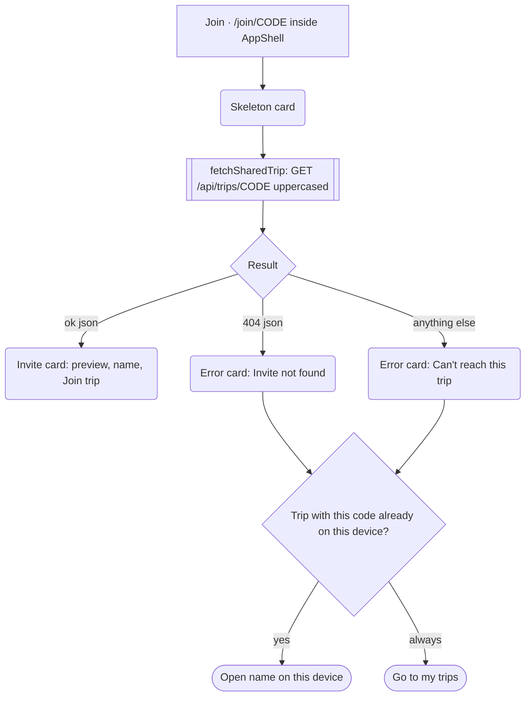
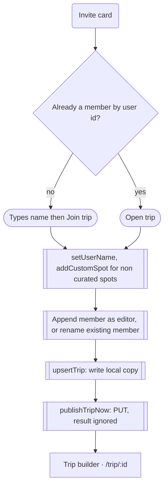

# 09 · Join a shared trip

> A recipient opens an Iter invite link (`/join/CODE`), sees a preview card fetched from KV, enters a name, and lands in their own local copy of the trip at `/trip/:id`.

## Goal
Get a friend from a pasted link into the shared itinerary with no account and no setup.

## Entry points
- Invite link or QR scan produced by the Invite modal: `{origin}/join/{CODE}` (`src/components/trip/InviteModal.tsx:100`). Route registered at `src/main.tsx:36`.
- Native share sheet text from the owner (`src/components/trip/InviteModal.tsx:120`), which carries the same URL.
- Nothing inside the app links to `/join/:code`; it is reached only by URL.

## Preconditions
- The owner has opened the trip builder at least once, so the trip exists in KV under `trip:CODE` (see doc 08).
- Network reachable to `/api/trips/CODE`. The route is a normal AppShell child, so the shell renders around it (`src/main.tsx:29-37`).
- The recipient may have a brand-new browser: empty `trips`, `customSpots`, `savedSpotIds`, and `user = { id: random, name: 'You', color: first member colour }` (`src/store/index.ts:37-41`).

## Flow

The loading skeleton is shown until the fetch settles; both error variants share the same two exits.

Joining writes locally first, pushes once, and navigates whether or not the push succeeded.

## Walkthrough
1. **Join page shell** · `/join/:code` · `src/pages/Join.tsx:68-69`
   Recipient lands directly inside AppShell: desktop (>=768px) shows the top bar with Logo, Explore / Trips / Saved tabs and "Plan a trip"; mobile shows the bottom tab bar. There is no welcome, explanation of Iter, or onboarding before the card. The page is a sunken-grey full-height area with the card in a `max-w-md` column; mobile (<768px) aligns the card to the top, desktop (md+) centres it vertically.

2. **Loading** · `src/pages/Join.tsx:70`, `src/components/trip/JoinInviteCard.tsx:105-116`
   A skeleton with a 176px cover block, a short overline line, a wide title line, a meta line and a full-width pill button. There is no timeout or abort on the fetch, so a hung request leaves the skeleton on screen indefinitely. The effect re-runs when `code` changes (`src/pages/Join.tsx:29-36`).

3. **Invite card (success)** · `src/pages/Join.tsx:87-97`, `src/components/trip/JoinInviteCard.tsx:73-100`
   Top to bottom:
   - Cover mosaic of up to three stop photos (1 = single, 2 = two columns, 3 = one tall + two stacked), height 176px, 208px at md+; with no resolvable stops, a 128px gold/rose gradient (`:12-21`).
   - Overline "You're invited to plan" (`:78`), trip name as display title (`:79`).
   - Meta row: calendar icon with date range and "N days" (`:81`), pin icon with "N stops" (`:82`). The stop count is `trip.stops.length` (`src/pages/Join.tsx:89`).
   - Numbered list of the first five stops with "Day N" at right and "+ n more" (`:28-41`, shown only if at least one stop resolves, `:85`).
   - Members box: avatar stack and the first two names, then " +n" (`:47-57`).
   - Input "Your name", placeholder "So your friends know who's who" (`:89-94`), prefilled with the local user's name unless it is the default 'You' (`src/pages/Join.tsx:26`).
   - Full-width primary button "Join trip" with an arrow; disabled until the name is non-empty (`:95-97`). Footnote "You'll join as an editor. No account needed." (`:98`).
   Cover and list read photos and names from the curated catalog first and the trip's bundled custom spots second (`src/pages/Join.tsx:38-46`). Stops whose spot cannot be resolved are silently dropped from the preview while still counted in "N stops".

4. **Already a member variant** · `src/pages/Join.tsx:47`, `src/components/trip/JoinInviteCard.tsx:89,96`
   If any trip member has the same id as the local user (owner opening their own link, or a returning collaborator on the same browser), the name input is hidden and the button reads "Open trip". The "You'll join as an editor" footnote still shows. The click runs the same `join` function (step 5), so it overwrites the local copy with the KV copy and re-publishes it.

5. **Join** · `src/pages/Join.tsx:49-65`
   On click (button shows a loading spinner):
   1. Name is `name.trim()` or, if blank, the existing user name (which is 'You' on a fresh device). If it differs from the stored name, `setUserName` runs (`:52-53`).
   2. Every spot in the payload that is not in `CURATED_SPOTS` is saved with `addCustomSpot` so it appears in Saved and in the builder (`:55-56`).
   3. `syncedAt` and `spots` are stripped from the payload (`:57`).
   4. Members: if already a member, that row's name and initials are refreshed; otherwise a new member `{ id: user.id, name, color, role: 'editor', initials }` is appended, with colour = first of the 8 member colours not already used, falling back to the user's colour (`:58-60`, `:103-105`).
   5. `updatedAt` is set to now and the trip is written with `upsertTrip` (adds at the top of the local list, or replaces by id) (`:61-62`, `src/store/index.ts:108`).
   6. `publishTripNow` PUTs it immediately, bypassing the debounce (`:63`, `src/lib/sync.ts:47`). The boolean result is not checked.
   7. Navigate to `/trip/{trip.id}` (`:64`). The trip id and share code are the owner's, so every collaborator writes to the same KV key.
   `activeTripId` is not set here; the builder sets it on mount (`src/pages/TripBuilder.tsx:64`).

6. **Trip builder opens** · `/trip/:id` · `src/pages/TripBuilder.tsx:49`
   The recipient is now in the full builder with the Invite button, map, and the SyncBadge ("Saving…" then "Synced"). Their next edit pushes the whole trip back (doc 08). Browser Back returns to `/join/CODE`, which now shows the "Open trip" variant.

7. **Error: Invite not found** · `src/pages/Join.tsx:72-85`
   Floating card with a search-off icon, title "Invite not found", body "No trip uses the code {CODE}. It may have expired — ask for a fresh link." (code upper-cased). Shown only when the Worker returns 404 with a JSON content type (`src/lib/sync.ts:76-79`), i.e. nothing is stored under that code, which includes expired entries and trips whose owner never opened the builder.

8. **Error: Can't reach this trip** · `src/pages/Join.tsx:72-85`
   Cloud-off icon, title "Can't reach this trip", body "Sharing works once deployed. Running locally, invite links can’t be fetched yet." This dev-oriented text is what a production recipient sees for every non-404 failure: offline device, DNS failure, Worker 5xx, a non-JSON response, a malformed trip body, and also a **malformed code** (the Worker answers 400 JSON for codes not matching `[A-Z0-9]{4,16}`, `worker/trips.ts:18`, and the client maps any non-OK that is not 404 to 'unavailable', `src/lib/sync.ts:82`). A typo'd code such as `AB` or `AB-12` therefore reads as a connectivity problem, not "not found". No retry button.

9. **Error actions** · `src/pages/Join.tsx:80-83`
   - If a local trip has this share code (case-insensitive match, `:21`): primary full-width "Open “{trip name}” on this device" navigates to that trip with no network needed.
   - "Go to my trips" goes to `/trips`; it is primary-styled when there is no local trip, ghost when there is.
   The local shortcut appears only on the error screens. When the fetch succeeds, the same trip goes through the normal "Open trip" path instead.

## Compared with opening `/trip/:id` directly on another device
`/trip/:id` looks up the **local** store only (`src/pages/TripBuilder.tsx:32`) and never fetches. The id (10 random characters, `src/store/index.ts:53`) is not the share code, so copying the address-bar URL to another device cannot work. That device sees `src/pages/TripBuilder.tsx:34-44`: plain tone, route icon, title "Trip not found", body "It may have been deleted, or it lives on another device. Ask for an invite link to join it here." and one button "Back to trips". There is no input to paste a code or link, and no network attempt. By contrast `/join/:code` is the only route that reads KV, and the only one that can create a local copy from a remote one.

## Screen states
| Screen | Empty | Loading | Error | Offline / timeout | Success |
|---|---|---|---|---|---|
| Join, fetch phase | n/a | Skeleton card (`Join.tsx:70`) | "Invite not found" (404 JSON) or "Can't reach this trip" (all else) | Fetch throw gives "Can't reach this trip" immediately; a hanging request has no timeout | Invite card |
| Invite card | Trip with 0 stops: gradient cover, no list, "0 stops" | Button spinner while joining (`JoinInviteCard.tsx:95`) | Join failure is not handled: PUT result ignored, spinner is never reset (`Join.tsx:51-64`) | Offline at join time: local copy is saved and navigation proceeds; no message; builder shows "Saved on device" | Navigate to `/trip/:id` |
| Name field | Button disabled while blank (`:95`) | n/a | No validation messages | n/a | Value used as member name |
| Trip not found (`/trip/:id`) | This is the empty state | None | None | None | n/a |

## Data
| Data | Read / write | Where it lives | Notes |
|---|---|---|---|
| Shared trip + bundled custom spots | Read | KV via GET `/api/trips/CODE` (`src/lib/sync.ts:69`) | Code is upper-cased before the request |
| Local trip match by share code | Read | Zustand `vantage.v1` `trips` (`Join.tsx:21`) | Drives "Open on this device" and nothing else |
| `user.name` | Write if changed | `vantage.v1` | Default 'You' |
| Custom spots from the trip | Write | `vantage.v1` `customSpots` | Added to Saved page too |
| Trip copy | Write | `vantage.v1` `trips` via `upsertTrip` | Same id and shareCode as owner's; overwrites any existing local copy with the fetched one |
| Member row | Write | In `trip.members`, synced | role 'editor' always |
| PUT after join | Write | KV `trip:CODE` | `publishTripNow`, result ignored |
| Name draft, joining flag, fetch result | Local | Component state | Lost on navigation |

## Not as it looks
- "Sharing works once deployed. Running locally..." is shown to production users on any non-404 failure, including a mistyped code.
- Pressing Enter in the name field calls `onJoin` regardless of the disabled button (`src/components/trip/JoinInviteCard.tsx:92`), so an empty name joins as the existing user name, i.e. "You" on a fresh device.
- "Open trip" for an existing member is a full join: it replaces the local copy with the KV copy (any local edits in the last second are lost) and re-publishes (`src/pages/Join.tsx:58-63`).
- The "N stops" figure counts every stop; the preview list only shows resolvable ones.
- "You'll join as an editor" is fixed text; the role is always editor and is not enforced either way (doc 08).
- Joining does not notify the owner; they see the new member only on their next pull while the builder is open (every 20s or on focus).
- There is no leave/decline path on the card; the only exits are the primary button or navigating away via the AppShell tabs.

## Tweak points
**Friction**
- The owner often appears to the recipient as "You". The owner's member entry is created with the owner's current display name, which is the default 'You' unless they renamed themselves first (`src/store/index.ts:58`), so the invite card shows a "Y" avatar labelled "You" next to "Your name" (seen in a local click-through of a fresh trip). Consider asking the owner for a name before the link can be shared. `src/components/trip/JoinInviteCard.tsx:87`
- First-time recipients arrive with no context on what Iter is or what they are joining beyond the card; the shell chrome (Explore / Trips / Saved) competes with the single CTA. `src/pages/Join.tsx:68`
- Name is required but the placeholder reads as optional guidance; on a fresh device nothing pre-fills. `src/components/trip/JoinInviteCard.tsx:91`
- After joining, the user drops into the builder with no welcome, no tip about Invite or sync, and no highlight of their own entry. `src/pages/Join.tsx:64`

**Dead ends**
- Error cards have no Retry; "Go to my trips" leads to an empty Trips screen for a new visitor. `src/pages/Join.tsx:83`
- `/trip/:id` on another device has no field for pasting a code. `src/pages/TripBuilder.tsx:42`

**Missing states**
- No timeout or "still trying" state on the skeleton. `src/pages/Join.tsx:70`
- No failure state if the post-join PUT fails; join succeeds locally and silently. `src/pages/Join.tsx:63`
- Distinguish a malformed code from a network failure. `src/lib/sync.ts:82`
- No empty-trip variant copy ("0 stops" with no list reads sparse). `src/components/trip/JoinInviteCard.tsx:82`

**Inconsistencies**
- Dev copy in production: `src/pages/Join.tsx:79`.
- Enter key bypasses the disabled state of the CTA. `src/components/trip/JoinInviteCard.tsx:92`
- The "editor" footnote shows for existing members, where it is irrelevant. `src/components/trip/JoinInviteCard.tsx:98`
- Local-trip shortcut appears only on error, never alongside a successful preview. `src/pages/Join.tsx:80`
- Header copy "Open “name” on this device" uses curly quotes while other copy uses straight quotes; check typography consistency. `src/pages/Join.tsx:81`

**Open design questions**
- Should the invite page be outside AppShell (like Landing) for a cleaner first impression?
- Should a returning member who clicks "Open trip" navigate without overwriting local data?
- Should the owner be told when someone joins (toast on pull)?
- Should the card show who invited, and whether the link is view-only or edit?
