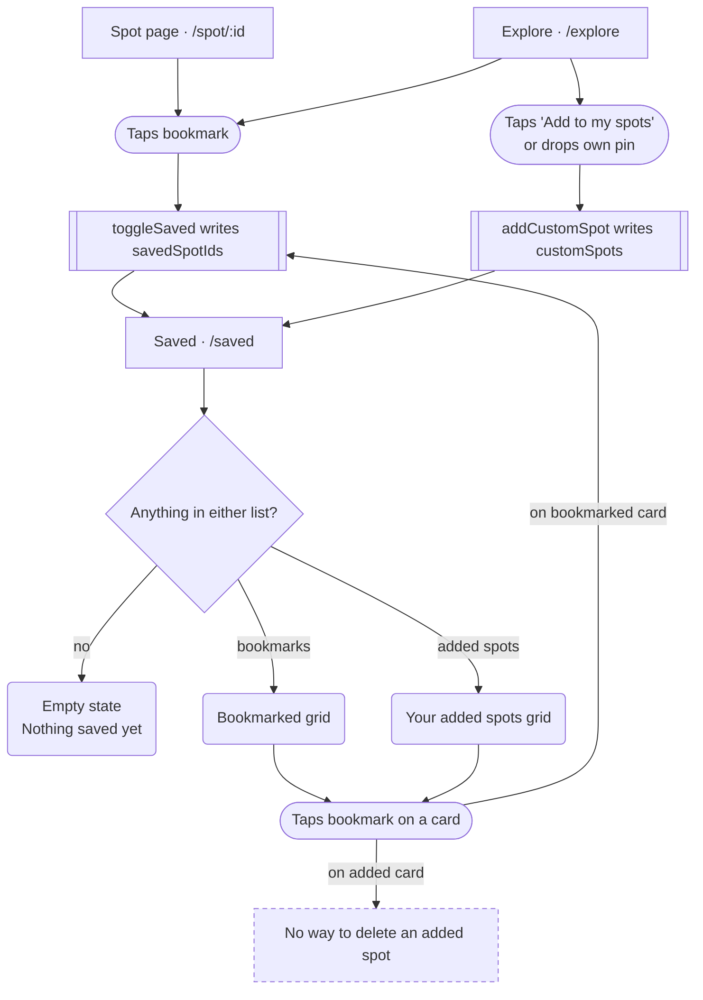
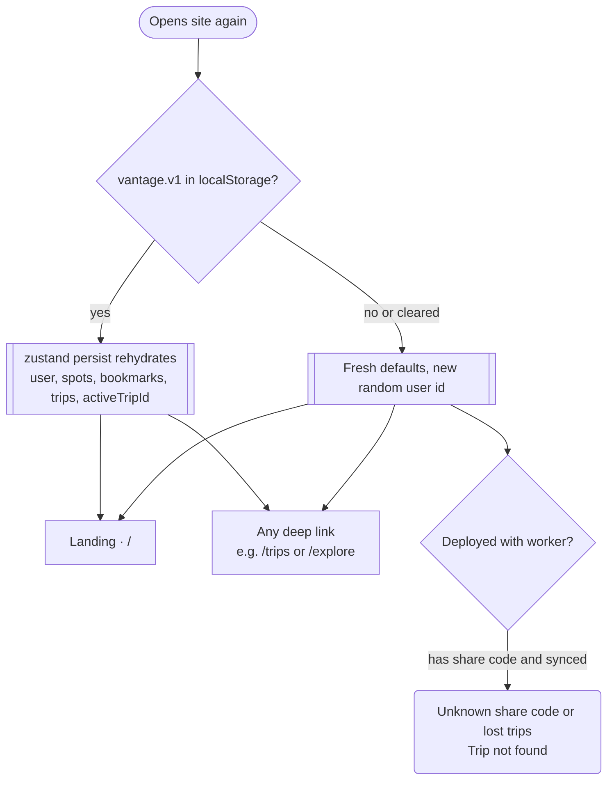

# 10 · Saved tab and returning-user behaviour

> The Saved tab lists two different things (bookmarked spots and spots "added by you"), and everything Iter remembers lives in one browser's localStorage under an anonymous, name-only identity.

## Goal
Keep a shortlist of places to shoot, come back later and find them (and trips) still there, without creating an account.

## Entry points
- Bottom tab "Saved" (mobile) and top-bar tab "Saved" (desktop, md+ = 768px): `src/components/layout/AppShell.tsx:12` (route `/saved`, `src/main.tsx:37`).
- Empty-state button "Explore spots" leads away from it to `/explore`: `src/pages/Saved.tsx:33`.
- Bookmark toggles that feed it: grid SpotCard top-right bookmark (`src/components/SpotCard.tsx:49-57`), Spot page header "Save"/"Saved" button (`src/components/spot/SpotHeaderBar.tsx:31`, wired at `src/pages/Spot.tsx:107`).
- "Add to my spots" on a discovery card (`src/components/explore/DiscoverCard.tsx:78`) and the add-your-own-spot sheet (`src/components/explore/AddSpotSheet.tsx:62`) feed the second list.
- Returning user: loading `/` or any other URL in a browser that already has `vantage.v1` in localStorage.

## Preconditions
- None required. A first visit creates defaults in memory and persists them on the first store change: `user {id, name 'You', color}`, empty `customSpots`, `savedSpotIds`, `trips`, `activeTripId: null` (`src/store/index.ts:36-41`).
- Saved reads only local state; it works offline and never calls the network itself. Each card does fetch a Wikipedia photo and an Open-Meteo forecast for its light badge (`src/components/SpotCard.tsx:87-88`).

## Flow

Two stores of "saved", one page. Un-bookmarking is possible everywhere; deleting an added spot is not possible anywhere.

A returning user is not recognised in any visible way; there is no redirect, greeting or "continue where you left off".

## Walkthrough
1. **Bookmark a spot** · `/explore` or `/spot/:id` · `src/components/SpotCard.tsx:49`, `src/pages/Spot.tsx:107`
   Grid cards show a floating bookmark (aria-label "Save", or "Remove from saved" when set; icon fills). The Spot page header shows a "Save" / "Saved" button. Both call `toggleSaved(spot.id)` which prepends the id to `savedSpotIds` or removes it (`src/store/index.ts:45-47`). There is no toast or confirmation. The bookmark works for curated, custom and AI-discovered spots alike, as long as they appear in a grid SpotCard. Compact SpotCards (list rows, sheets) render no bookmark (`src/components/SpotCard.tsx:47`).
2. **Add a spot to "my spots"** · `/explore` · `src/pages/Explore.tsx:161`, `src/components/explore/useSpotActions.ts:16`
   On a discovery result (web/AI scout) the "Add to my spots" button copies the spot into `customSpots` (id preserved, `source` becomes 'web' or 'ai', and the AI "why" is turned into a note starting "Why Vantage suggested it: ...", `useSpotActions.ts:13`). A toast says "Saved <name> to your spots" with a "View" link to `/spot/:id` (`Explore.tsx:163`). The button becomes a "Saved" link to the spot page. Dropping a pin yourself (AddSpotSheet) creates a `source: 'user'` spot with id `user-<slug>-<4 chars>` and the toast "Added <name>" (`AddSpotSheet.tsx:46-62`, `Explore.tsx:247`). Also, "Add to trip" on a discovery card silently saves the spot into `customSpots` first (`useSpotActions.ts:27`), so a spot can appear under "Your added spots" without the user pressing "Add to my spots".
   Not as it looks: the UI word is "Saved" for both lists, but bookmarking never touches `customSpots` and "Add to my spots" never touches `savedSpotIds`. The discovery card's "Saved" state reads `customSpots` only (`useSpotActions.ts:39`).
3. **Open Saved** · `/saved` · `src/pages/Saved.tsx:13`
   Header "Saved" with subtitle. Empty: "Your shortlist of places to shoot." Otherwise `"{n} saved spot(s)"` plus `" · {m} added by you"` when there are custom spots (`Saved.tsx:26`). Note `n` counts bookmarks only.
4. **Page states** · `src/pages/Saved.tsx:19-60`
   See "Screen states" below. Cards are the normal grid SpotCard (photo, light badge for today, name, place, best-light line) in a 1/2/3/4 column grid (<640 / 640 / 1024 / 1280 px, `Saved.tsx:10`). Bookmarked cards fade up with a stagger capped at 8 items; custom cards fade up without stagger.
5. **Remove a bookmark** · `/saved` · `src/components/SpotCard.tsx:56`
   Tapping the filled bookmark on a card in the top grid removes the id, and the card vanishes immediately (it is derived from `savedSpotIds`). No undo, no confirmation, no exit animation. If it was the last item and there are no custom spots, the page falls back to the empty state.
6. **Remove an "added by you" spot** · not possible
   Verified: the store has no remove/delete action for custom spots (`src/store/index.ts:17-31` lists `addCustomSpot` only; `grep customSpots src` shows only reads and `addCustomSpot`). The card in "Your added spots" shows the same bookmark; tapping it bookmarks the spot, which makes it ALSO appear in the top "saved" grid (duplicate card, `Saved.tsx:18`, `:40`, `:56`). Un-bookmarking leaves it in "Your added spots". The only ways a custom spot disappears are clearing site storage, or (for trip-synced ones) not at all. Deleting a trip does not remove its custom spots (`store/index.ts:69`).
7. **Returning to the site** · `/` · `src/main.tsx:27`, `src/pages/Landing.tsx:12`
   The Landing page does not read the store (no `useStore` import in `Landing.tsx` or `components/landing/*`) and there is no redirect for returning users. A returning visitor sees the same marketing page as a new one and must click through to the app (the Logo in the app shell links back to `/` too, so a user can land on the marketing page mid-session). Any deep link (`/trips`, `/trip/:id`, `/saved`) works directly because zustand `persist` rehydrates synchronously from localStorage on load (`store/index.ts:112`).
8. **What survives and what resets**
   Persisted (`vantage.v1`): user, customSpots, savedSpotIds, trips, activeTripId. Lost on navigation or reload (React component state in `src/pages/Explore.tsx:42-53`): Explore text/filters, date, map area, selected spot, browse/discover mode, bottom-sheet snap, pick mode, toast. Lost on navigation (hook state in `src/components/explore/useDiscover.ts:9-14`): discovery query, results, status; only spots the user explicitly saved remain. In-memory module caches (weather, wiki, geocode, routes) and sync status (`src/lib/sync.ts:12-15`) vanish on reload.
9. **The silent active trip** · `src/store/index.ts:70`, `src/components/explore/useSpotActions.ts:29`
   `activeTripId` is set whenever the user creates a trip (`store/index.ts:63`), opens a trip builder (`src/pages/TripBuilder.tsx:64`) or confirms "Add to trip" on a Spot page (`AddToTripModal.tsx:182`), and cleared only if that trip is deleted (`store/index.ts:69`). Explore's "Add to trip" on a discovery/selected card has no trip picker: it adds to the active trip if one exists, otherwise creates a new trip named "<place> light trip" or "<place> trip" (`useSpotActions.ts:30`). The toast names the trip ("Added to <name>", `Explore.tsx:167`) but only after the fact. Since the active trip persists across sessions, a returning user's first discovery "Add to trip" goes into whichever trip they last touched.
10. **Identity** · `src/store/index.ts:37`, `src/components/trip/InviteModal.tsx:158`, `src/pages/Join.tsx:53`
    On first load the store generates a random 8-char `user.id`, `name: 'You'` and a color. There is no sign-in. The name is changed in only two places: the Invite modal field "Your name" (hint "Shown to everyone on this trip. No account needed.", Save disabled when blank, `InviteModal.tsx:94-126`) and the Join screen name field (`Join.tsx:53`; prefilled blank while the name is still 'You', `Join.tsx:24`). The top-bar avatar shows initials from the name and is not clickable (`AppShell.tsx:48`). Trips created before the name is set record the owner as "You" (`store/index.ts:58`); the Invite modal rename patches the member entry on that trip only (`InviteModal.tsx:126`), not on other trips.
11. **Clearing storage / new device**
    Clearing site data or opening a different browser/device creates a brand-new user id and empty lists. Bookmarks, added spots and unsynced trips cannot be recovered. A trip that was synced (the Builder was opened at least once while the Worker was reachable, status "Synced", `src/lib/sync.ts:23-43`) can be recovered only by someone having its share code/link: `/join/:code` fetches it (KV, 90-day TTL since last write) and adds the new browser as a fresh editor member; the old member entry for the previous id stays on the trip. Bookmarks (`savedSpotIds`) are never synced; custom spots travel only attached to a synced trip's stops (`TripBuilder.tsx:67-71`, `Join.tsx:56`).

## Screen states

| Screen | Empty | Loading | Error | Offline / timeout | Success |
|---|---|---|---|---|---|
| Saved, nothing at all | Illustration, title "Nothing saved yet", body "Save the spots you want to shoot and they'll live here — with today's light score on every card.", primary button "Explore spots" (`SavedEmptyState.tsx:45-47`, `Saved.tsx:30-34`) | None (store rehydrates before first render) | None | Fully usable; card photos/light badges degrade (see doc 11) | n/a |
| Saved, only added spots (no bookmarks) | Callout, no icon: "Tap the bookmark on any spot to save it here." with small "Explore" button (`Saved.tsx:44-51`), then section "Your added spots" / "Places you found and added to Vantage." (`Saved.tsx:54`) | Per-card skeletons while photo resolves | None | As above | Header: "0 saved spots · N added by you" |
| Saved, bookmarks only | Grid only; no "added" section (`Saved.tsx:37-43`) | Per-card | None | As above | Header "N saved spots" (singular for 1) |
| Saved, both | Bookmarked grid first, then "Your added spots" (`Saved.tsx:52`) | Per-card | None | As above | A custom spot that is also bookmarked appears in both grids |
| Stale bookmark id | Ids that no longer resolve to a spot are silently dropped from view but kept in storage (`Saved.tsx:18`) and not counted | n/a | n/a | n/a | n/a |
| Landing for returning user | n/a | n/a | n/a | n/a | Same page as new user; no personalisation (`Landing.tsx:12`) |

## Data

| Data | Read / write | Where it lives | Notes |
|---|---|---|---|
| `savedSpotIds` (bookmarks) | Read: Saved, SpotCard, Spot. Write: `toggleSaved` | zustand, localStorage `vantage.v1` (`store/index.ts:13`) | Newest first. Local only, never synced. |
| `customSpots` ("added by you") | Read: `useAllSpots` (everywhere), Saved. Write: `addCustomSpot` (Explore save, Add-to-trip on discovery, AddSpotSheet, Join, TripBuilder pull) | zustand, `vantage.v1` (`store/index.ts:12`) | Newest first, de-duplicated by id. No delete. They also become searchable/mappable in Explore (`useAllSpots`, `store/index.ts:117`). |
| `user {id, name, color}` | Read: AppShell avatar, trips, Join. Write: `setUserName` | zustand, `vantage.v1` | id never shown; used as TripMember id. |
| `trips`, `activeTripId` | See docs for trips; `activeTripId` consulted by Explore "Add to trip" | zustand, `vantage.v1` | Persist key has no `version`/`migrate` option (`store/index.ts:112`). |
| Sync status per trip | Read: SyncBadge, Invite modal | In-memory Map (`sync.ts:13`) | Resets to idle on reload. |
| Explore filters, date, area, mode, selection | Component state | `Explore.tsx:42-53` | Reset on every navigation; URL params ignored (Landing sends `?q=&date=&light=`, `HeroSearchCard.tsx:103`; no `useSearchParams` anywhere in `src`). |
| Discovery results | Hook state | `useDiscover.ts:9-14` | Lost on navigation. |
| Shared trip | KV via `/api/trips/:code` | Worker KV `TRIPS`, TTL 90 days | The only cross-device recovery path. |

## Not as it looks
- "Saved" means two different lists. The bookmark icon and the "Save" button on a Spot page write `savedSpotIds`; "Add to my spots" / "Saved" on a discovery card and the toast "Saved <name> to your spots" write `customSpots`. Both are shown on `/saved`, in different sections.
- The Saved subtitle count "N saved spots" counts bookmarks only; "added by you" is a separate suffix (`Saved.tsx:26`). With only added spots the header reads "0 saved spots · N added by you".
- Custom spots cannot be deleted from anywhere. The bookmark on an "added" card does not remove it.
- A spot that is both bookmarked and custom is rendered twice on the page (`Saved.tsx:40` and `:56`).
- Unknown/stale bookmark ids are hidden but retained.
- "Add to trip" on Explore discovery cards silently saves the spot to "my spots" too (`useSpotActions.ts:27`).
- Explore "Add to trip" targets the persisted active trip with no picker and no way to see which trip is active before pressing; the Spot page's modal does show a picker defaulting to the active trip (`AddToTripModal.tsx:164`).
- Returning users get no redirect and no recognition: `/` always shows the marketing page.
- The top-bar avatar looks like an account/profile button but is not interactive (`AppShell.tsx:48`).
- Name 'You' remains on trips and members until the user edits it in the Invite modal or Join; changing it later updates only the trip being edited/joined.
- Copy leftover: the section subtitle says "added to Vantage" (`Saved.tsx:54`).

## Tweak points
**Friction**
- Removing a bookmark from Saved is instant with no undo (`src/components/SpotCard.tsx:56`); the card jumps out of the grid.
- Two similarly worded save actions on discovery cards (bookmark is not offered on discovery cards at all; only "Add to my spots", `DiscoverCard.tsx:78`) versus curated cards (bookmark). A user cannot tell which list a spot will land in.
- Name entry is buried in the Invite modal; the avatar that implies identity does nothing (`AppShell.tsx:48`).

**Dead ends**
- No delete for custom spots, including ones created by accident via "Add to trip" or a mis-placed pin (`src/store/index.ts:17-31`).
- Clearing storage is unrecoverable for bookmarks and unsynced trips; there is no export, backup or "your data lives only on this device" notice.

**Missing states**
- No toast/feedback when bookmarking.
- No sort, filter, count per section or "remove" action on the "Your added spots" cards.
- No handling for stale bookmark ids beyond hiding them (`Saved.tsx:18`).
- No "welcome back" or "continue planning" path from `/` for returning users (`Landing.tsx:12`).

**Inconsistencies**
- Header count ignores custom spots when determining plural/zero (`Saved.tsx:26`).
- Duplicate rendering of bookmarked custom spots (`Saved.tsx:40`, `:56`).
- Landing hero search params are dropped by Explore (`HeroSearchCard.tsx:103`), so even the one path that carries intent forgets it.
- "Vantage" wording in Saved copy (`Saved.tsx:54`), the notes prefix "Why Vantage suggested it:" (`useSpotActions.ts:13`) and the trip invite text (`InviteModal.tsx:120`) are rename leftovers.

**Open design questions**
- Merge the two concepts into one list with a "mine" badge, or rename them clearly (for example "Saved" vs "My spots") and give "My spots" a delete?
- Should Explore "Add to trip" always ask which trip (or show the active trip as a chip before the user taps)? Today it is decided by `activeTripId` (`useSpotActions.ts:29`).
- Should returning users with trips skip or shortcut the landing page?
- Should there be a lightweight identity step (name on first trip creation) so 'You' never reaches collaborators?
