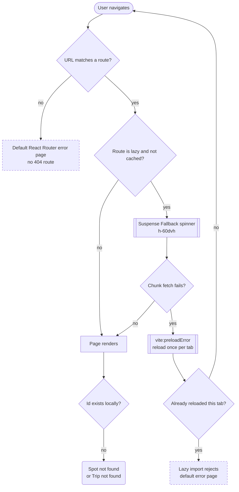
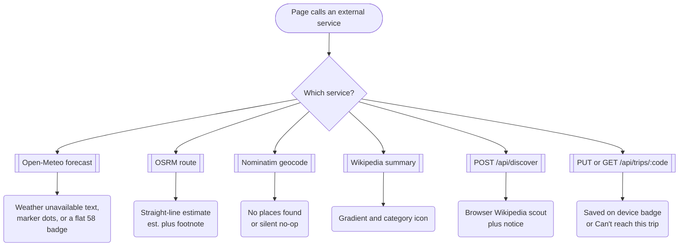

# 11 · System and edge states, and /styleguide

> What Iter shows when something is loading, missing, offline or broken, plus a note on the designer-only `/styleguide` route that is not part of the user flow.

## Goal
Give a designer one place to see every non-happy-path state, how it is triggered, and where the current build has no state at all.

## Entry points
These are not flows the user starts; they are conditions the user lands in.
- Any lazy route being fetched for the first time (`src/main.tsx:9-15`, `:24`).
- A URL that matches no route, a stale deployed tab, or a render crash (`src/main.tsx:26-40`, `:43-47`).
- Missing ids: `/spot/:id`, `/trip/:id`, `/join/:code` (`src/pages/Spot.tsx:34`, `src/pages/TripBuilder.tsx:36`, `src/pages/Join.tsx:72`).
- Network or API failure while using Explore, Spot, Trip builder, Invite/Join.
- `/styleguide`: typed by hand or reached from the README (`README.md:31`); no in-app link exists (see below).

## Preconditions
- Production: the Cloudflare Worker serves the built SPA with `not_found_handling: single-page-application`, `/api/discover`, `/api/trips/:code` and KV (`wrangler.jsonc:7-12`, `worker/index.ts:16-21`).
- Local `vite dev` alone has no Worker: `/api` is proxied to `http://localhost:8787` (`vite.config.ts:10`) and that port is only live if `npm run dev:worker` is running (`package.json:8`). Without it the proxy fails and the app's own fallbacks kick in (see table).

## Flow

Routing-level failures. The reload loop is guarded by a sessionStorage flag so it can happen once per tab session.

Each external dependency fails independently and degrades to a different, mostly quiet, fallback.

## Walkthrough
1. **Lazy route loading** · any of `/explore /spot /trips /trip /join /saved /styleguide` · `src/main.tsx:17-24`
   While a route chunk downloads, `Fallback` renders a 24px ink spinner (`h-6 w-6 rounded-full border-2 border-ink border-t-transparent animate-spin`) centred in a `60dvh` block. For the six in-shell routes the app bar/tab bar stay visible because `Suspense` sits inside the `<Outlet/>` child (`main.tsx:32-37`); `/styleguide` has no shell. `/` (Landing) is imported eagerly (`main.tsx:7`), so it has no loading state. Not as it looks: a design-system version of this fallback exists, `RouteFallback` in `src/components/layout/AppShell.tsx:84` (uses `Spinner size="lg"`), whose doc comment says "REQUEST: main.tsx `Fallback` should render this instead of its hand-rolled spinner" (`AppShell.tsx:83`). That request has not been done; `RouteFallback` is rendered only in the styleguide (`src/components/styleguide/LandingSection.tsx:129`).
2. **Unknown URL** · e.g. `/foo`, `/spot/` (no id), `/join/` (no code) · `src/main.tsx:26-40`
   The router has no `path: '*'` route and no `errorElement`. React Router 7.18 therefore shows its built-in error page ("Unexpected Application Error!" with "404 Not Found", plus a developer hint about providing an ErrorBoundary in dev builds) as a bare unstyled page, with no AppShell and no link back. In production the Worker still serves `index.html` for such paths (SPA fallback, `wrangler.jsonc:10`), so the user sees this page, not a server 404. The same default page also appears for any uncaught render error in any route.
3. **Stale deployment** · any lazy navigation after a deploy · `src/main.tsx:43-47`
   If a chunk hash no longer exists Vite fires `vite:preloadError`. The handler cancels the error and reloads the page once, tracked by sessionStorage key `vantage.reloaded`. The user sees a brief full reload and lands on the same URL. If a second failure happens in the same tab session, nothing handles it (the lazy import rejects into the default error page, step 2). The flag is never cleared, so later deploys in the same tab session will not auto-reload again; there is no try/catch around sessionStorage.
4. **Spot not found** · `/spot/:id` · `src/pages/Spot.tsx:34`, `:38-48`
   Inside the shell: empty state with map-pin icon, title "Spot not found", body "It may have been removed, or the link is incomplete.", primary button "Explore spots" to `/explore`. Triggers: mistyped id, or a custom/AI spot id opened in a browser that does not have that spot in `customSpots` (for example a shared `/spot/web-12345` link, or after clearing storage). Spot links are not synced; only trips carry custom spots.
5. **Trip not found** · `/trip/:id` · `src/pages/TripBuilder.tsx:36-44`
   Empty state, route icon, title "Trip not found", body "It may have been deleted, or it lives on another device. Ask for an invite link to join it here.", button "Back to trips" (navigates to `/trips`). The id is the local trip id, not the share code, so a trip URL copied from another device never resolves; only `/join/:code` crosses devices.
6. **Join: loading, not-found, unavailable** · `/join/:code` · `src/pages/Join.tsx:31-36`, `:70-87`, `src/lib/sync.ts:69-86`
   Loading: `JoinInviteCardSkeleton`. Not found (worker answered 404 with JSON): icon SearchX, title "Invite not found", body "No trip uses the code <CODE>. It may have expired — ask for a fresh link." Unavailable (fetch threw, non-JSON response such as Vite serving HTML, 404 with non-JSON content type, other non-OK status, malformed payload): icon CloudOff, title "Can't reach this trip", body "Sharing works once deployed. Running locally, invite links can’t be fetched yet." Both are floating white cards. If the same code exists in local trips, the primary button is `Open “<name>” on this device` and "Go to my trips" is the secondary; otherwise "Go to my trips" is primary. Note the "unavailable" copy talks about deployment even for a user on the production site who is simply offline.
7. **Weather failure** · Spot page, Explore cards, Trip builder · `src/lib/weather.ts:23-24`, `src/lib/hooks.ts:9-19`
   Open-Meteo is fetched per rounded lat/lng and cached in memory for the session; a failed request is removed from the cache so it retries on next mount (`weather.ts:53`). Spot page: `useForecast` returns `error`; `WeatherStrip` shows the line "Weather is unavailable right now — light times above are still accurate." (`src/components/spot/WeatherStrip.tsx:29-30`). If there is no error but no hourly rows (date beyond 7 days) it shows "Hourly forecast only reaches 7 days out." While loading: skeleton tiles. Light score computed without a forecast falls back to astronomy only (`src/lib/light.ts:15-23`, `hourAt` returns undefined), so the Spot page's light index still renders but is not weather-aware, with no indication. Explore: `useLightScores` swallows errors and retries on a later spots change (`src/components/explore/useLightScores.ts:39`); discovery cards render the light badge only when the forecast is ready (`DiscoverCard.tsx:53`; Explore's "best" line needs `ready` scores, `Explore.tsx:80`) and map markers show "···", but the regular `SpotCard` (Explore list, Landing "Tonight's light", Saved) computes its own index via `useLightIndex` (`src/lib/hooks.ts:22-25`) and shows a geometry-only badge of about 58 ("Good") that never changes if the forecast fails (`src/lib/light.ts:53`). Trip builder: forecast prefetch has an empty catch (`src/components/trip/tripUtils.ts:65`).
8. **Route (driving) failure** · Trip builder · `src/lib/routing.ts:40-62`, `src/pages/TripBuilder.tsx:251`
   Public OSRM demo router, 12 s timeout, one request per up-to-90 waypoints. Any failure (network, non-OK, no route, timeout) silently returns a haversine estimate x1.25 at 80 km/h and the line geometry becomes straight segments. The page shows the estimate immediately, with a small spinner labelled "Routing" on each leg while the real route loads (`StopCard.tsx:174`), then an "est." suffix on each leg (`StopCard.tsx:173`) and the footnote "Drive times are straight-line estimates at 80 km/h — the road router didn't respond." (`TripBuilder.tsx:252`). The failed key is evicted so a later edit retries (`routing.ts:59`). No manual retry.
9. **Geocode failure** · place search, reverse geocode · `src/lib/geocode.ts:22-37`, `:48-58`
   Forward geocode (Nominatim) errors or non-OK responses become an empty list. In the Explore search popover that renders as "No places found" (`src/components/explore/SearchBar.tsx:133`), indistinguishable from a genuine miss; pressing Enter with no match does nothing (`SearchBar.tsx:58-59`). Reverse geocode (drop-a-pin sheet) returns null on failure, so the place field is left blank, the summary shows "Dropped pin" and the user can type a name, otherwise it falls back to "lat, lng" (`AddSpotSheet.tsx:39`, `:98`, `:49`). The same sheet falls back to a longitude-based timezone guess if the forecast fails (`AddSpotSheet.tsx:40`, `:19`). Nominatim has no timeout. Its results are cached by query for the session (including failures that resolved to empty).
10. **Image and media failure** · `src/components/explore/SpotImage.tsx:40-60`, `src/lib/wiki.ts:15-35`, `src/components/spot/SpotHero.tsx:25-40`
    Wikipedia summaries return null on any failure, so `useSpotMedia` yields no image (`src/lib/hooks.ts:28-38`). Cards (`SpotImage`): skeleton while the summary resolves, then a grey gradient with the category icon when there is no URL. There is no `onError` on the card ``; if a URL exists but the file 404s or is blocked, the browser shows a broken/blank image rather than the fallback. The Spot page hero does handle it: skeleton until `onLoad`, `onError` flips to the category art (`SpotHero.tsx:34-37`, `:40`). Trip covers use their own loading/fallback states (`src/components/trip/TripCover.tsx:25`). Invite QR code is an external image with no error handling (`InviteModal.tsx:147`).
11. **Discover (Ask Vantage) failure** · Explore · `src/lib/discover.ts:21-55`, `src/components/explore/useDiscover.ts:20-41`, `src/components/explore/DiscoverPanel.tsx:85-91`, `:112-116`
    Loading: paced checklist "Reading the map…", "Scouting the web…", "Asking the model…", "Checking the light…" at 0.9 s, 2.6 s, 6.5 s (`useDiscover.ts:6`, `:29`) plus skeleton cards. The Worker call has a 75 s abort, one retry on 5xx, and any failure falls back to a browser-only Wikipedia scout; the result is flagged `offline: true` and shows the notice "The AI scout didn’t answer in time or isn’t reachable here. Showing web results found directly from Wikipedia." with the extra clause " (plain vite dev — run npm run dev:worker alongside it)" only when the hostname is localhost, 127.x or 192.168.x (`DiscoverPanel.tsx:142`). The `error` status, with copy "The scout couldn’t reach the web just now. Check your connection and try again." and a "Try again" button, only fires if the fallback scout itself throws, which it effectively cannot (geocode, Wikipedia and forecast calls are all individually caught, `discover.ts:101-116`, `:130`). Fully offline therefore ends in the "done" state with "Nothing solid turned up" (plus the notice, plus the hint "Try naming a place — “waterfalls near Asheville”, “sunset beaches around San Diego”."), not in the error state. If the Worker's web signal is empty, the browser tops up with Wikipedia results silently (`discover.ts:42-48`). Zero results with a healthy backend look identical to a failure.
12. **Sync offline badge** · Trip builder title area, Invite modal · `src/lib/sync.ts:24-43`, `src/components/trip/TripHeader.tsx:50-62`, `src/components/trip/InviteModal.tsx:153`
    The badge is hidden when idle, shows "Saving…" (spinner) while a debounced PUT (900 ms) is pending, "Synced" (check) on success, and "Saved on device" (CloudOff, grey, tooltip "Sharing works once deployed") on any failure. The Invite modal appends " · link goes live once deployed" after the share code when status is offline. Failures are never retried by themselves; the next edit triggers a new publish, or reopening the builder (the effect runs on mount, but `lastSent` only skips when the body is unchanged and a failed send never sets it, `sync.ts:28`, `:38`). Pull failures (every 20 s and on window focus) are swallowed (`TripBuilder.tsx:83`). Status is in-memory only and resets to idle on reload.
13. **Offline in general** · whole app
    There is no service worker, manifest or offline cache (no `serviceWorker`/manifest in `index.html`, `src/` or `vite.config.ts`; `public/` holds only `favicon.svg`). Offline reload fails at the browser level for a not-yet-cached page. If the SPA is already loaded: stores and navigation keep working; map tiles fail; photos fall back; forecasts fail; routes fall back to estimates; sharing shows "Saved on device". There is no global offline banner or `navigator.onLine` check anywhere in `src` (`SearchBar` has an unused `offline` prop that no caller sets, `SearchBar.tsx:17`, `:29`, `:39`).
14. **Local dev without the worker** · `vite dev` on :5173 · `vite.config.ts:10`
    `/api/*` calls go to the Vite proxy and fail (connection refused). Effects: sharing badge "Saved on device"; Join shows "Can't reach this trip"; Ask Vantage uses the browser fallback and the notice mentions `npm run dev:worker`. `fetchSharedTrip` also treats a 404 with non-JSON content type as "unavailable" because Vite may answer 404/HTML (`sync.ts:76-80`).
15. **Map tile failure** · Explore map, Trip map · `src/components/map/SpotMap.tsx:106-115`, `src/components/trip/TripMap.tsx:18`, `:47`
    Both maps load the CARTO Positron style from `https://basemaps.cartocdn.com/gl/positron-gl-style/style.json`. Neither registers an `error` handler (`grep` finds no `.on('error'` in either). If the style or tiles fail the container shows its own grey `bg-surface-muted` (`SpotMap.tsx:245`) with the controls and DOM spot markers/pins still present, and no message. Geolocation ("Locate me") has its own mini-toast: "Location isn’t available in this browser" or "Couldn’t get your location" for 2.6 s (`SpotMap.tsx:222`, `:238`, `:242`), 10 s timeout.
16. **Toast behaviour** · `src/components/ui/Toast.tsx:28-44`, `src/pages/Explore.tsx:95-99`, `:291`, `:360`
    Dark pill, `role="status"` / `aria-live="polite"`, fixed bottom-centre by default (z-90), text truncated at 56vw, optional pill-link or button. It is mount/unmount-controlled by the caller. There is exactly one app-level toast system, in Explore only: `flash()` replaces any current toast (keyed to replay the entrance) and auto-dismisses after 3.6 s (`TOAST_MS`). Messages: "Saved <name> to your spots" (link "View"), "Added to <trip name>" (link "Open trip"), "Added <name>" (link "View"). Desktop offset is 28px from the bottom; mobile offset sits above the tab bar and the peeking sheet or the floating spot card. Hovering or focusing does not pause it, and there is no close button. The map has a separate inline toast for locate errors (above), and the add-spot pick-mode banner reuses the Toast component with a "Cancel" action (`src/components/explore/PickModeBanner.tsx:7`). No other page uses toasts: bookmarking, adding to a trip from the Spot page (a modal "done" step), copy link (icon changes, `Spot.tsx:85`) and copying an invite link (button label "Copied", `InviteModal.tsx:32`) each use local feedback.

### Condition table

| Condition | Where | What the user sees | Source |
|---|---|---|---|
| Lazy route chunk loading | Any in-shell route, `/styleguide` | Centred 24px spinner in 60dvh block, shell stays | `src/main.tsx:17-24` |
| Landing loads | `/` | No fallback (eager import) | `src/main.tsx:7` |
| Unknown URL | Any unmatched path | React Router default error page (no shell, no way back) | `src/main.tsx:26-40` |
| Uncaught render error | Any route | Same default error page (no `errorElement`) | `src/main.tsx:26-40` |
| Stale chunk after deploy | Lazy navigation | One automatic page reload, then default error if it recurs | `src/main.tsx:43-47` |
| Spot id unknown | `/spot/:id` | "Spot not found" empty state, "Explore spots" | `src/pages/Spot.tsx:34-48` |
| Trip id unknown | `/trip/:id` | "Trip not found" empty state, "Back to trips" | `src/pages/TripBuilder.tsx:36-44` |
| Share code unknown | `/join/:code` | "Invite not found" card | `src/pages/Join.tsx:72-87`, `src/lib/sync.ts:76-79` |
| Share API unreachable or invalid | `/join/:code` | "Can't reach this trip" card | `src/pages/Join.tsx:72-87`, `src/lib/sync.ts:73-84` |
| Weather request fails | Spot page | "Weather is unavailable right now — light times above are still accurate." | `src/components/spot/WeatherStrip.tsx:29-30` |
| Weather request fails | Explore list, Landing and Saved cards (SpotCard) | Geometry-only "Good" badge of about 58 that looks like real data, no message | `src/lib/hooks.ts:22-25`, `src/lib/light.ts:53` |
| Weather request fails | Map markers and discovery cards | Marker stays at "···"; discovery card has no light badge; no message | `src/components/map/MapMarker.tsx:61`, `DiscoverCard.tsx:53` |
| Forecast shorter than selected date | Spot page | "Hourly forecast only reaches 7 days out." | `src/components/spot/WeatherStrip.tsx:30` |
| Router (OSRM) fails or times out | Trip builder | Estimated legs with "est.", footnote about 80 km/h | `src/lib/routing.ts:58-61`, `src/pages/TripBuilder.tsx:251-253` |
| Geocode (place search) fails | Explore search | "No places found" | `src/lib/geocode.ts:37`, `SearchBar.tsx:133` |
| Geocode (reverse) fails | Add-spot sheet | "Dropped pin", coordinates | `src/lib/geocode.ts:58`, `AddSpotSheet.tsx:98` |
| Wikipedia image missing | Cards | Gradient plus category icon | `src/components/explore/SpotImage.tsx:50-58` |
| Wikipedia image URL broken | Cards | Broken/blank image (no onError) | `src/components/explore/SpotImage.tsx:43-49` |
| Wikipedia image URL broken | Spot hero | Category art | `src/components/spot/SpotHero.tsx:34-37` |
| Discover API fails | Explore, Ask Vantage | Notice plus Wikipedia-only results (or "Nothing solid turned up") | `src/lib/discover.ts:50-54`, `DiscoverPanel.tsx:112` |
| Discover fully fails | Explore, Ask Vantage | Error text with "Try again" (effectively unreachable) | `src/components/explore/useDiscover.ts:35-40`, `DiscoverPanel.tsx:85-91` |
| Trip sync PUT fails | Trip builder, Invite modal | "Saved on device" badge, "link goes live once deployed" | `src/lib/sync.ts:40-42`, `TripHeader.tsx:58`, `InviteModal.tsx:153` |
| Trip sync pull fails | Trip builder | Nothing | `src/pages/TripBuilder.tsx:83` |
| No network at all | Whole app | No global state; each feature degrades separately; no service worker | `index.html`, `vite.config.ts` |
| No Worker in local dev | All `/api` features | As the three rows above plus a dev hint in the discover notice | `vite.config.ts:10`, `DiscoverPanel.tsx:115` |
| Map style/tiles fail | Explore map, Trip map | Grey map area, markers and controls still shown, no message | `src/components/map/SpotMap.tsx:106-115`, `:245` |
| Geolocation denied or unsupported | Explore map | Inline toast for 2.6 s | `src/components/map/SpotMap.tsx:222`, `:238`, `:242` |
| Saved or added confirmation | Explore | Toast for 3.6 s with link | `src/pages/Explore.tsx:95-99`, `:161-168` |
| Route-level loading for Join | `/join/:code` | Skeleton invite card | `src/pages/Join.tsx:70` |
| Clipboard blocked | Invite modal | Falls back to selecting the field, still says "Copied" | `src/components/trip/InviteModal.tsx:109-117` |

## The `/styleguide` route

**What it is.** A living, single-page component catalogue titled "Design system" (document title "Design system · Vantage", restored to "Vantage" on leave, `src/pages/Styleguide.tsx:757`, `:763`). It renders every primitive and every domain component in each variant, size and state, from the tokens in `src/design/tokens.ts`. Each example sits in an element with a stable `id` and `data-component="Name/axis values"` for automated export to Figma; foundations carry `data-token` (`Styleguide.tsx:1-6`, `:61-64`). The component specs come from five manifests (`src/design/manifest.ts`, `manifest.explore.ts`, `manifest.spot.ts`, `manifest.trip.ts`, `manifest.landing.ts`; the sidebar header shows `MANIFEST_ALL.length` components).

**Not part of the user flow.** It is registered outside AppShell (`src/main.tsx:28`), so it has none of the app chrome, and a grep for `/styleguide` in `src/` finds only the route, comments and doc strings, with no `Link`, `navigate`, tab, footer or menu entry anywhere in the app or on the Landing page. The only references to it are the README ("Living styleguide: `/styleguide` ...", `README.md:31`) and code comments. A designer reaches it by typing the URL (`/styleguide` on the dev server or the deployed site; it is shipped in the production bundle and publicly reachable, lazy-loaded, `main.tsx:15`).

**Layout and navigation.** Desktop (md+, 768px): fixed 256px left sidebar with the Logo (links to `/`), "Design system · N components" and anchor links, highlighted by an IntersectionObserver as you scroll (`Styleguide.tsx:758-763`, `:773`). Mobile (<768px): the sidebar is `hidden md:block`, so there is no navigation at all, only the scrolling page.

Sidebar groups, in order: Foundations (Colour, Typography, Spacing, Radii, Shadows, Icon sizes, Component sizes, Motion; `f-*` anchors, `Styleguide.tsx:749-752`); then one group per manifest category for the primitives (Button, IconButton, Chip, Card, Input family, display components, feedback including EmptyState and Toast, overlays including Modal, Sheet, Tooltip, Tabs, NavLinkItem, TabBarItem, Logo), then, under a "Domain components" divider headed "Explore, Spot, Trips, Landing", four area groups: "Explore & map" (SearchBar, SpotCard, DiscoverCard, MapMarker, FloatingSpotCard and so on, `ExploreSection.tsx`), "Spot detail" (SpotHero, Callout, DayTile, LightTimeline, WeatherStrip, AddToTripModal, SavedEmptyState and so on, `SpotSection.tsx`), "Trips" (TripCard, StopCard, DriveSegment, SyncBadge, InviteModal, JoinInviteCard, TripEmptyState and so on, `TripSection.tsx`), "Landing & shell" (DesktopTopBar, MobileTabBar, RouteFallback, HeroSearchCard and so on, `LandingSection.tsx`). These domain sections are where designers can inspect the state variants documented above (loading, skeleton, empty, error cards).

**Behaviour notes.**
- It reads no user data; it uses hard-coded sample content (for example "Saved to Iceland ring road", `Styleguide.tsx:640`).
- Overlays (Modal, Sheet, Toast, Tooltip) are rendered `inline`/static so they can be seen without interaction.
- Interactive primitives are live (tabs and switches work) but links inside examples route into the real app.
- It does not include the real pages; there is no 404, trip-not-found or default error screen in it (the empty-state *components* are there, not the unknown-URL page).

## Screen states

| Screen | Empty | Loading | Error | Offline / timeout | Success |
|---|---|---|---|---|---|
| Any lazy route | n/a | Spinner fallback (`main.tsx:17`) | Default router error page | Same as stale-chunk path | Page |
| Unknown URL | n/a | n/a | Default router error page | Same | n/a |
| Spot page | "Spot not found" | Hero skeleton, weather skeleton tiles | Weather unavailable line | Weather line; photo gradient | Full page |
| Trip builder | "Trip not found" | Routing spinner on legs | Footnote on estimated legs | "Saved on device" badge | "Synced" badge |
| Join | n/a | Skeleton card | "Invite not found" / "Can't reach this trip" | "Can't reach this trip" | Invite card |
| Explore | "No spots here yet" (browse, `BrowseResults.tsx:54`) | Discover checklist and skeletons | Discover error text (rarely reachable) | Offline notice, Wikipedia-only results | Results and toasts |
| Saved | "Nothing saved yet" | Card skeletons | None | Works from local state | Grids |
| `/styleguide` | n/a | Spinner fallback | Default error page | Needs initial load only | Catalogue |

## Data

| Data | Read / write | Where it lives | Notes |
|---|---|---|---|
| Reload-once flag | Read and write on `vite:preloadError` | sessionStorage `vantage.reloaded` | Per tab session; never cleared (`main.tsx:45-46`). |
| Forecasts | Read | Open-Meteo, in-memory cache by lat/lng 3 dp | Failures evicted (`weather.ts:53`). |
| Routes | Read | OSRM demo server, in-memory cache | Fallback estimate not cached as success (`routing.ts:59`). |
| Place search | Read | Nominatim, in-memory cache | Empty results cached (`geocode.ts:38`). |
| Photos and descriptions | Read | Wikipedia REST, in-memory cache | Null results cached for the session (`wiki.ts:33`). |
| Discovery | Write (POST) | Worker `/api/discover`, browser fallback | 75 s abort (`discover.ts:24`). |
| Shared trips | Read and write | KV via `/api/trips/:code`, TTL 90 days, 512 KB max | Status in-memory (`sync.ts:12-15`, `worker/trips.ts:9-11`). |
| Toast | Component state | Explore page (`Explore.tsx:53`) | Gone on navigation. |

## Not as it looks
- The `RouteFallback` component documented in the design system is not used by the real router (`AppShell.tsx:83` REQUEST comment, `main.tsx:17`).
- "Can't reach this trip" says "Sharing works once deployed. Running locally, ..." even in production when the user is simply offline or the Worker errors (`Join.tsx:78`).
- The Ask Vantage error state exists in UI and code but is effectively unreachable; real failures surface as the offline notice or "Nothing solid turned up" (`useDiscover.ts:35`, `discover.ts:50-54`).
- "No places found" in the search popover also means "the geocoder failed".
- Card images have no `onError` fallback, unlike the Spot hero (`SpotImage.tsx:43` vs `SpotHero.tsx:35`).
- Map tile failure is invisible: no handler, no message (`SpotMap.tsx:106`).
- The sync badge says "Saved on device" for any PUT failure, including a 4xx/5xx from a deployed Worker (`sync.ts:37`), and its tooltip claims "Sharing works once deployed".
- `SearchBar` has an `offline` prop (disables place lookup) that no caller passes (`SearchBar.tsx:29`, `:39`).
- `/styleguide` is public in production and has no navigation on mobile.

## Tweak points
**Friction**
- Unknown URL, bad `/spot/` or `/join/` paths and any render crash land on an unstyled developer error page with no way back (`src/main.tsx:26-40`).
- The stale-deploy reload happens without any message and only once per tab session (`main.tsx:43-47`).
- Weather and routing failures are silent for scores and light badges; users cannot tell "no data" from "poor light" (`useLightScores.ts:39`, `light.ts:15-23`).

**Dead ends**
- Default error page has no link to Explore or Landing.
- Spot-not-found for a shared custom spot id has no recovery beyond "Explore spots" (`Spot.tsx:38-48`).
- No retry control for failed sync, route, weather or tiles.

**Missing states**
- No branded 404 or error boundary (`main.tsx:26-40`).
- No global offline banner or service-worker/offline mode (no PWA assets in `public/`).
- No map-tile failure message (`SpotMap.tsx:106-115`, `TripMap.tsx:47`).
- No card image `onError` state (`SpotImage.tsx:43-49`).
- No error/timeout distinction for geocoding (`geocode.ts:37`).
- No loading indicator on the lazy fallback beyond a bare spinner; no skeleton of the page shape (`main.tsx:17-24`).
- No toasts outside Explore: bookmarking and sync failures give none (`Explore.tsx:53`).

**Inconsistencies**
- Two different route spinners: `main.tsx:17` `Fallback` (hand-rolled, 24px ink) vs `AppShell.tsx:84` `RouteFallback` (design system `Spinner size="lg"`).
- Not-found screens use three different containers: Spot (EmptyState, centred, `Spot.tsx:38`), Trip (`TripEmptyState` plain, `TripBuilder.tsx:36`), Join (`TripEmptyState` card on a sunken page, `Join.tsx:72`), with different button styles ("Explore spots", "Back to trips", "Go to my trips").
- Sync-failure copy differs between header ("Saved on device"), tooltip ("Sharing works once deployed") and modal ("link goes live once deployed").
- "Vantage" appears in system copy: browser tab title "Design system · Vantage" (`Styleguide.tsx:757`), "Ask Vantage" (`Explore.tsx:303`), "Let Vantage scout ..." (`BrowseResults.tsx:58`), landing title (`Landing.tsx:15`, `index.html:7`); all rename leftovers.

**Open design questions**
- What should a global error/404 page offer: link to Explore, recent trips, a short explanation?
- Do we want a persistent "You're offline" strip, or keep quiet degradation?
- Should `/styleguide` be linked (footer, dev-only) or remain hidden; and should it be excluded from production?
- Should the sync badge distinguish "offline" from "server problem", and should failed syncs offer a retry?
