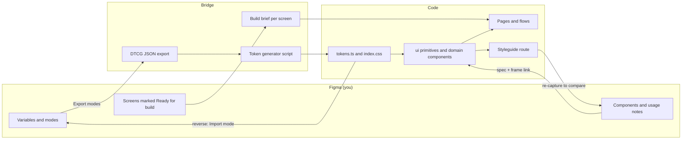

# 3 · How you control the design

You said: "I need more control and ability to improve this." This section is the working model that gives you that control. In one line: **Figma becomes the place where every visual decision is made, and code follows it.** Code keeps the things a design file cannot hold: behaviour, data and the Light Index rules.

Every step below is either done by you by hand in Figma, or done for you by a script or an agent and then reviewed by you. Nothing generated overwrites something you have finished by hand.

## 3.1 What lives where

| Thing | Source of truth | Why |
|---|---|---|
| Colour, type, spacing, radius, motion tokens, and their light, dark and Night modes | **Figma variables** | You edit them directly; they export as standard JSON that code can read ([tool path §2d](../research/design-audit/04-design-tool-path.md#2d-tokens-as-variables-from-json-natively-supported)) |
| Components: anatomy, variants, states, "use when / don't use when" | **Figma components**, with the usage note written on the component page | The current styleguide is "an inventory rather than a system" ([system §4](../research/design-audit/02-system-and-identity.md#4-components)); Figma is where the guidance belongs |
| Screens and flows | **Figma Screens page**, one section per flow | Each finished frame is the spec for its build |
| Logo, app icon, illustration, the light visual language (timeline, arc, ramp) | **Figma**, drawn by hand | These are the human-touch pieces |
| Behaviour, data, the Light Index rules, copy strings | **Code** (`src/`), described in the flow briefs | A design file cannot test whether a warning fires |
| What is true about the product today | **The flow briefs** ([docs/flows](../flows/README.md)) | They describe what is built, including what is not as it looks |

## 3.2 Getting everything into Figma

**Where it stands.** The Figma file [WkNg8qOWBqNSIs6vNJLwiH](https://www.figma.com/design/WkNg8qOWBqNSIs6vNJLwiH) already has the variables (6 collections), 16 text styles, 4 effect styles, 30 icons and 10 component sets with 309 variants. About 117 components are still missing, and the Screens page is empty. The Figma MCP quota on the Starter plan stopped after 3 calls, and Paper's connection was refused ([tool path, where things stand](../research/design-audit/04-design-tool-path.md#04--getting-the-design-into-a-tool-you-control)). A separate piece of work is packaging the remaining component scripts as a local Figma development plugin, with an import kit under `figma-import/`. It is in progress, so the steps below follow the routes in the tool-path brief rather than that kit's final instructions.

**The route, with what you do by hand:**

| Step | What happens | Who does it | Your time | Source |
|---|---|---|---|---|
| 0 | Install Archivo, Roboto Serif (variable) and Inter locally; open the file in **Figma desktop** (plugins need the desktop app) | You | about 5 minutes | [tool path §4](../research/design-audit/04-design-tool-path.md#4-what-i-would-prepare-so-the-import-takes-one-sitting) |
| 1 | **Components.** Plugins → Development → Import plugin from manifest, then run the seven commands in order (groupB first, landing last), reading each run's `errors[]` before the next | You run it; the plugin is prepared for you | about 30 minutes | [tool path §2a](../research/design-audit/04-design-tool-path.md#2a-run-the-prepared-scripts-in-a-local-development-plugin-recommended-for-components) |
| 2 | **Screens.** Capture about 50 screen states from the running app. Best: Figma's own capture, which needs at least one MCP call to start. No-quota fallback: the html.to.design browser extension. Captures arrive as editable layers with real text; the WebGL map arrives flat or blank | You click through states from the [screen manifest](../research/design-audit/screens/_manifest.md); a seed-data snippet makes populated states one reload away | not estimated in the brief. Assumption: an afternoon | [tool path §2b](../research/design-audit/04-design-tool-path.md#2b-figmas-own-capture-of-the-running-app-best-for-screens), [§2c](../research/design-audit/04-design-tool-path.md#2c-htmltodesign-divriots) |
| 3 | Arrange screens on the Screens page by flow; rebuild the map area by hand or drop in a static map image; swap captured layers for component instances only where you plan to iterate | You | Assumption: a few hours, spread out | [tool path §4–5](../research/design-audit/04-design-tool-path.md#5-recommendation) |

> **Owner decision needed · How to pay for the screens.** Routes 1 and 2 need no upgrade. If you want everything in place in one sitting with no quota anxiety, one month of a Figma Professional Full seat ($16/mo as listed) gives 200 MCP calls a day, which covers the whole remaining job (about 110–130 calls) in a day. There is an earlier "do not upgrade" decision on record, so this is your call ([tool path, short answer](../research/design-audit/04-design-tool-path.md#the-short-answer)).

**Before step 2, fix two things in code** so the captures are worth editing: the blank phone map (otherwise Explore arrives in Figma empty) and the "Vantage" strings, which are already baked into the Logo component and the "Ask Vantage" label ([tool path §4](../research/design-audit/04-design-tool-path.md#4-what-i-would-prepare-so-the-import-takes-one-sitting)). Both are in [Phase 1](04-phases.md#phase-1--stop-misleading-stop-breaking).

**Known unknowns on this route** (all marked unverified in the brief): whether each toolbar capture after the first costs another MCP call; whether Figma's capture produces auto layout; the plugin manifest's `menu` syntax (fallback: seven tiny plugins); html.to.design's current free limits. The first real run of the plugin is the test, because the mock checks test logic, not the real Plugin API.

## 3.3 How the file is organised

A proposal for you to reshape:

```text
Iter (Figma)
├── 00 Cover and changelog      what changed, when, why
├── 01 As-is (v0)               imported components + captured screens, untouched
├── 02 Foundations              colour (with modes), type, light ramp,
│                               the "window" object, icons, layout, voice
├── 03 Components               the cleaned-up library you own
├── 04 Screens                  one section per flow, status on each frame:
│                               Exploring · In review · Ready for build · Built
└── 05 Explorations             sketches, options from section 6
```

The as-is page is the before photo. It is never edited, so you can always compare. The import scripts are idempotent: they find or create by exact name and skip complete sets ([tool path §2a](../research/design-audit/04-design-tool-path.md#2a-run-the-prepared-scripts-in-a-local-development-plugin-recommended-for-components)). Keep your redesigned components under new names or on the Components page so a rerun cannot touch them.

The audit says to merge duplicate components "before the Figma import (otherwise Figma inherits them)" ([system §4](../research/design-audit/02-system-and-identity.md#4-components)). The tool-path brief says to run the prepared scripts now. I side with importing now: the scripts are ready, and merging is a design decision that belongs to you, in Figma. Do the merge as your first pass on the Components page, and code follows.

## 3.4 How your Figma changes come back into code

Three channels, one for each kind of change.



1. **Tokens, automatically.** You change a variable in Figma, export the collection's modes as DTCG JSON (right-click → Export modes), and a small generator writes `tokens.ts` and `index.css`. You review the diff. The reverse also works (Import mode), which is how dark and Night modes get made ([tool path §2d](../research/design-audit/04-design-tool-path.md#2d-tokens-as-variables-from-json-natively-supported)). The generator does not exist yet: the CSS header claims it is generated, but the sync is manual today ([system §1](../research/design-audit/02-system-and-identity.md#1-tokens)). It is a small build and it comes first in Phase 2. Figma's DTCG support covers colour, px dimensions, a single font family, durations in seconds, numbers, booleans, strings and aliases. Anything outside that list (easing curves, for example) stays in code.
2. **Components, by spec.** You change a component and write its usage note on the component (anatomy, states, use when, do not use when). The build works from that frame and note. Afterwards the styleguide route shows the result, and it is re-captured next to your frame so you can compare side by side. Reading a frame back through the Figma MCP costs quota calls ([tool path §1](../research/design-audit/04-design-tool-path.md#1-figma-mcp-limits-as-currently-documented)), so the handoff should not depend on it.
3. **Screens, by status.** When you mark a frame "Ready for build", it becomes the spec for that flow. Behaviour that a frame cannot show (what happens on failure, what fires a warning) goes in the flow brief. When it is built, the frame moves to "Built" and the new screen is re-captured for the as-built record.

For the native app the same token JSON feeds the asset-catalog colours with light and dark values ([system §9](../research/design-audit/02-system-and-identity.md#9-native-translation-summary)). Assumption: a second small script, the same shape as the first.

## 3.5 What stays generated, and what you finish by hand

| Generated (by scripts or agents, then reviewed) | Hand-finished (by you) |
|---|---|
| The as-is import: ~117 components and the screen captures | The identity: logo, app icon, palette, type pairing |
| Token JSON in both directions; native colour assets | The light visual language: ramp, window bands, timeline, sky arc, the "no forecast" state |
| Variant matrices for mechanical states (sizes, disabled, focus) once a component is designed | Every redesigned screen in Phases 3 and 4 |
| Re-captures of built screens for comparison | Night mode, dark mode tuning, motion intent |
| Icon set (30 in; SF Symbols on native) | Copy voice and the content foundations page |

The line is simple. Machines move things that already exist, and you decide anything a user will notice.

## 3.6 Where Paper fits

Stay in Figma for this job. Your library already lives there; Paper would start it from zero, and it has no documented export back to Figma ([tool path §3](../research/design-audit/04-design-tool-path.md#3-paper-paperdesign)). Paper is a reasonable **sketchpad** because its agent calls are cheap (free: 100 MCP tool calls a week), for throwaway explorations only, never as a second source of truth. To use it at all, fix the connection: open Paper Desktop with a file open, or switch to the `paper mcp` stdio setup.

## 3.7 What you will be able to do, once this is in place

- Change a colour, a radius or a type step in Figma, and see it in the running app after one export and one reviewed diff.
- Redesign a screen in Figma, mark it ready, and have it built to your frame, with the before and after side by side in the file.
- Add dark and Night modes as variable modes without touching code first.
- Hand any frame to an agent or developer as the spec, with behaviour defined in the flow brief next to it.
