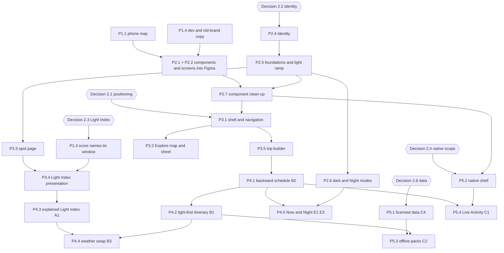

# 4 · The plan, in phases

Five phases. Each one makes the next one cheaper or safer. Sizes are relative (S, M, L); there are no calendar dates. Item IDs (P1.1, P2.3 and so on) are used in the critique digest and the dependency diagram. Option IDs (A1, B3, E1 and so on) refer to the [differentiation options brief](../research/opportunities/03-differentiation-options.md#at-a-glance); "pattern #N" refers to the [benchmarks](../research/design-audit/03-benchmarks.md#at-a-glance), numbered as in its section headings (its at-a-glance table numbers patterns 8 to 13 differently).

## Why this order

1. **Fix what misleads before anything else.** A photographer who is told a grey sunset is "Great" stops trusting every later feature. These fixes are cheap, and "every competitor that got them wrong paid for it in reviews" ([gaps, what this means](../research/competitors/gaps-and-openings.md#what-this-means-for-the-improvement-plan)). Phase 1 changes behaviour and copy only. It does not touch the visual design, so it decides nothing that belongs to you.
2. **Then get everything into Figma, and set the foundation.** The screens are captured from the running app, so Phase 1 has to land first or the blank phone map and "Vantage" go into the file. And no flow should be redesigned until the identity, the light ramp and the modes exist, or every screen gets redesigned twice.
3. **Then redesign the core flows** against the benchmarks, on top of the new foundation. They are what every differentiator plugs into.
4. **Then build the differentiators** on the web prototype first, where they are cheap to change and easy to put in front of photographers with a link.
5. **Then go native,** with licensed data and the Apple-only pieces (offline packs, Live Activity) that the positioning makes the first milestone.

Phases overlap at the edges. Phase 2's identity work can start as soon as round three is in and you settle [decision 2.2](02-decisions.md#22-design-direction-and-identity), while Phase 1 is still being built.

## Dependency diagram

Read it top to bottom. An arrow means "needs this first"; hexagons are your decisions. To keep it readable, the diagram shows the items that gate other work. Every item's exact dependencies are in the "Depends on" column of the tables below.

---

## Phase 1 · Stop misleading, stop breaking

**Goal.** Nothing in the prototype tells a photographer something false, and nothing looks unfinished. Behaviour and copy only; no visual redesign. **Exit:** every item below is done, and the screens are ready to capture.

| ID | What | Why (evidence) | Done when | Size | Depends on | Owner decision first? |
|---|---|---|---|---|---|---|
| P1.1 | Make `tw()` resolve the position group (or adopt `tailwind-merge`), then sweep for other layout-utility overrides | Phone Explore map is blank; scout submit button misplaced ([audit X0](../research/design-audit/01-screen-by-screen-audit.md#cross-cutting-findings-read-these-first), [system §4](../research/design-audit/02-system-and-identity.md#4-components)) | The map fills the screen behind the search bar at 390×844, confirmed on a real phone (phone map framing is unverified on a device) | S | — | No |
| P1.2 | A distinct "No forecast" state: no colour band, hollow ring, "No forecast · sun times only"; fix the "yet" copy on failure; a retry; date-strip tiles stop showing a skeleton forever | Unknown shown as a green "Good" 58–64 ([audit X2](../research/design-audit/01-screen-by-screen-audit.md#cross-cutting-findings-read-these-first), [flow 05](../flows/05-spot-detail.md#when-the-forecast-fails)) | With the forecast blocked, no pin, card, ring, strip or stop shows a score in a band colour | S | — | No |
| P1.3 | Interim score rule: headline = the score of the window the spot is best at, with the window name always printed ("Sunset · 38"); the date strip ranks days on the same rule | The headline is the best window, usually night ([audit X1](../research/design-audit/01-screen-by-screen-audit.md#cross-cutting-findings-read-these-first), table row 2) | Delicate Arch on a rainy day reads "Sunset · 38", not "93 · Epic"; Epic is rare across a normal week | M | — | Yes: [2.3](02-decisions.md#23-what-the-light-index-is-and-how-it-earns-trust) (the interim rule is safe under any answer) |
| P1.4 | Rename to Iter in all 27 UI strings; a styled 404 with a way back; scout fallback in user language; the owner's real name for invitees; join button clear of the tab bar | Developer and old-brand text reaches users ([audit X5](../research/design-audit/01-screen-by-screen-audit.md#cross-cutting-findings-read-these-first), rows 8 and 10; [app map tweak points](../flows/00-app-map.md#tweak-points)) | No "Vantage", "vite", "npm" or "Hey developer" text is reachable; Join works on a phone | S | Name confirmed | Yes: confirm "Iter" in UI copy |
| P1.5 | Undo for stop removal and trip edits (toast with Undo); save notes as you type; date shrink warns before moving stops | One mis-tap loses a stop and its note ([flow 07, tweak points](../flows/07-trip-builder.md#tweak-points); [gaps §1](../research/competitors/gaps-and-openings.md#1-table-stakes-iter-lacks)) | Every destructive action can be undone for a few seconds | S | — | No |
| P1.6 | Plain sync status ("Not shared yet", "Couldn't reach the server"); the scout shows real progress and can be cancelled; broken-image alt text replaced; tile failure shown | Silent failures and dead-looking states ([gaps §4](../research/competitors/gaps-and-openings.md#4-the-ux-failures-common-across-the-category); [audit row 5](../research/design-audit/01-screen-by-screen-audit.md#the-most-important-screen-level-findings); [flow 08](../flows/08-invite-and-sync.md#not-as-it-looks)) | Every network failure says what happened in plain words | M | — | No |
| P1.7 | Visible focus ring (≥3:1, width 2, offset 2); 44 as the default control size; modals trap and return focus; sheet handle works by keyboard | 1.24:1 focus ring, ~60 controls under 44px ([audit X8](../research/design-audit/01-screen-by-screen-audit.md#cross-cutting-findings-read-these-first), [system §6](../research/design-audit/02-system-and-identity.md#6-accessibility-system-level)) | Keyboard-only walk through Explore → Spot → Trip works; no control under 44 on phone | M | — | No |

---

## Phase 2 · Everything in Figma, and the design foundation

**Goal.** You own the design in Figma: every component and screen is there, and the foundation (identity, type, colour, the light visual language, dark and Night modes) is decided and built. **Exit:** the Foundations and Components pages are yours, and a token change in Figma reaches the app through one export. The working model is in [section 3](03-design-control.md).

| ID | What | Why (evidence) | Done when | Size | Depends on | Owner decision first? |
|---|---|---|---|---|---|---|
| P2.1 | Run the seven component scripts through a local development plugin (about 117 components) | Only route that keeps variable bindings and needs no quota ([tool path §2a](../research/design-audit/04-design-tool-path.md#2a-run-the-prepared-scripts-in-a-local-development-plugin-recommended-for-components)) | All sets on the As-is page, `errors[]` empty or explained | S (your time ~30 min) | P1.4 | No |
| P2.2 | Capture about 50 screen states; arrange by flow | Screens page is empty ([tool path §2b](../research/design-audit/04-design-tool-path.md#2b-figmas-own-capture-of-the-running-app-best-for-screens)) | Every state in the [screen manifest](../research/design-audit/screens/_manifest.md) has a frame | M | P1.1, P1.4 | Yes: capture route and whether to buy a month of Professional ([3.2](03-design-control.md#32-getting-everything-into-figma)) |
| P2.3 | Token generator: DTCG JSON ↔ `tokens.ts` / `index.css`; split `size/*` from `space/*` | Sync is manual and "will eventually break" ([system §1](../research/design-audit/02-system-and-identity.md#1-tokens); [tool path §2d](../research/design-audit/04-design-tool-path.md#2d-tokens-as-variables-from-json-natively-supported)) | A variable edited in Figma appears in the app after one export and one reviewed diff | S | — | No |
| P2.4 | Identity: finish round three (Switchback or Contour, heavier or serif face); app icon; type pairing; decide how First Light and Alpine share the work, tested on three real screens in light, dark and Night | Iter looks like an Airbnb theme ([system §8](../research/design-audit/02-system-and-identity.md#8-identity-distinctive-or-generic)); type to be decided with the logo ([§2](../research/design-audit/02-system-and-identity.md#2-typography)) | One lockup, one icon, one type system, one palette on the Foundations page | M (yours) | — | Yes: [2.2](02-decisions.md#22-design-direction-and-identity) |
| P2.5 | Foundations: retire rose; one written job per colour (brand accent never marks data or status); a single-hue sequential Light Index ramp with band words; a categorical set of ≤6 for days and people; status colours; focus, material, z-index and breakpoint tokens; a numeric type style for every time and score; a light foundations page (the "window" object) and a content page (voice, terms) | [System §1](../research/design-audit/02-system-and-identity.md#1-tokens), [§2](../research/design-audit/02-system-and-identity.md#2-typography), [§3](../research/design-audit/02-system-and-identity.md#3-colour), [§4](../research/design-audit/02-system-and-identity.md#4-components), [§5](../research/design-audit/02-system-and-identity.md#5-the-data-visualisation-system-the-products-core); pattern [#20](../research/design-audit/03-benchmarks.md#20-named-bands-for-a-composite-score) | Every pair passes its contrast target; the ramp orders by lightness and survives deuteranopia; Epic and Good are distinguishable in greyscale | M | P2.4 | No (follows 2.2) |
| P2.6 | Dark mode and a Night (field) mode as variable modes | No dark mode in a dawn-and-dusk product ([system §1](../research/design-audit/02-system-and-identity.md#1-tokens)); E3 ([option](../research/opportunities/03-differentiation-options.md#e3--night-mode)) | Both modes exist in Figma and in code through the generator | M | P2.3, P2.5 | No |
| P2.7 | Component clean-up in Figma, then code: merge duplicates (two OverlayChip, two PopoverMenu, three tag-likes…), one selection style, one press style, usage notes | [System §4](../research/design-audit/02-system-and-identity.md#4-components) | No two components share a name; every component has a "use when" note | M | P2.1, P2.5 | No |

---

## Phase 3 · Redesign the core flows

**Goal.** Explore, the spot page, the trip builder and sharing meet the benchmarks and speak the new visual language. Designed by you in Figma, then built. The bigger choices are laid out in [section 6](06-design-options.md). **Exit:** each flow's frames are "Built" and match the running app.

| ID | What | Why (evidence) | Done when | Size | Depends on | Owner decision first? |
|---|---|---|---|---|---|---|
| P3.1 | One shell and navigation across phone, tablet and desktop; trip-first home; active tab everywhere; readable inactive labels | Phone and desktop feel like different products ([audit X6](../research/design-audit/01-screen-by-screen-audit.md#cross-cutting-findings-read-these-first)); pattern [#14](../research/design-audit/03-benchmarks.md#14-tab-bar-that-becomes-a-sidebar); "the trip, not the map, is the home" ([positioning](../research/opportunities/04-positioning.md#recommendation)) | Same identity, profile and primary action at every size; no screen without a highlighted place | M | P2.7, 2.1 | Yes: [6.1](06-design-options.md) |
| P3.2 | Explore map and sheet: named detents, one selection drives map, list and sheet; camera fits results and filters; pins carry "Sunset · 82" with a pin budget and clusters | Map ignores what the user did ([audit X7](../research/design-audit/01-screen-by-screen-audit.md#cross-cutting-findings-read-these-first), row 6); patterns [#1](../research/design-audit/03-benchmarks.md#1-detented-sheet-over-a-live-map), [#3](../research/design-audit/03-benchmarks.md#3-map-chrome-that-respects-the-sheet), [#4](../research/design-audit/03-benchmarks.md#4-pins-that-carry-the-decision-variable-with-a-pin-budget), [#5](../research/design-audit/03-benchmarks.md#5-one-selection-drives-map-list-and-sheet) | Selecting a pin, a card or a result highlights the same object everywhere and keeps it visible above the sheet | L | P3.1 | Yes: [6.2](06-design-options.md) |
| P3.3 | Spot page leads with "when to go": best window this week and the timeline first; redraw the timeline as labelled golden, blue and night bands with a shared axis and a scrubber linked to the sky arc; facts as a fixed row (walk-in, parking where known) | "When to go" buried and split ([audit X4](../research/design-audit/01-screen-by-screen-audit.md#cross-cutting-findings-read-these-first), row 3); [system §5.3](../research/design-audit/02-system-and-identity.md#5-the-data-visualisation-system-the-products-core); pattern [#16](../research/design-audit/03-benchmarks.md#16-the-time-series-as-the-hero-with-a-scrubber-tide-guide); opening 4 ([gaps §6](../research/competitors/gaps-and-openings.md#4-the-spot-page-as-the-shot)) | On a phone, the first viewport answers "when should I be here this week?"; selecting a window highlights it in all five views | L | P2.5 | No |
| P3.4 | Light Index presentation: intent picker, window name with every number, forecast age, uncertainty fading days 4–7 | [Decision 2.3](02-decisions.md#23-what-the-light-index-is-and-how-it-earns-trust); patterns [#21](../research/design-audit/03-benchmarks.md#21-contributors-under-the-number), [#22](../research/design-audit/03-benchmarks.md#22-visible-uncertainty-and-horizon) | No bare number anywhere; day 7 visibly less certain than today | M | P1.3, P3.3 | Yes: [2.3](02-decisions.md#23-what-the-light-index-is-and-how-it-earns-trust), [6.4](06-design-options.md) |
| P3.5 | Trip builder editing: drag to reorder with recompute and undo; feasibility connectors between every stop; one session control per stop, assigned by default; "Add stop" targets the day you are on; add-stop list sorted by distance from the trip and by light | Editing lags Wanderlog ([gaps §5](../research/competitors/gaps-and-openings.md#5-where-a-competitor-does-it-better-than-iter-today)); stop card overloaded (audit row 7); warnings rarely fire ([flow 07](../flows/07-trip-builder.md#not-as-it-looks)); patterns [#9](../research/design-audit/03-benchmarks.md#9-feasibility-connectors-between-stops), [#11](../research/design-audit/03-benchmarks.md#11-direct-manipulation-reorder-with-recompute-and-undo) | Every stop has a session; every pair of stops shows a feasibility signal, across days too | L | P3.1, P1.5 | Yes: [6.3](06-design-options.md) |
| P3.6 | Sharing: owner named correctly; roles that mean something (edit vs suggest); attribution of changes; revocable link; keep the no-account join | Patterns [#24](../research/design-audit/03-benchmarks.md#24-guests-never-hit-an-account-wall)–[#28](../research/design-audit/03-benchmarks.md#28-visible-attribution-and-activity); [flow 09](../flows/09-join-shared-trip.md#tweak-points) | A guest joins with no account and sees who changed what | M | P3.1 | No |
| P3.7 | AI scout: results land as editable map objects with provenance and a checkable confidence; cancel during the wait | Patterns [#29](../research/design-audit/03-benchmarks.md#29-ai-answers-land-as-editable-map-objects), [#30](../research/design-audit/03-benchmarks.md#30-checkable-confidence-on-ai-suggestions-a-gap); opening 8 ([gaps §6](../research/competitors/gaps-and-openings.md#8-ai-that-plans-a-trip-and-shows-its-work)) | Every scouted spot says where it came from and how sure Iter is | M | P3.2 | No |
| P3.8 | Landing: legible hero over bright rock; one primary action; the hero search drives Explore; returning users skip to their trips | [Audit §1](../research/design-audit/01-screen-by-screen-audit.md#1-landing-); [flow 01](../flows/01-first-visit-landing.md#tweak-points) | The hero search lands on Explore with the query applied | S | P2.4 | No |
| P3.9 | Saved and your own spots: one idea of "saved" instead of two; Saved layout and empty state; add-a-spot form with a mini-map and a pin you can confirm; quick "Add to trip" from Saved | Two kinds of saved ([flow 10](../flows/10-saved-and-returning.md#not-as-it-looks)); add-spot friction ([flow 04](../flows/04-add-custom-spot.md#tweak-points)); [audit, Saved](../research/design-audit/01-screen-by-screen-audit.md#saved--empty-and-populated) | A saved spot means one thing, appears in one place, and can go into a trip in one tap | M | P3.1 | No |

---

## Phase 4 · The differentiators

**Goal.** The things that make Iter worth switching to, designed in Figma and built on the web prototype, then put in front of a handful of photographers before the native port. **Exit:** a photographer can plan a three-day trip in which every stop lands in its light, and Iter warns and offers a swap when the sky turns.

| ID | What | Why (evidence) | Done when | Size | Depends on | Owner decision first? |
|---|---|---|---|---|---|---|
| P4.1 | **B2 Backward schedule:** "Leave 5:31 · park 6:02 · walk 12 min · set up by 6:12" as the stop card's headline | 5/4/4 ([B2](../research/opportunities/03-differentiation-options.md#b2--backward-schedule)); "every stop card leads with a decision" ([positioning](../research/opportunities/04-positioning.md#recommendation)) | Every stop shows when to leave; walk-in time is shown where known and flagged where not | M | P3.5 | No |
| P4.2 | **B1 Light-first itinerary:** "plan my days around the light", first as a suggested order you accept, not an automatic reshuffle | 5/5/3, effort L ([B1](../research/opportunities/03-differentiation-options.md#b1--light-first-itinerary)); opening 1 ([gaps §6](../research/competitors/gaps-and-openings.md#1-the-light-aware-itinerary-that-re-plans-with-the-forecast)) | Given spots and days, Iter proposes an order where each stop meets its window and drives fill the midday | L | P4.1 | Yes: 2.1 (and testing: reorder vs suggest) |
| P4.3 | **A1 Explainable Light Index:** reasons by layer one tap away, confidence chip, a public method page, "How did it go?" after a session | 5/4/5, effort M ([A1](../research/opportunities/03-differentiation-options.md#a1--explainable-light-index)); opening 2 ([gaps §6](../research/competitors/gaps-and-openings.md#2-the-most-trustworthy-light-score-in-the-category)) | Any score can answer "why?" and "how sure?" in one tap | M | P3.4 | No |
| P4.4 | **B3 Weather swap:** inside 72 hours, when a session turns grey, offer a nearby spot for the same window or swap two days; one tap accepts; never forced | 5/5/3, effort L ([B3](../research/opportunities/03-differentiation-options.md#b3--weather-swap-plan-b)); [need 4](../research/opportunities/02-unmet-needs.md#need-4-weather-plan-b-and-flexible-itineraries) | A forecast drop produces a clear, dismissible suggestion with the reason | L | P4.2, P4.3 | No |
| P4.5 | **E1 "Now" field mode and E3 Night mode:** one screen with the next three hours (where, leave by, the light, the sky), red and dim at night | E1 5/4/4 ([E1](../research/opportunities/03-differentiation-options.md#e1--now-field-mode)), E3 4/3/5; pattern [#13](../research/design-audit/03-benchmarks.md#13-now--next--later-and-live-activities-flighty) | During a trip, the app opens to Now; Night mode is one tap | M | P4.1, P2.6 | No |
| P4.6 | **Along the drive, timed to the light:** spots near the route with detour minutes and the light you would arrive in | Opening 5 ([gaps §6](../research/competitors/gaps-and-openings.md#5-along-the-drive-timed-to-the-light)); pattern [#12](../research/design-audit/03-benchmarks.md#12-add-to-trip-everywhere-plus-an-along-route-filter) | Add-stop offers "near this drive" first, with detour and light | M | P3.2, P3.5 | No (needs more than 45 spots to be useful) |
| P4.7 | **Handoff and export:** directions to Apple or Google Maps from any stop; calendar export of sessions; GPX | Table stakes ([gaps §1](../research/competitors/gaps-and-openings.md#1-table-stakes-iter-lacks)) | From a trip, one tap opens navigation; sessions land in a calendar | S | P3.5 | No |
| P4.8 | **D1 Private by default,** with a "sensitive" flag that shares only an area; edit and delete your own spots | D1 3/4/5, effort S ([D1](../research/opportunities/03-differentiation-options.md#d1--private-by-default-spots-with-a-sensitive-flag)); custom spots cannot be edited ([flow 04](../flows/04-add-custom-spot.md#tweak-points)) | A shared trip never reveals a sensitive pin | S | P3.6 | No |

---

## Phase 5 · Go native

**Goal.** The first MapKit release for iPhone and Mac, on licensed data, with the field features the web cannot do. Scope per [decision 2.4](02-decisions.md#24-scope-of-the-first-native-release). **Exit:** the app can be sold legally and works on a mountain road with no signal.

| ID | What | Why (evidence) | Done when | Size | Depends on | Owner decision first? |
|---|---|---|---|---|---|---|
| P5.1 | Licensed data: replace Open-Meteo (C4 WeatherKit, with the value-added attribution), replace the OSRM demo, settle tile licensing | Non-commercial terms ([where the prototype stands](../research/opportunities/03-differentiation-options.md#where-the-prototype-stands)); [C4](../research/opportunities/03-differentiation-options.md#c4--weatherkit-as-data-backbone) | Every data source has a licence that allows a paid app; attribution shown in a "Data" row | M | — | Yes: [2.6](02-decisions.md#26-data-providers-licensed-for-commercial-use) |
| P5.2 | Native shell and components from the Figma library: SwiftUI, Dynamic Type, SF Symbols, system sheets, Liquid Glass for controls only, Swift Charts for the light views | [System §9](../research/design-audit/02-system-and-identity.md#9-native-translation-summary); patterns [#2](../research/design-audit/03-benchmarks.md#2-glass-for-controls-solid-for-content), [#15](../research/design-audit/03-benchmarks.md#15-sheets-become-panels-on-large-screens) | Every Phase 3 flow exists natively and matches its Figma frame | L | P2.7, Phase 3 | Yes: [2.4](02-decisions.md#24-scope-of-the-first-native-release) |
| P5.3 | **C2 Offline trip packs,** never paywalled: map area, route legs, light windows, access notes, last forecast with its age | 5/3/3, effort L ([C2](../research/opportunities/03-differentiation-options.md#c2--offline-trip-packs)); pattern [#8](../research/design-audit/03-benchmarks.md#8-offline-downloads-with-freshness-stamps) | "Ready offline · 340 MB · updated Tue 6 pm" per trip; everything degrades visibly | L | P5.1, P4.2 | No |
| P5.4 | **C1 "Tonight" Live Activity:** leave by, set up by, the window and the score on the Lock Screen, Watch and CarPlay Dashboard | 5/4/4, effort M ([C1](../research/opportunities/03-differentiation-options.md#c1--tonight-live-activity)) | Each session starts its own Live Activity without opening the app | M | P4.1, P5.2 | No |
| P5.5 | Trips on all your devices (iCloud), keeping the no-account join for guests; real collaboration (C6) later | Table stakes ([gaps §1](../research/competitors/gaps-and-openings.md#1-table-stakes-iter-lacks)); [C6](../research/opportunities/03-differentiation-options.md#c6--real-collaboration) | A trip made on the Mac is on the iPhone | L | P5.2, P3.6 | No |
| P5.6 | **E5 Fair paywall:** one tier, price before trial, renewal date, one-tap cancel, never lock a built trip | [E5](../research/opportunities/03-differentiation-options.md#e5--honest-pricing); [pricing](../research/competitors/pricing-and-models.md#what-this-suggests-for-iter) | The paywall is designed in Figma like any other screen | S | P5.3 | Yes: [2.5](02-decisions.md#25-business-model-in-outline) |

**After the first native release** (in rough order, each its own decision): A4 terrain-aware sun times, B3 if it did not make the first release, C7 widgets and Watch, C3 Photos-library memory as the second act ([positioning](../research/opportunities/04-positioning.md#recommendation)), astro-curious features for the second audience ([audience 5.2](../research/opportunities/01-photographers-and-jobs.md#52-the-second-audience)).
